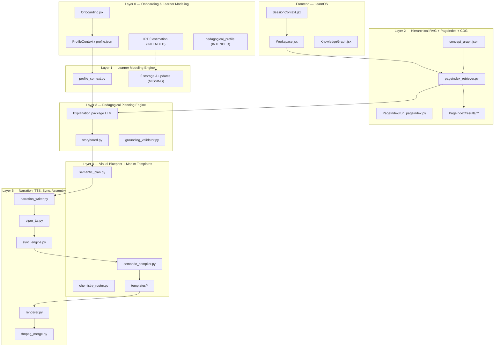
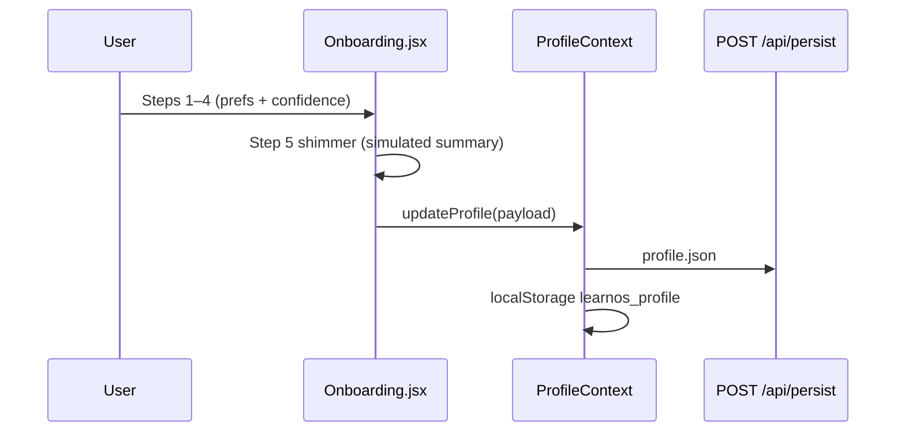
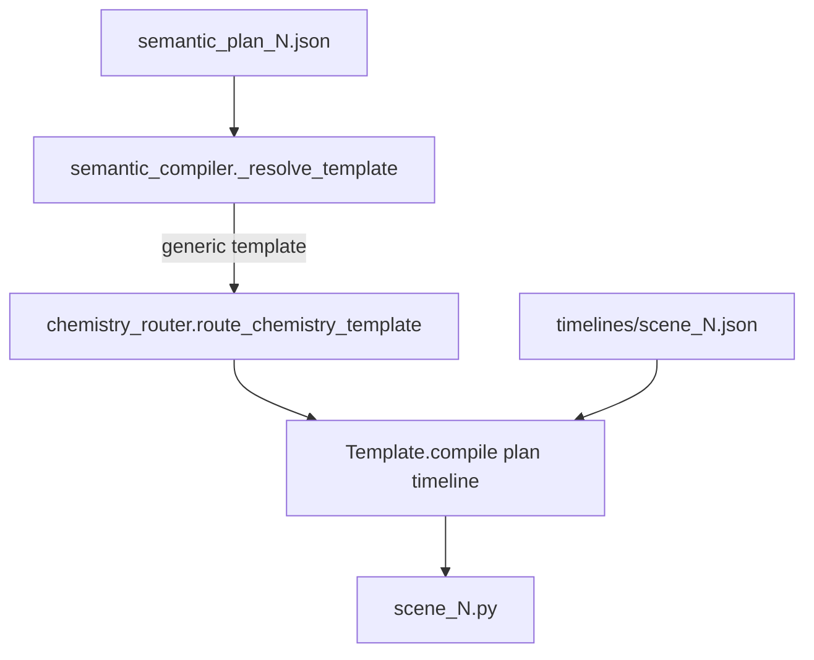
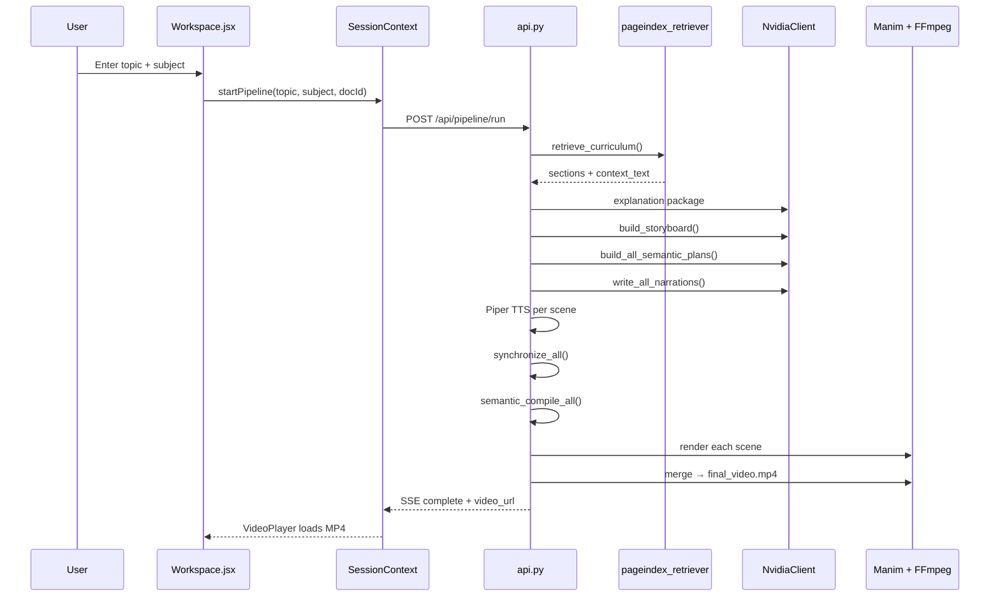

# AICARLS — Project Architecture & Implementation Guide

**AI-Driven Context-Aware Retrieval-Augmented Learning System**

| Field | Value |
|-------|-------|
| **Repository root** | `topic2manim/` (also referred to as RAG_MANIM, Topic2Manim, LearnOS) |
| **Document date** | 2026-06-15 |
| **Audience** | New engineers onboarding to the full stack |
| **Scope** | Intended academic design **vs.** current code, file-by-file map, gaps, extension guide |

> **Note on source documents:** The project report PDF, `stich.pdf` (5-layer architecture), and *MINI PROJECT ENHANCEMENT DOMAINS* were not present in this workspace at authoring time. This guide reconstructs the **intended design** from the layer model described in those documents, `specui.html` (LearnOS Frontend Spec v1.0), and all in-repo docs (`INTEGRATION_STATUS.md`, `production_implementation_plan.md`, `PROFILE_CONTEXT_IMPLEMENTATION.md`, etc.). Sections labeled **Intended** vs **Current** make the distinction explicit.

---

## Table of Contents

1. [Executive Summary](#1-executive-summary)
2. [High-Level Architecture](#2-high-level-architecture)
3. [Layer-by-Layer Breakdown](#3-layer-by-layer-breakdown)
4. [Core Data Models & Artifacts](#4-core-data-models--artifacts)
5. [Key Pipelines & Data Flows](#5-key-pipelines--data-flows)
6. [Component Deep Dive](#6-component-deep-dive)
7. [Current Implementation vs Project Vision](#7-current-implementation-vs-project-vision)
8. [Enhancement Opportunities & Recommendations](#8-enhancement-opportunities--recommendations)
9. [How to Navigate & Modify the Codebase](#9-how-to-navigate--modify-the-codebase)

---

## 1. Executive Summary

**AICARLS** is an end-to-end educational system that takes a **student profile + indexed textbook + natural-language topic** and produces a **personalized, curriculum-grounded, narrated Manim video lesson**. The intended transformation is:

```text
(Student + Textbook) → Personalized Video Lesson
```

The architecture is organized as a **5-layer pipeline** (Layer 0–5) plus a **React frontend (LearnOS)** that collects learner preferences, triggers generation, and surfaces videos, scripts, and curriculum graphs.

### Current maturity (June 2026)

| Area | Maturity | Summary |
|------|----------|---------|
| **PageIndex textbook indexing** | Strong | Two SCERT textbooks indexed (`Chemistry.pdf`, `physics.pdf`) with `structure.json`, summaries, `concept_graph.json`, `pedagogical_metadata.json` |
| **Curriculum retrieval → LLM** | Good (API path) | `pageindex_retriever.py` injects textbook evidence into all planning LLM stages |
| **Pedagogical planning** | Good | 5-scene storyboard with `scene_role` arc, semantic plans, narration |
| **Template-constrained Manim** | Good (chemistry + mechanics) | 12 chemistry + 16 mechanics + 5 explain templates; chemistry router active |
| **TTS + sync + FFmpeg** | Partial | Piper/gTTS chain works; WhisperX off by default; beat-sync incomplete in many templates |
| **Learner modeling (IRT θ)** | **Missing** | Self-reported profile only; no diagnostic quiz, no θ estimation, no ability-based item selection |
| **Pedagogical profile propagation** | Partial | `format_learner_context()` injected into LLM prompts; does not affect retrieval scoring or template dispatch |
| **Concept graph in planning** | Partial | Prerequisites resolved at retrieval time; not used for full learning-path planning or difficulty classification |
| **Frontend ↔ backend** | Good | Onboarding, Workspace pipeline, `documentId` + `learnerProfile` sent on run |

**One-line verdict:** *Core video pipeline and curriculum-grounded planning exist and are demonstrable; **IRT-based learner modeling and full pedagogical closed-loop** (θ → difficulty → retrieval → lesson depth) remain the largest gaps relative to the project report vision.*

---

## 2. High-Level Architecture

### 2.1 The 5-layer conceptual model

The intended AICARLS stack (from `stich.pdf` / project report) maps to this repository as follows:



### 2.2 Transformation: Student + Textbook → Personalized Video

| Stage | Input | Output | Primary artifacts |
|-------|-------|--------|-------------------|
| Indexing (offline) | PDF textbook | Hierarchical curriculum index | `structure.json`, `summaries.json`, `concept_graph.json` |
| Onboarding (once) | User choices | Learner snapshot | `profile.json` |
| Lesson request | Topic + subject + docId | Retrieval bundle | `retrieval_audit.json`, curriculum context string |
| Planning | Context + profile | Lesson + visual plans | `storyboard.json`, `semantic_plan_*.json` |
| Generation | Plans + timelines | Scene code + audio | `scene_*.py`, `scene_*.wav`, `timelines/scene_*.json` |
| Assembly | Scene MP4s + WAVs | Final lecture | `renders/final_video.mp4` |

### 2.3 Key data artifacts (intended names → actual files)

| Intended artifact | Purpose | Current file / location | Status |
|-------------------|---------|-------------------------|--------|
| `learner_profile.json` | Stable learner identity + prefs | `backend/data/user/profile.json` | Implemented (frontend schema) |
| `theta` | IRT ability estimate per domain | — | **Not implemented** |
| `pedagogical_profile` | Derived teaching knobs (depth, pace, prereq policy) | Partially: `format_learner_context()` output (ephemeral, in prompts only) | Partial |
| `lesson_blueprint.json` | Scene arc, roles, learning goals | `backend/data/json/storyboard.json` | Implemented |
| `visual_blueprint.json` | Per-scene template slots + events | `backend/data/json/semantic_plan_{N}.json` | Implemented |
| `narration_script.json` | Spoken script per scene | `plan["narration"]` in semantic plans; `data/audio/scene_{N}.txt` | Implemented |
| `structure.json` | PageIndex document tree | `PageIndex/results/<doc>/structure.json` | Implemented |
| `concept_graph.json` | Prerequisite edges | `PageIndex/results/<doc>/concept_graph.json` | Implemented (both indexed docs) |
| `pedagogical_metadata.json` | Per-node objectives, tags, visual elements | `PageIndex/results/<doc>/pedagogical_metadata.json` | Implemented |

---

## 3. Layer-by-Layer Breakdown

### Layer 0 — Onboarding & Learner Modeling

#### Purpose (intended)

Collect learner identity and **estimate ability (IRT θ)** through diagnostic items, then derive a **pedagogical profile** (preferred modality, acceptable difficulty band, prerequisite policy) that propagates through every downstream stage.

#### Input → Output

| | Intended | Current |
|---|----------|---------|
| **Input** | Name, grade, exam targets, diagnostic quiz responses | 5-step onboarding UI (no quiz) |
| **Output** | `learner_profile` + `theta` + `pedagogical_profile` | `profile.json` with self-rated `confidence_map` |

#### Key files

| File | Role |
|------|------|
| `frontend/src/screens/Onboarding.jsx` | 5-step wizard: name, academic level, exam targets, learning style, pace, per-subject confidence sliders |
| `frontend/src/screens/Profile.jsx` | Edit profile + API keys |
| `frontend/src/context/ProfileContext.jsx` | Canonical React state; dual persistence to `localStorage` (`learnos_profile`) and `POST /api/persist` → `profile.json` |
| `frontend/src/utils/profileSnapshot.js` | Builds API payload snapshot with `subject_confidence` for the active lesson |
| `frontend/src/screens/Landing.jsx` | Entry; routes new users to onboarding when `profile.name` is empty |
| `frontend/src/App.jsx` | Nests `ProfileProvider` → `SessionProvider` |

#### Onboarding flow (current)



**Intended but missing:** diagnostic item bank, response logging, θ estimation (2PL/3PL IRT), convergence criteria, `theta.json` or θ fields on profile.

#### Gaps / TODOs

- No IRT module anywhere in the codebase (grep for `IRT`, `theta` as ability returns zero hits).
- Onboarding step 5 **simulates** AI summary (`setTimeout`) — does not call backend.
- `weak_subjects` field reserved in schema but unused in UI logic.
- Enhancement doc likely calls for: adaptive diagnostic, θ per subject strand, updating θ after each lesson (not present).

---

### Layer 1 — Learner Modeling Engine

#### Purpose (intended)

Maintain a **normalized learner model**: map raw onboarding + ongoing analytics into prompt-ready **pedagogical directives** and **difficulty calibration** used by retrieval, planning, and narration.

#### Input → Output

| | Intended | Current |
|---|----------|---------|
| **Input** | `learner_profile`, `theta`, session history, analytics | `learner_profile` dict (optional), loaded from API body or `profile.json` |
| **Output** | `pedagogical_profile`, `learner_context` block, difficulty offset | `format_learner_context()` string only |

#### Key files

| File | Function | Responsibility |
|------|----------|----------------|
| `backend/modules/planning/profile_context.py` | `normalize_profile()` | Maps frontend + legacy backend shapes to one internal dict |
| | `format_learner_context()` | Emits ~400–800 char markdown block for LLM prompts |
| | `pace_word_budget()` | Maps `pace_preference` → narration word targets |
| | `confidence_band()` | weak / standard / strong from `subject_confidence` |
| | `level_group()` | lower / standard / advanced from `academic_level` |
| `backend/api.py` | `run_pipeline_task()` | Loads profile fallback from disk; calls `format_learner_context` for explanation package |
| `backend/data/user/analytics.json` | Dashboard metrics | **Not** fed into learner model today |
| `backend/data/user/history.json` | Past sessions | **Not** fed into learner model today |

#### What θ was supposed to do (intended design)

| Consumer | Intended influence of θ |
|----------|-------------------------|
| Retrieval | Prefer nodes at appropriate `grade_appropriateness` / difficulty |
| Lesson blueprint | Scene count, prerequisite depth, equation density |
| Narration | Vocabulary level, analogy complexity |
| Visual blueprint | Template complexity (e.g. full derivation vs intuition-only) |
| Post-lesson | Update θ from embedded checks (not implemented) |

#### Current implementation status

Self-reported **confidence_map** (0–100 per subject) substitutes for θ in `format_learner_context()`. This is **explicitly labeled** in prompts as "self-rated confidence" — not a psychometric estimate.

#### Gaps / TODOs

- Create `backend/modules/learner/irt_engine.py` (or similar) — **does not exist**.
- No `pedagogical_profile.json` persisted artifact.
- Analytics `weak_topic_flags` documented as future signal in `PROFILE_CONTEXT_IMPLEMENTATION.md` — not wired.
- Profile does not affect: retrieval scoring, chemistry router, template compile parameters, TTS speed.

---

### Layer 2 — Hierarchical RAG + PageIndex + Concept Dependency Graph

#### Purpose

Index textbooks into a **hierarchical tree** (chapters → sections) with summaries and semantic metadata; at query time retrieve **evidence-grounded** sections; use **concept_graph.json** to order prerequisites.

#### Input → Output

| Stage | Input | Output |
|-------|-------|--------|
| **Indexing** | PDF in `PageIndex/examples/documents/` | `PageIndex/results/<doc>.pdf/` artifact folder |
| **Retrieval** | `topic`, `documentId`, `subject` | Up to 3 scored sections + flattened `context_text` |

#### Key files — PageIndex (indexing)

| File | Role |
|------|------|
| `PageIndex/run_pageindex.py` | CLI entry: PDF → artifacts |
| `PageIndex/pageindex/page_index.py` | Core pipeline: TOC detection, tree build, summarization |
| `PageIndex/pageindex/local_llm.py` | Ollama-local LLM calls (offline indexing) |
| `PageIndex/pageindex/results_loader.py` | `DocumentArtifacts` — load structure, pages, concept graph |
| `PageIndex/pageindex/concept_graph.py` | Build prerequisite edges (curated + sequential + semantic overlap) |
| `PageIndex/scripts/build_concept_graph.py` | Wrapper to regenerate graphs |
| `PageIndex/scripts/build_chemistry9_semantic_layer.py` | Enrich artifacts with pedagogical metadata |
| `PageIndex/scripts/synthesize_ideal_index.py` | Gold-standard synthetic indexes for testing |
| `docs/ONBOARDING.md` | Operator guide for running PageIndex on Mac |

#### Key files — Retrieval (inference)

| File | Role |
|------|------|
| `backend/modules/retrieval/pageindex_retriever.py` | **Single integration module** (replaces planned `curriculum/` package) |
| | `retrieve_curriculum()` — main entry |
| | `_resolve_doc_folder()` — documentId → subject → env → newest |
| | `_score_node()` — word-boundary keyword scoring + chemistry tag boost |
| | `_resolve_prerequisites()` — reads `concept_graph.json` edges |
| | `format_sections_for_prompt()` — visual metadata for planners |
| | `validate_document_request()` — preflight for API |

#### Indexed documents (on disk)

| Folder | Subject | Key artifacts |
|--------|---------|---------------|
| `PageIndex/results/Chemistry.pdf/` | Chemistry (Class 9 SCERT) | `structure.json`, `summaries.json`, `concept_graph.json`, `pedagogical_metadata.json`, `tree.json` |
| `PageIndex/results/physics.pdf/` | Physics (Class 10) | Same set + `tree_structure.json`, `validated_toc.json` |

#### Document resolution priority (current)

```text
1. Subject (highest priority) via _folders_for_subject
2. Explicit documentId when it matches the same subject (source=request)
3. Subject override when documentId conflicts with requested subject
4. Newest non-blacklisted folder only when no subject and no documentId
5. LLM-only degradation when the requested subject has no indexed textbook
```

`PAGEINDEX_ACTIVE_DOC` is not used; resolution is subject-first and never silently falls back to another subject's book.

#### Concept Dependency Graph usage

```mermaid
flowchart LR
    CG[concept_graph.json]
    RET[pageindex_retriever]
    SB[storyboard.py]
    CG -->|prerequisite edges| RET
    RET -->|sections[].prerequisites| SB
    SB -->|format_prerequisites_for_prompt| LLM[Storyboard LLM]
```

Edges: `{ from: prereq_node_id, to: dependent_node_id, relation: "prerequisite" }`.

**Current:** Prerequisites attached to retrieved sections and injected into storyboard / semantic plan prompts.

**Not current:** Full graph traversal for learning-path planning, prerequisite scene auto-insertion, or θ-aware node filtering.

#### Gaps / TODOs

| Gap | Detail |
|-----|--------|
| `PageIndex/pageindex/retrieve.py` | Tree-walking RAG from upstream PageIndex — **unused**; backend reimplemented simpler scorer |
| Vector / BM25 retrieval | Intended in enhancement docs — not integrated |
| `difficulty` classifier per node | Mentioned in project vision — not implemented |
| Cross-textbook routing | Mathematics has no indexed folder; edge cases remain |
| Frontend graph | `KnowledgeGraph.jsx` loads real `structure.json` when user picks a doc, but defaults to `MOCK_SYLLABUS` |

---

### Layer 3 — Pedagogical Planning Engine

#### Purpose (intended)

Transform retrieved curriculum + learner model into a **lesson blueprint**: learning objectives, scene arc, difficulty-appropriate sequencing, prerequisite ordering.

#### Input → Output

| Step | Input | Output file |
|------|-------|-------------|
| Explanation package | topic, curriculum_context, learner_context | Ephemeral JSON (SSE to frontend) — **not saved** |
| Storyboard | topic, curriculum, learner_profile | `data/json/storyboard.json` |
| Grounding check | storyboard + curriculum_sections | `data/json/grounding_issues.json` |

#### Key files

| File | Role |
|------|------|
| `backend/api.py` | `run_pipeline_task()` stage 1 — NVIDIA `chat_json` explanation package |
| `backend/modules/planning/storyboard.py` | `build_storyboard()` — 5-scene arc, `scene_role` enforcement in prompt |
| `backend/modules/planning/grounding_validator.py` | `validate_storyboard_grounding()` — post-LLM overlap check |
| `backend/modules/planning/chemistry_router.py` | Used in storyboard validation to override generic templates |
| `backend/modules/planning/scene_json.py` | Legacy master-plan generator — **not used** by active pipeline |
| `backend/modules/planning/narration.py` | Legacy — **not imported** |
| `backend/modules/planning/visual_skeleton.py` | Stub prompt only — **not wired** |

#### Storyboard schema (current)

Each of 5 scenes includes:

| Field | Description |
|-------|-------------|
| `scene_id` | 1–5 |
| `concept_template` | Template ID from registry |
| `scene_role` | `hook` → `visual_intuition` → `formal_concept` → `worked_example` → `summary` |
| `title`, `anchor_example`, `learning_goal` | Pedagogical content |
| Scene 1 extras | `subtitle`, `key_term` |
| Scene 5 extras | `summary_points` (3 items) |

Post-validation enforces unique templates and anchor examples in scenes 2–4.

#### Intended vs current

| Feature | Intended | Current |
|---------|----------|---------|
| `lesson_blueprint.json` as distinct artifact | Separate from visual plan | `storyboard.json` serves this role |
| Difficulty estimation module | Classifier on node + θ | LLM-only; no numeric difficulty |
| Explanation package drives scenes | Bound to storyboard | Generated but **not structurally bound** to scene content |
| Prerequisite auto-scenes | Insert missing prereq scenes | Prompt instruction only |

---

### Layer 4 — Visual Blueprint + Template-Constrained Manim Generation

#### Purpose

For each storyboard scene, produce a **visual blueprint** (template choice, content slots, timed animation events), then **compile** deterministic Manim Python (no raw LLM geometry in the happy path).

#### Input → Output

| Step | Input | Output |
|------|-------|--------|
| Semantic plan | storyboard entry + curriculum + learner_context | `semantic_plan_{N}.json` |
| Compile | plan + sync timeline | `data/manim/scene_{N}.py` |
| Render | scene py | `media/videos/scene_{N}/.../*.mp4` |

#### Key files

| File | Role |
|------|------|
| `backend/modules/planning/semantic_plan.py` | `build_semantic_plan()` / `build_all_semantic_plans()` |
| `backend/modules/planning/asset_registry.py` | Per-run asset instance IDs for mechanics templates |
| `backend/modules/manim/semantic_compiler.py` | Template dispatch + chemistry router upgrade + stub on failure |
| `backend/modules/manim/renderer.py` | Manim subprocess + LLM repair loop (max 3 retries) |
| `backend/modules/manim/code_sanitize.py` | LaTeX / mobject sanitization |
| `backend/modules/templates/__init__.py` | `TEMPLATES` registry |
| `backend/modules/templates/chemistry/*` | 12 chemistry templates |
| `backend/modules/templates/mechanics/*` | 16 physics simulation templates |
| `backend/modules/templates/explain/*` | 5 chalkboard explanation templates |
| `backend/modules/templates/freeform.py` | LLM-written Manim fallback |
| `backend/modules/assets/mechanics.py` | SVG-style asset code for mechanics scenes |

#### Template registry summary

| Family | Count | Examples |
|--------|-------|----------|
| Mechanics | 16 | `projectile`, `magnetism`, `circular_motion`, … |
| Explain | 5 | `concept_card`, `equation`, `diagram`, `comparison`, `timeline` |
| Chemistry | 12 | `atomic_structure`, `bohr_orbit`, `rutherford_gold_foil`, `redox_transfer`, … |
| Bookends | 2 | `intro`, `summary` |
| Fallback | 1 | `freeform` |

#### Semantic plan shape (visual blueprint)

```json
{
  "scene_id": 2,
  "concept_template": "rutherford_gold_foil",
  "title": "...",
  "anchor_example": "...",
  "content": { },
  "assets": [],
  "events": [
    {
      "id": "e0",
      "type": "place_title",
      "anchor_phrase": "alpha particles fired",
      "phase": "on",
      "importance": 4
    }
  ],
  "narration": ""
}
```

`anchor_phrase` strings **must** appear verbatim in narration (enforced by `narration_writer.py`).

#### Compilation flow



#### Gaps / TODOs

| Gap | Detail |
|-----|--------|
| `event.start` beat sync | `timeline_builder.py` computes phrase-anchored starts; many templates still animate **sequentially** from t=0 (chemistry templates use `event_rt` + `self.wait`, not `event_start()` in generated code) |
| `freeform` escape hatch | Still produces generic rectangles when LLM planning fails |
| Domain beyond chem/physics | No biology/math templates |
| Visual blueprint as separate JSON name | Uses `semantic_plan_*.json` not `visual_blueprint.json` |

---

### Layer 5 — Narration, TTS, Synchronization & Final Assembly

#### Purpose

Write narration aligned to curriculum; synthesize speech; align words to animation events; render scenes; mux into one MP4.

#### Input → Output

| Step | Input | Output |
|------|-------|--------|
| Narration | semantic plans + curriculum + learner_context | `narration` field in plans; `audio/scene_{N}.txt` |
| TTS | narration text | `audio/scene_{N}.wav` |
| Sync | plans + wav | `timelines/scene_{N}.json`, `master_timeline.json` |
| Render | scene py | per-scene MP4 |
| Merge | MP4s + WAVs | `renders/final_video.mp4` |

#### Key files

| File | Role |
|------|------|
| `backend/modules/planning/narration_writer.py` | `write_narration()` / `write_all_narrations()` |
| `backend/modules/tts/piper_tts.py` | Piper CLI → Piper Python → gTTS → pyttsx3 → silent WAV fallback |
| `backend/modules/sync/whisper_align.py` | WhisperX alignment (optional; default off) |
| `backend/modules/sync/timeline_builder.py` | Phrase → `event.start` / `run_time` / `hold_after` |
| `backend/modules/sync/sync_engine.py` | `synchronize_all()` orchestrator |
| `backend/modules/video/ffmpeg_merge.py` | Pad video to audio, concat, mux |
| `backend/modules/config.py` | `USE_WHISPERX=false` by default |

#### Sync model

```text
event.start = phrase_start + phase_offset(before|on|after)
run_time    = f(importance)  # 0.4s – 2.0s
```

When WhisperX is disabled, `whisper_align.py` uses **uniform proportional** word timestamps — adequate for coarse sync, not broadcast-quality.

#### Gaps / TODOs

| Gap | Severity |
|-----|----------|
| Silent TTS fallback still produces valid silent WAV → mute videos | High (see `implementation_plan_v2.md` P1) |
| Explain templates ignore `event.start` | Medium |
| No separate `narration_script.json` — embedded in semantic plans | Low (naming only) |
| Hardcoded `duration: "01:30"` in history entries | Low |

---

### Frontend Architecture (LearnOS)

#### Purpose

LearnOS is the **experience layer**: onboarding, topic search, pipeline progress, video playback, library, knowledge graph, script inspector, analytics.

#### Stack

| Layer | Technology |
|-------|------------|
| Framework | React 19 + Vite 8 |
| Styling | CSS variables (`globals.css`, `index.css`) |
| API | FastAPI backend proxied via `vite.config.js` → `localhost:5000` |
| State | React Context (no Redux) |

#### Screen map

| Screen | File | Function |
|--------|------|----------|
| S-01 Landing | `screens/Landing.jsx` | Entry, routes to onboarding or dashboard |
| S-02 Onboarding | `screens/Onboarding.jsx` | Profile capture (5 steps) |
| S-03 Dashboard | `screens/Dashboard.jsx` | Topic suggestions sorted by low confidence; starts pipeline |
| S-04 Workspace | `screens/Workspace.jsx` | **Primary generation UI** — topic bar, subject, pipeline status, video player |
| S-05 Knowledge Graph | `screens/KnowledgeGraph.jsx` | Syllabus visualization; click node → pipeline |
| S-06 Library | `screens/Library.jsx` | Past sessions from `history.json` |
| S-07 Analytics | `screens/Analytics.jsx` | Watch time, subject distribution |
| S-08 Profile | `screens/Profile.jsx` | Edit learner profile + API keys |
| S-09 Script Inspector | `screens/ScriptInspector.jsx` | Manim code + narration inspection |
| S-10 Health | `screens/Health.jsx` | Dependency / PageIndex health |

#### Context providers

```text
App.jsx
  └── ProfileProvider     (profile.json)
        └── SessionProvider   (session.json, pipeline SSE)
              └── Router / screens
```

#### Pipeline integration (current)

`SessionContext.startPipeline(query, subject, documentId)`:

1. `buildProfileSnapshot(profile, subject)` → `learnerProfile`
2. `POST /api/pipeline/run` with `{ topic, subject, documentId, learnerProfile, apiKeys }`
3. `EventSource` on `/api/pipeline/status/{sessionId}` for SSE stages
4. On complete: updates `session.video_url`, persists `session.json`, appends `history.json`

`Workspace.jsx` maps `selectedSubject` → `documentId` via `/api/curriculum/documents` (with static fallback).

#### Intended vs current (frontend)

| Feature | Intended (`specui.html`) | Current |
|---------|--------------------------|---------|
| `prompt_context.json` | Separate file with `learner_summary` | Merged into API payload as `learnerProfile` |
| Chat grounded in pipeline | Real RAG chat | `ChatPanel` uses **mock** delayed replies in `SessionContext` |
| Breadcrumb "Chemistry → Chapter → Topic" | Resolved hierarchy display | Partial / topic string only |
| Express middleware server | `specui` describes Node routes | **Not implemented** — FastAPI only |

---

## 4. Core Data Models & Artifacts

### 4.1 Learner profile (`profile.json`)

**Path:** `backend/data/user/profile.json`  
**Schema (canonical — frontend):**

```json
{
  "learner_id": "user-abc123",
  "name": "Abhishek",
  "academic_level": "class_11",
  "exam_target": ["JEE", "CBSE"],
  "learning_style": "visual",
  "pace_preference": "balanced",
  "weak_subjects": [],
  "confidence_map": {
    "Chemistry": 42,
    "Physics": 70,
    "Mathematics": 55
  },
  "created_at": "2026-06-15T10:00:00",
  "updated_at": "2026-06-15T10:00:00"
}
```

**Created by:** `ProfileContext.updateProfile()` → `POST /api/persist`  
**Consumed by:** `SessionContext` (snapshot per run), `api.run_pipeline_task()` → `format_learner_context()`

### 4.2 θ (intended, not implemented)

**Intended schema:**

```json
{
  "learner_id": "user-abc123",
  "abilities": {
    "Chemistry": { "theta": 0.35, "se": 0.22, "n_items": 12 },
    "Physics": { "theta": -0.1, "se": 0.18, "n_items": 8 }
  },
  "last_updated": "2026-06-15T12:00:00"
}
```

**Would be created by:** diagnostic onboarding + post-lesson updates  
**Would be consumed by:** difficulty classifier, retrieval filter, planning depth — **none wired today**

### 4.3 Pedagogical profile (intended)

Ephemeral derivative of profile + θ. Example intended fields:

| Field | Source | Use |
|-------|--------|-----|
| `vocabulary_band` | academic_level + θ | Narration |
| `equation_density` | learning_style + θ | Template choice |
| `prerequisite_policy` | θ weak → always teach prereqs | Storyboard |
| `narration_wpm_target` | pace + θ | TTS speed (not implemented) |

**Current:** Only the text block from `format_learner_context()` — not a structured JSON artifact.

### 4.4 PageIndex artifacts

**Root:** `PageIndex/results/<document_folder>/`

| File | Created by | Consumed by |
|------|------------|-------------|
| `structure.json` | `page_index_main` | `DocumentArtifacts.walk_nodes()`, retrieval |
| `tree.json` / `tree_structure.json` | Export variants | Knowledge graph UI, debugging |
| `summaries.json` | Summarization stage | Optional; node summaries also on tree |
| `extracted_pages.json` | PDF ingestion | `get_page_text()` evidence chunks |
| `concept_graph.json` | `concept_graph.py` | `_resolve_prerequisites()` |
| `pedagogical_metadata.json` | Semantic layer builder | Enriches nodes with tags, `visualizable_elements` |
| `semantic_validation.json` | Validators | `/api/pageindex/health` |
| `pipeline_metrics.json` | Indexing run | Operator debugging |

### 4.5 Pipeline runtime artifacts

**Root:** `backend/data/`

| Path | Role |
|------|------|
| `json/storyboard.json` | Lesson blueprint (5 scenes) |
| `json/semantic_plan_{1-5}.json` | Visual blueprints |
| `json/asset_registry.json` | Mechanics asset instances |
| `json/retrieval_audit.json` | Last run's retrieval debug |
| `json/grounding_issues.json` | Storyboard vs curriculum mismatches |
| `audio/scene_{N}.wav` | TTS output |
| `audio/scene_{N}.txt` | Narration text |
| `timelines/scene_{N}.json` | Word timestamps + event timeline |
| `timelines/master_timeline.json` | All scenes |
| `manim/scene_{N}.py` | Generated Manim source |
| `renders/final_video.mp4` | Deliverable |
| `renders/session_*/` | Per-session copies (when saved) |
| `user/session.json` | Active workspace state |
| `user/history.json` | Library entries |
| `user/analytics.json` | Derived dashboard stats |

### 4.6 Session object (`session.json`)

Key fields used by Workspace:

| Field | Description |
|-------|-------------|
| `session_id` | `session_<timestamp>` |
| `topic_query` / `topic_resolved` | User input vs resolved label |
| `pipeline_stage` | `idle` \| `retrieving` \| … \| `complete` \| `error` |
| `video_url` | `/generated/...` or absolute backend URL |
| `explanation_package` | Objectives / analogies from stage 1 |
| `scene_plan` | Storyboard array from SSE |
| `script` | Concatenated narration + events |
| `messages` | Chat history (mostly mock) |

---

## 5. Key Pipelines & Data Flows

### 5.1 End-to-end: user requests a lesson



### 5.2 CLI path (same backend modules)

```bash
cd topic2manim/backend
python main.py "Bohr model of hydrogen" --document-id Chemistry.pdf --subject Chemistry
```

`main.py` calls the same planners and compiler as the API (with retrieval at step 0).

### 5.3 Concept graph in retrieval and planning

```text
1. User asks: "Bohr model"
2. Retriever scores nodes in structure.json
3. Top match: node_id "0007" (Bohr section)
4. concept_graph.json edges → prerequisites [{title: "Rutherford scattering"}, ...]
5. format_prerequisites_for_prompt() → ordered list in storyboard prompt
6. Storyboard LLM instructed to teach Rutherford before Bohr
```

**Limitation:** Only prerequisites of **matched** sections are surfaced — not a full forward learning path through the graph.

### 5.4 How learner profile influences stages (current)

| Stage | Influenced? | Mechanism |
|-------|-------------|-----------|
| Document routing | No | Subject string only |
| Retrieval scoring | No | Keyword overlap only |
| Explanation package | Yes | `learner_context_block` in prompt |
| Storyboard | Yes | `format_learner_context()` in prompt |
| Semantic plan | Yes | Same |
| Narration | Yes | Same + `pace_word_budget()` |
| Template dispatch | No | chemistry_router ignores profile |
| Manim compile | No* | *Except `freeform` LLM path if used |
| TTS speed | No | Piper fixed rate |

---

## 6. Component Deep Dive

### 6.1 Module reference table

| Module | Path | Primary functions | Responsibility |
|--------|------|-------------------|----------------|
| **PageIndex retriever** | `backend/modules/retrieval/pageindex_retriever.py` | `retrieve_curriculum()`, `list_documents()`, `validate_document_request()` | Load artifacts, score nodes, build prompt context, resolve prerequisites |
| **Results loader** | `PageIndex/pageindex/results_loader.py` | `DocumentArtifacts`, `walk_nodes()`, `get_page_text()`, `prerequisites_for()` | Read-only artifact access |
| **Storyboard** | `backend/modules/planning/storyboard.py` | `build_storyboard()` | 5-scene pedagogical arc via LLM |
| **Semantic plan** | `backend/modules/planning/semantic_plan.py` | `build_semantic_plan()`, `build_all_semantic_plans()` | Template slot filling + animation events |
| **Narration writer** | `backend/modules/planning/narration_writer.py` | `write_narration()`, `write_all_narrations()` | Embed anchor phrases verbatim |
| **Profile context** | `backend/modules/planning/profile_context.py` | `normalize_profile()`, `format_learner_context()` | Learner → prompt block |
| **Chemistry router** | `backend/modules/planning/chemistry_router.py` | `route_chemistry_template()` | Tag/keyword → chemistry template ID |
| **Grounding validator** | `backend/modules/planning/grounding_validator.py` | `validate_storyboard_grounding()` | Curriculum overlap check |
| **Semantic compiler** | `backend/modules/manim/semantic_compiler.py` | `semantic_compile()`, `semantic_compile_all()` | Plan + timeline → `scene_N.py` |
| **Renderer** | `backend/modules/manim/renderer.py` | `render()` | Manim CLI + repair loop |
| **Sync engine** | `backend/modules/sync/sync_engine.py` | `synchronize_all()` | Audio alignment + timelines |
| **Piper TTS** | `backend/modules/tts/piper_tts.py` | `synthesize()` | Offline speech synthesis |
| **FFmpeg merge** | `backend/modules/video/ffmpeg_merge.py` | `merge()` | Final video assembly |
| **API** | `backend/api.py` | `run_pipeline_task()`, routes | HTTP + SSE orchestration |
| **CLI** | `backend/main.py` | `run()` | Non-HTTP entry |
| **Concept graph builder** | `PageIndex/pageindex/concept_graph.py` | CLI `--doc` / `--all` | Generate prerequisite edges |
| **NVIDIA LLM client** | `backend/modules/llm/nvidia_client.py` | `chat_json()` | Primary planner LLM (Gemini fallback) |

### 6.2 `pageindex_retriever.py` — retrieval algorithm

1. **Resolve document folder** (`_resolve_doc_folder`)
2. **Load** `DocumentArtifacts(results_dir)`
3. **Flatten** all nodes from `structure.json`
4. **Score** each node: word-boundary keyword hits + chemistry tag boost + `visualizable_elements` boost
5. **Take top 3** with score > 0
6. **Attach** page text (max 3000 chars), breadcrumbs, prerequisites from graph
7. **Return** `{ matched, sections, context_text, document_id, resolution_source }`

### 6.3 `storyboard.py` — planning contract

- System prompt enforces JSON array output, no timing fields
- User prompt includes: curriculum (with visual metadata), prerequisites, learner context, template families
- Post-processing: `_validate_entry()` deduplicates templates; chemistry router may override template IDs

### 6.4 `semantic_compiler.py` — template resolution order

1. If plan's `concept_template` is a registered chemistry template → use directly
2. If generic (`freeform`, `diagram`, …) → `route_chemistry_template()` upgrade
3. Else use registered template or fall back to `intro`
4. On compile exception → write stub scene, continue pipeline

### 6.5 Onboarding / IRT (intended location)

| Intended component | Suggested path | Status |
|--------------------|----------------|--------|
| Diagnostic item bank | `backend/data/diagnostics/chemistry_class9.json` | Missing |
| IRT estimator | `backend/modules/learner/irt.py` | Missing |
| Onboarding API | `POST /api/onboarding/diagnostic` | Missing |
| θ persistence | `backend/data/user/theta.json` | Missing |
| Frontend quiz UI | `screens/OnboardingDiagnostic.jsx` | Missing |

### 6.6 Frontend components

| Component | Path | Role |
|-----------|------|------|
| `ProfileContext` | `context/ProfileContext.jsx` | Load/save profile |
| `SessionContext` | `context/SessionContext.jsx` | Pipeline + SSE + session persistence |
| `profileSnapshot` | `utils/profileSnapshot.js` | API payload builder |
| `Workspace` | `screens/Workspace.jsx` | Main lesson UI |
| `VideoPlayer` | `components/VideoPlayer.jsx` | Playback + decorative atom overlay |
| `PipelineStatus` | `components/PipelineStatus.jsx` | Stage progress bar |
| `KnowledgeGraph` | `screens/KnowledgeGraph.jsx` | Curriculum graph |
| `Sidebar` | `components/Sidebar.jsx` | Navigation |

### 6.7 API routes (complete list)

| Method | Path | Purpose |
|--------|------|---------|
| GET | `/api/health` | Backend health |
| GET | `/api/pageindex/health` | Indexed docs + artifact status |
| POST | `/api/persist` | Atomic JSON write to `data/user/` |
| GET | `/api/load/{filename}` | Load user JSON |
| POST | `/api/pipeline/run` | Start video generation |
| GET | `/api/pipeline/status/{sessionId}` | SSE progress stream |
| GET | `/api/curriculum/documents` | List indexed textbooks |
| GET | `/api/curriculum/validate` | Preview document resolution |
| POST | `/api/curriculum/index` | Trigger PageIndex on uploaded PDF |
| Static | `/generated`, `/results` | Video + curriculum JSON mounts |

---

## 7. Current Implementation vs Project Vision

### 7.1 Implemented well

| Capability | Evidence |
|------------|----------|
| Offline PageIndex indexing with Ollama | `PageIndex/run_pageindex.py`, `docs/ONBOARDING.md` |
| Multi-textbook artifact storage | `Chemistry.pdf/`, `physics.pdf/` |
| Concept graphs with curated chemistry rules | `concept_graph.json`, `concept_graph.py` |
| API pipeline with curriculum injection | `api.py` stage 0, all planners accept `curriculum_context` |
| Learner profile in API + prompts | `SessionContext`, `profile_context.py` |
| Pedagogical scene roles | `storyboard.py` `scene_role` field |
| Chemistry Manim templates (12) | `templates/chemistry/` |
| Chemistry template router | `chemistry_router.py`, `semantic_compiler._resolve_template` |
| Retrieval audit logging | `retrieval_audit.json` |
| Document ID from frontend | `Workspace.jsx` → `startPipeline(..., docId)` |
| Curriculum index API | `POST /api/curriculum/index` |
| Grounding validator | `grounding_validator.py` |

### 7.2 Partial / stub

| Capability | Gap |
|------------|-----|
| IRT θ learner modeling | Self-rated confidence only |
| `pedagogical_profile` artifact | Ephemeral prompt text only |
| Concept graph | Prerequisites on matched nodes only; no path planning |
| Difficulty classifier | Not implemented |
| Beat-synced Manim | Timelines computed; templates mostly sequential |
| WhisperX alignment | Disabled by default (`USE_WHISPERX=false`) |
| Chat / follow-up Q&A | Mock responses in `SessionContext` |
| `visual_skeleton.py` | Prompt stub, unused |
| Knowledge graph | Mock fallback; real data optional |
| TTS reliability | Silent fallback can produce mute videos |

### 7.3 Missing (project report + enhancement doc themes)

| Missing item | Impact |
|--------------|--------|
| **IRT-based θ estimation** | No psychometric personalization |
| **Diagnostic onboarding quiz** | Cannot calibrate ability objectively |
| **θ → difficulty mapping** | Lessons not ability-matched to content |
| **Structured `pedagogical_profile.json`** | Cannot audit personalization decisions |
| **Retrieval influenced by θ** | May retrieve sections too hard/easy |
| **`lesson_blueprint` separate from visual plan** | Naming/architecture drift only — functionally merged in storyboard |
| **Template-constrained generation for all domains** | Biology, math still fall through to freeform |
| **`PageIndex/retrieve.py` integration** | Simpler keyword retriever vs tree-walking RAG |
| **Post-lesson θ update** | No learning loop |
| **`prompt_context.json` as spec'd** | Uses inline API payload instead |
| **Express/Node middleware layer** | Spec only — FastAPI direct |

### 7.4 Enhancement document highlights (typical academic feedback)

Based on in-repo enhancement and production plans:

1. **Ground videos in the correct textbook** — largely addressed via `documentId` + subject routing
2. **Chemistry-specific visuals** — addressed via chemistry template pack
3. **Use `visualizable_elements` in planning** — addressed in retriever + semantic_plan enrichment
4. **Pedagogical arc enforcement** — addressed via `scene_role` in storyboard
5. **IRT / adaptive difficulty** — **still open**
6. **Audio-visual sync quality** — **partially open**
7. **Library hygiene (delete failed videos)** — **open** (`implementation_plan_v2.md` P2)

---

## 8. Enhancement Opportunities & Recommendations

Prioritized roadmap to align with the full AICARLS vision:

### P0 — Learner modeling (closes largest vision gap)

| # | Task | Suggested location | Approach |
|---|------|------------------|----------|
| 1 | Diagnostic item bank per subject | `backend/data/diagnostics/{subject}.json` | 15–20 MCQs mapped to `node_id` / difficulty |
| 2 | IRT θ estimator | `backend/modules/learner/irt_engine.py` | 2PL model; MLE or EAP; store per-subject θ |
| 3 | Onboarding quiz UI | `frontend/src/screens/OnboardingDiagnostic.jsx` | Step between profile and summary |
| 4 | θ persistence | `backend/data/user/theta.json` + API fields on `profile.json` | `GET/POST /api/learner/theta` |
| 5 | `pedagogical_profile` builder | `backend/modules/learner/pedagogical_profile.py` | Map θ + profile → structured knobs |
| 6 | Wire θ into planners | Extend `format_learner_context()` or parallel block | Difficulty band, prereq policy, equation density |

### P1 — Retrieval & planning quality

| # | Task | Location | Approach |
|---|------|----------|----------|
| 7 | θ-aware retrieval filter | `pageindex_retriever._score_node` | Boost nodes where `grade_appropriateness` matches θ band |
| 8 | Full prerequisite path | New `planning/prerequisite_planner.py` | BFS on concept_graph from matched node |
| 9 | Port tree RAG | Wrap `PageIndex/pageindex/retrieve.py` | Hybrid: tree walk + keyword fallback |
| 10 | Persist explanation package | `api.py` | Save to `json/explanation_package.json` for audit |
| 11 | Difficulty classifier | `planning/difficulty.py` | Rule + LLM label per node; train on graph depth + metadata |

### P2 — A/V production quality

| # | Task | Location | Approach |
|---|------|----------|----------|
| 12 | Detect silent TTS | `piper_tts.synthesize()` return flag | Abort or warn in `api.py` (see v2 plan) |
| 13 | Consume `event.start` in all templates | `templates/explain/_base.py`, chemistry `_base.py` | `self.wait(event_start(...))` before each play |
| 14 | Enable WhisperX path | `config.py`, docs | Optional torch install guide |
| 15 | TTS speed from pace | `piper_tts` | Map `slow_deep` → 0.85×, `fast_overview` → 1.15× |

### P3 — Product & frontend

| # | Task | Location | Approach |
|---|------|----------|----------|
| 16 | Real chat RAG | New `backend/routes/chat.py` | topic + curriculum_context + profile |
| 17 | Library delete | `api.py` + `Library.jsx` | `DELETE /api/sessions/{id}` soft delete |
| 18 | Breadcrumb resolver | `Workspace.jsx` | Display top retrieval section breadcrumb |
| 19 | θ dashboard | `Analytics.jsx` | Show ability trends over time |
| 20 | Mathematics textbook index | PageIndex run on math PDF | Extend `subjectDocMap` |

---

## 9. How to Navigate & Modify the Codebase

### 9.1 Recommended exploration order

```text
1. topic2manim/README.md                          — repo layout
2. backend/main.py                                — CLI pipeline skeleton (8 steps)
3. backend/api.py :: run_pipeline_task()          — API pipeline (+ SSE stages)
4. backend/modules/retrieval/pageindex_retriever.py — curriculum grounding
5. backend/modules/planning/storyboard.py         — lesson structure
6. backend/modules/planning/semantic_plan.py      — visual blueprint
7. backend/modules/manim/semantic_compiler.py     — template dispatch
8. backend/modules/templates/chemistry/           — domain visuals
9. frontend/src/screens/Workspace.jsx             — user entry point
10. docs/INTEGRATION_STATUS.md                    — integration history
```

### 9.2 Repository layout (essential paths)

```text
topic2manim/
├── PageIndex/                 # Textbook indexing (vendored fork, Ollama-local)
│   ├── run_pageindex.py
│   ├── pageindex/             # Core indexing package
│   ├── scripts/               # concept graph, semantic layer builders
│   └── results/               # Per-PDF artifact folders
├── backend/
│   ├── api.py                 # FastAPI + pipeline orchestration
│   ├── main.py                # CLI entry
│   ├── modules/
│   │   ├── retrieval/         # pageindex_retriever.py
│   │   ├── planning/          # storyboard, semantic_plan, narration, profile
│   │   ├── manim/             # compiler, renderer
│   │   ├── templates/         # mechanics, chemistry, explain
│   │   ├── tts/               # piper_tts.py
│   │   ├── sync/              # whisper_align, timeline_builder, sync_engine
│   │   └── video/             # ffmpeg_merge.py
│   └── data/                  # Runtime artifacts (json, audio, manim, renders, user)
├── frontend/
│   └── src/
│       ├── screens/           # LearnOS UI
│       ├── context/           # Profile + Session
│       └── components/
├── docs/                      # Deep dives, integration reports, plans
└── specui.html                # Frontend spec (parent folder: manim/specui.html)
```

### 9.3 Common modification patterns

#### Change how learner pace affects narration length

1. Edit word bands in `profile_context.py` → `_PACE_WORD_BUDGET`
2. Ensure `narration_writer.py` references `pace_word_budget()` in its prompt (already uses `format_learner_context`)

#### Change how θ *would* affect narration (after implementing IRT)

1. Add θ band logic to `pedagogical_profile.py` (new)
2. Extend `format_learner_context()` with θ-derived difficulty line
3. Optionally scale `pace_word_budget` by θ distance from section difficulty

#### Add a new chemistry Manim template

1. Create `backend/modules/templates/chemistry/my_template.py` with `CONTENT_SCHEMA`, `ALLOWED_EVENTS`, `compile()`
2. Register in `templates/chemistry/__init__.py` → `CHEMISTRY_TEMPLATES`
3. Add routing rules in `chemistry_router.py` (`_TAG_TO_TEMPLATE` or keyword set)
4. List template in `storyboard.py` `STORYBOARD_PROMPT` family C
5. Add semantic plan prompt branch in `semantic_plan.py` if schema differs

#### Improve retrieval for a subject

1. Tune `_score_node()` in `pageindex_retriever.py` (tag boosts, keyword sets)
2. Enrich `concept_graph.py` curated rules for that domain
3. Re-run `python -m pageindex.concept_graph --doc <folder>.pdf`

#### Index a new textbook

```bash
cp textbook.pdf topic2manim/PageIndex/examples/documents/
cd topic2manim/PageIndex
PYTHONPATH=. python run_pageindex.py --pdf_path examples/documents/textbook.pdf --model qwen2.5:3b
PYTHONPATH=. python -m pageindex.concept_graph --doc textbook.pdf
```

Then add subject mapping in `Workspace.jsx` `_STATIC_SUBJECT_DOC_MAP` or rely on `/api/curriculum/documents`.

#### Run the full stack locally

```bash
# Terminal 1 — Ollama (for indexing only)
ollama serve

# Terminal 2 — Backend
cd topic2manim/backend && python api.py

# Terminal 3 — Frontend
cd topic2manim/frontend && npm run dev
```

Set `NVIDIA_API_KEY` or `GEMINI_API_KEY` in `backend/.env` or Profile screen localStorage.

### 9.4 Debugging checklist

| Symptom | Check |
|---------|-------|
| Wrong textbook content | `data/json/retrieval_audit.json` → `document_id`, `sections` |
| Generic / hallucinated lesson | `matched: false` in logs; run `validate_document_request` |
| Empty prerequisites | `PageIndex/results/<doc>/concept_graph.json` exists? |
| Cubes instead of atoms | `semantic_plan_*.json` → `concept_template`; chemistry router logs |
| Silent video | `data/audio/scene_*.wav` — listen; check Piper install |
| Profile not applied | Network tab → `learnerProfile` in POST body; server log "Pipeline personalization" |

### 9.5 Naming aliases (avoid confusion)

| Name | Same codebase |
|------|---------------|
| AICARLS | Academic project name |
| RAG_MANIM | GitHub / README name |
| Topic2Manim | Backend CLI branding |
| LearnOS | Frontend product name |

---

## Appendix A — Pipeline stage map (API SSE)

| SSE `stage` | Progress | Backend step |
|-------------|----------|--------------|
| `retrieving` | 5% | `retrieve_curriculum()` |
| `explaining` | 15–25% | Explanation package LLM |
| `planning` | 35–45% | `build_storyboard()` |
| `generating` | 55–87% | semantic plans, narration, compile |
| `tts` | 75–83% | Piper + sync |
| `complete` | 100% | FFmpeg merge, history save |
| `error` | 100% | Any fatal exception |

---

## Appendix B — Environment variables

| Variable | Default | Purpose |
|----------|---------|---------|
| `NVIDIA_API_KEY` | — | Primary LLM (planner) |
| `GEMINI_API_KEY` | — | Fallback LLM |
| `NVIDIA_PLANNER_MODEL` | `meta/llama-3.3-70b-instruct` | Storyboard / plans |
| `MANIM_REPAIR_TIMEOUT` | `30` | LLM Manim repair timeout (seconds) |
| `MANIM_REPAIR_MAX_CALLS` | `1` | Max LLM repair calls per pipeline run |
| `USE_WHISPERX` | `false` | Force alignment quality |
| `PIPER_MODEL` | `en_US-lessac-medium` | TTS voice |
| `MANIM_QUALITY` | `-qm` | Render quality flag |

---

## Appendix C — Related documentation index

| Document | Path | Topic |
|----------|------|-------|
| PageIndex operator guide | `docs/ONBOARDING.md` | Indexing textbooks |
| Integration status | `docs/INTEGRATION_STATUS.md` | PageIndex ↔ video wiring |
| Profile wiring guide | `docs/PROFILE_CONTEXT_IMPLEMENTATION.md` | Learner profile design |
| Concept graph | `docs/CONCEPT_GRAPH.md` | Prerequisite edges |
| Production plan | `docs/production_implementation_plan.md` | Chemistry reliability fixes |
| Pipeline diagnostic | `docs/diagnostic_retrieval_and_video_pipeline_analysis.md` | Deep technical audit |
| Frontend spec | `../specui.html` | LearnOS screens & schemas |
| PageIndex deep dive | `docs/PAGEINDEX_DEEP_DIVE.md` | Indexing internals |

---

*This document reflects the `topic2manim/` codebase as of 2026-06-15. When the project report PDF and `stich.pdf` become available in the repo, merge any naming or layer-boundary differences into Section 2 and the Layer 0–1 IRT sections.*
