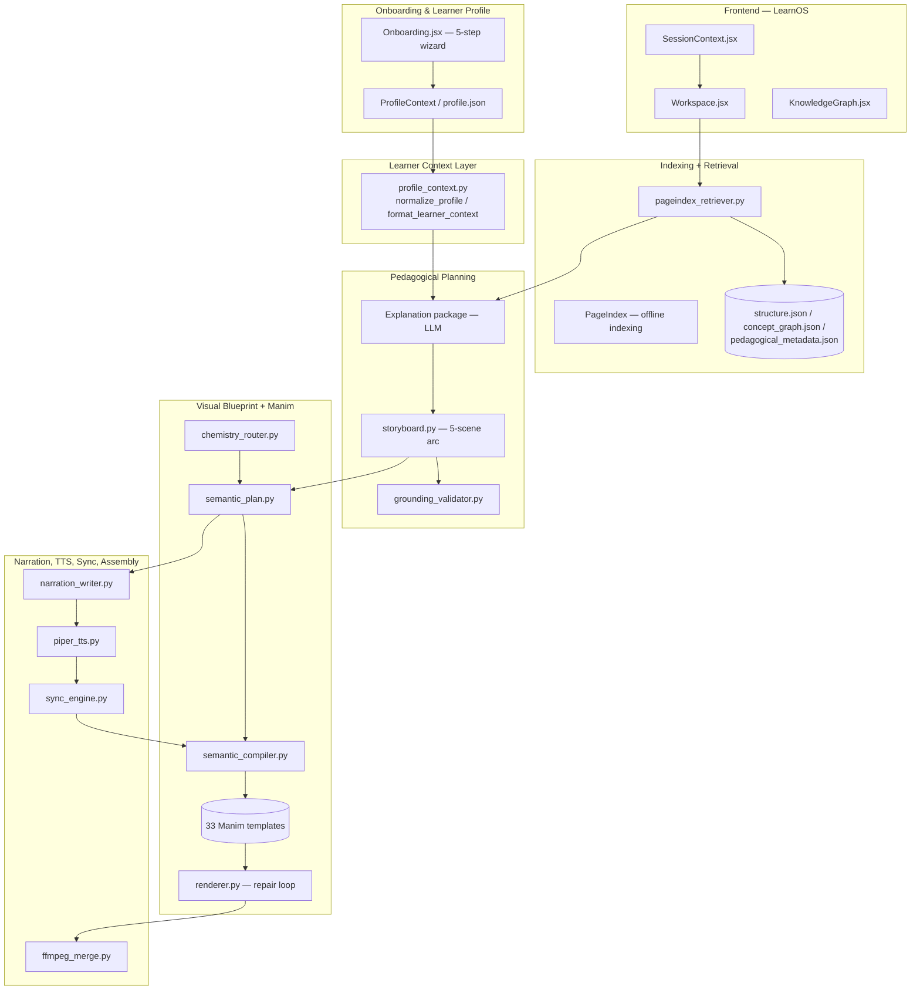
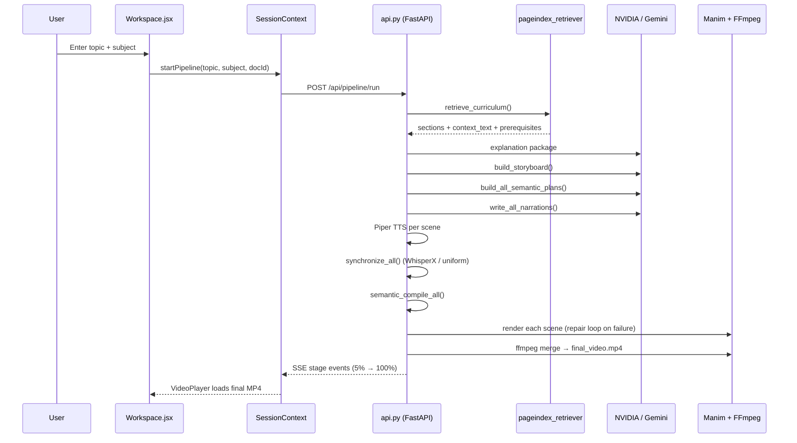
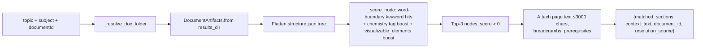
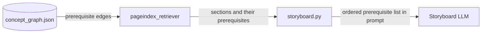
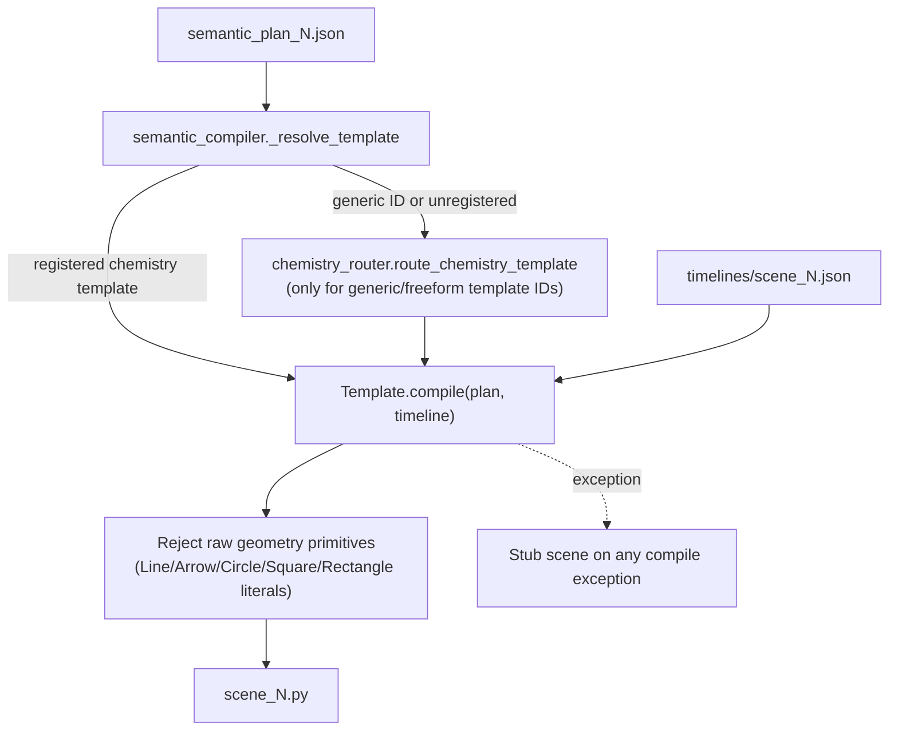

# AICARLS / Topic2Manim — Curriculum-Grounded Educational Video Generation Pipeline

> A retrieval-grounded, template-constrained multi-stage pipeline that turns a textbook + a topic query into a synchronized, narrated Manim video lesson.

**Repository:** [`AbhishekLGowda05/RAG-MANIM`](https://github.com/AbhishekLGowda05/RAG-MANIM)
**Also referred to as:** AICARLS (academic project name), RAG_MANIM (repo name), Topic2Manim (backend CLI branding), LearnOS (frontend product name) — these are the same codebase at different layers.

---

## How to read this document

This README distinguishes explicitly between two things that are easy to conflate in a student project write-up:

1. **The system as designed** — the 5-layer "AI-Driven Context-Aware Retrieval-Augmented Learning System" (AICARLS) described in the accompanying academic project report, including an IRT-based learner model and a 3-condition retrieval ablation study.
2. **The system as implemented** — what actually runs when you clone this repository, install the requirements, and execute the pipeline today.

Every section below is written from the implementation, verified against source files, and cross-checked against the repository's own internal engineering documentation (`PROJECT_ARCHITECTURE_AND_IMPLEMENTATION.md`, `docs/INTEGRATION_STATUS.md`, `docs/production_implementation_plan.md`). Where the report describes a capability that is not present in code, this is stated **explicitly and without euphemism**, with a pointer to what would need to be built to close the gap. This is a deliberate choice: a README that quietly inflates scope does not survive a code walkthrough in a technical interview, and a README that names its own gaps precisely is a stronger engineering signal than one that hides them.

---

## Table of Contents

1. [Executive Summary](#1-executive-summary)
2. [Problem Statement](#2-problem-statement)
3. [Motivation](#3-motivation)
4. [Key Contributions](#4-key-contributions)
5. [System Overview](#5-system-overview)
6. [End-to-End Pipeline](#6-end-to-end-pipeline)
7. [High-Level Architecture](#7-high-level-architecture)
8. [Request / Data Flow](#8-request--data-flow)
9. [Complete AI Pipeline](#9-complete-ai-pipeline)
10. [Retrieval Architecture](#10-retrieval-architecture)
11. [Hierarchical RAG Design](#11-hierarchical-rag-design)
12. [Knowledge Representation](#12-knowledge-representation)
13. [Concept Dependency Graph](#13-concept-dependency-graph)
14. [Adaptive Learning Pipeline](#14-adaptive-learning-pipeline)
15. [Learner Modelling (IRT)](#15-learner-modelling-irt)
16. [Content Retrieval Strategy](#16-content-retrieval-strategy)
17. [Prompt Engineering Strategy](#17-prompt-engineering-strategy)
18. [Blueprint Generation Pipeline](#18-blueprint-generation-pipeline)
19. [Manim Code Generation Pipeline](#19-manim-code-generation-pipeline)
20. [Multi-Stage Validation and Repair Pipeline](#20-multi-stage-validation-and-repair-pipeline)
21. [WhisperX Alignment Pipeline](#21-whisperx-alignment-pipeline)
22. [Piper TTS Pipeline](#22-piper-tts-pipeline)
23. [Evaluation Methodology](#23-evaluation-methodology)
24. [Experimental Results](#24-experimental-results)
25. [Performance Metrics](#25-performance-metrics)
26. [Comparison with Baselines](#26-comparison-with-baselines)
27. [Engineering Decisions](#27-engineering-decisions)
28. [Technology Choices and Trade-offs](#28-technology-choices-and-trade-offs)
29. [Folder Responsibilities](#29-folder-responsibilities)
30. [Project Structure](#30-project-structure)
31. [Database / Storage Architecture](#31-database--storage-architecture)
32. [API Architecture](#32-api-architecture)
33. [Frontend Architecture](#33-frontend-architecture)
34. [Deployment Architecture](#34-deployment-architecture)
35. [Local Development Setup](#35-local-development-setup)
36. [Environment Variables](#36-environment-variables)
37. [Future Improvements](#37-future-improvements)
38. [Known Limitations](#38-known-limitations)
39. [Lessons Learned](#39-lessons-learned)
40. [Contributors](#40-contributors)

---

## 1. Executive Summary

This repository implements a pipeline that converts a **textbook PDF + a natural-language topic query** into a **narrated animated video lesson**, grounded in the actual textbook content rather than a general-purpose LLM's unconstrained output.

Concretely, the shipped system does the following, end to end, with no human in the loop after a topic is submitted:

1. Indexes a textbook offline into a hierarchical semantic tree (`PageIndex/`, a vendored and extended fork of [VectifyAI/PageIndex](https://github.com/VectifyAI/PageIndex)).
2. Retrieves the top-scoring sections of that tree for a query (`backend/modules/retrieval/pageindex_retriever.py`).
3. Plans a 5-scene pedagogical arc constrained to the retrieved evidence (`storyboard.py`).
4. Converts each scene into a structured visual blueprint bound to a specific Manim template (`semantic_plan.py`, `semantic_compiler.py`).
5. Writes narration whose key phrases are contractually required to appear in the generated animation events (`narration_writer.py`).
6. Synthesizes speech offline (Piper TTS, with a 4-tier fallback chain), aligns words to those events (WhisperX, with a documented and reasoned fallback), renders each scene with Manim, and merges the result with FFmpeg.

The engineering focus of this project is **reliability under an unreliable component** (the LLM): almost every subsystem exists specifically to constrain, validate, or gracefully degrade LLM output rather than trust it directly — a code-level geometry-primitive check that rejects raw shape calls from a "semantic" compiler, a repair loop with a circuit breaker and a hard call budget, a 4-tier TTS fallback that guarantees a WAV file always exists, and a template resolution order that only reaches a free-form LLM-authored Manim scene as the last resort.

The project also includes a full **React 19 frontend** (10 screens: onboarding, workspace, knowledge graph, library, analytics, script inspector, health), a **FastAPI backend** with SSE-streamed pipeline progress, and **33 hand-authored, parameterized Manim scene templates** across two curriculum domains (Chemistry, Physics/Mechanics).

**What is explicitly not implemented:** the IRT-based learner ability model (θ estimation), the full concept-dependency-graph learning-path planner, and the 3-condition retrieval ablation study described in the accompanying academic report. These are real, scoped, prioritized gaps (see [§15](#15-learner-modelling-irt), [§37](#37-future-improvements)) — not aspirations left vague. The report's evaluation numbers for those subsystems (NDCG@3, IRT Pearson correlation, Manim pass@1/pass@3) describe a **research-design evaluation harness that has not been reproduced against the code in this repository**, and are presented in this document as such, not as CI-verified benchmarks.

---

## 2. Problem Statement

Two independent failure modes motivate this project, both documented in the repository's own diagnostic write-ups before any code was changed to address them:

**Failure mode 1 — generic content delivery.** Most AI tutoring and video-generation tools produce the same explanation regardless of which textbook, curriculum, or syllabus the learner is actually studying from. An LLM asked to "explain Newton's third law" will produce a plausible answer that may use terminology, examples, or a sequencing that doesn't match the specific textbook (e.g., SCERT Kerala Class 10 Physics) the learner is being examined on. There is no retrieval or grounding step in a naive LLM pipeline to prevent this.

**Failure mode 2 — unreliable AI-to-animation code generation.** Asking an LLM to write raw Manim (a Python animation DSL) directly and execute it is a well-known reliability trap: syntax errors, hallucinated API calls (deprecated Manim methods), objects placed off-screen or overlapping, and non-deterministic output across runs of the same prompt. A pipeline that renders video for end users cannot tolerate a ~1-in-3 failure rate on the code-generation step, which is roughly what naive LLM-authored Manim produces before any constraint is applied (see [§26](#26-comparison-with-baselines) for how this project addresses it architecturally).

The system is designed around a single organizing principle: **the LLM proposes; deterministic, testable code disposes.** Every stage that touches an LLM output is followed by a validation, sanitization, template-binding, or repair step before that output is allowed to become an artifact (a rendered scene, a stored profile, a merged video).

---

## 3. Motivation

The project targets a concrete and narrow use case rather than a general "AI tutor": Class 9–10 SCERT/NCERT-aligned Chemistry and Physics content, where (a) the source textbooks are fixed and known in advance, (b) the visual vocabulary is bounded (atomic structure, bonding, mechanics, circular motion, SHM — not an open-ended domain), and (c) reliability of the final artifact (a video a student will actually watch) matters more than generality.

This scoping decision — pick two curricula, build real domain templates for them, and get the pipeline to actually work end-to-end — is itself a documented engineering trade-off. The repository's `docs/production_implementation_plan.md` records the alternative that was rejected: continuing to route chemistry topics through generic `diagram`/`concept_card`/`freeform` templates never designed for chemistry, which produced labeled rectangles instead of orbital diagrams. Building 12 chemistry-specific templates was chosen over broadening domain coverage thinly, because a narrow domain rendered correctly is a better artifact than a broad domain rendered as generic shapes.

---

## 4. Key Contributions

| # | Contribution | Where |
|---|---|---|
| 1 | Vendored and extended fork of PageIndex with project-specific additions not in upstream: `concept_graph.py` (prerequisite-edge inference), `pedagogy_metadata.py` (per-node teaching metadata), `nvidia_hybrid.py` / `model_router.py` (cloud/local LLM routing for indexing) | `PageIndex/pageindex/` |
| 2 | Deterministic, template-constrained Manim compilation layer that treats free-form LLM code generation as a last-resort fallback, not the primary path | `backend/modules/manim/semantic_compiler.py` |
| 3 | 33 hand-authored, parameterized Manim scene templates across two curricula (12 Chemistry, 16 Mechanics, 5 generic Explain) with a keyword/tag-based domain router that upgrades generic template choices to domain-specific ones | `backend/modules/templates/` |
| 4 | Circuit-breaker LLM repair loop with a hard per-pipeline call budget, a banned-API list, explicit safe-area constraints, and two levels of minimal-safe-scene fallback | `backend/modules/manim/renderer.py` |
| 5 | 4-tier TTS fallback chain (Piper CLI → Piper Python API → pyttsx3 → silent WAV with estimated duration) guaranteeing the pipeline never crashes on audio synthesis | `backend/modules/tts/piper_tts.py` |
| 6 | Documented, reasoned dependency-conflict decision to disable WhisperX by default (Manim 0.19 requires NumPy ≥ 2; installed PyTorch wheels were built against NumPy 1.x) with a uniform-timestamp fallback instead of pinning a broken environment | `requirements.txt`, `backend/modules/sync/whisper_align.py` |
| 7 | Full internal engineering audit trail: root-cause diagnostics for 7 named defects (D1–D7) with file:line evidence, a prioritized production remediation plan, and a living architecture document that explicitly separates "intended" from "current" for every layer | `docs/`, `PROJECT_ARCHITECTURE_AND_IMPLEMENTATION.md` |
| 8 | React 19 frontend with 10 functional screens, SSE-driven pipeline progress, and a knowledge-graph visualization backed by real indexed textbook structure | `frontend/src/` |

---

## 5. System Overview

| Component | Role | Technology |
|---|---|---|
| PageIndex (vendored fork) | Offline textbook indexing → hierarchical tree + concept graph | Python, Ollama (local) / NVIDIA NIM / Gemini (cloud), LangChain |
| Retrieval | Query → top-3 scored sections + prerequisites | Keyword/tag scoring over the indexed tree (no vector store) |
| Planning | Curriculum + learner context → 5-scene lesson blueprint → per-scene visual blueprint | NVIDIA NIM (`llama-3.3-70b-instruct`) primary, Gemini (`gemini-2.5-flash`) fallback |
| Manim generation | Visual blueprint → deterministic scene code → rendered MP4 | Manim Community Edition 0.19, template-constrained compiler, LLM repair loop |
| Narration & audio | Scene content → script → speech → word alignment | Piper TTS (offline), WhisperX (optional) |
| Assembly | Per-scene MP4 + WAV → single lesson video | FFmpeg |
| Backend orchestration | HTTP API, SSE progress, artifact persistence | FastAPI, Uvicorn |
| Frontend | Onboarding, generation UI, library, analytics, knowledge graph | React 19, Vite 8 |

---

## 6. End-to-End Pipeline

The backend executes this exact 8-step sequence (verified against `backend/api.py`'s SSE stage emissions, `run_pipeline_task()`):

```text
[0] retrieving  (5%)   → retrieve_curriculum(): score PageIndex tree, top-3 sections + prerequisites
[1] explaining  (15%)  → NVIDIA/Gemini: pedagogical "explanation package" (objectives, analogies)
[2] planning    (35%)  → build_storyboard(): 5-scene pedagogical arc, scene_role enforced
[3] generating  (55%)  → build_all_semantic_plans(): per-scene visual blueprint + template binding
[4] generating  (65%)  → write_all_narrations(): scene scripts with verbatim anchor phrases
[5] tts         (75%)  → Piper TTS per scene → WAV
[6] tts         (83%)  → synchronize_all(): WhisperX / uniform word alignment → event timeline
[7] generating  (87%)  → semantic_compile_all(): timeline + plan → scene_N.py
[8] generating  (92%)  → render(): Manim subprocess per scene, LLM repair loop on failure
[9] generating  (96%)  → ffmpeg_merge.merge(): pad, concat, mux → final_video.mp4
    complete    (100%) → SSE "complete", video_url returned to frontend
```

The same module functions are reachable from a CLI entry point (`backend/main.py`) for local, non-HTTP runs — useful for debugging a single stage without spinning up the API/frontend.

---

## 7. High-Level Architecture



> **Note:** this is a re-labeled version of the diagram in `PROJECT_ARCHITECTURE_AND_IMPLEMENTATION.md`. The original marks IRT/θ nodes as `(INTENDED)` and `(MISSING)`; those nodes are omitted here rather than drawn-and-crossed-out, and handled explicitly in [§15](#15-learner-modelling-irt) instead.

---

## 8. Request / Data Flow



The frontend consumes progress via `GET /api/pipeline/status/{sessionId}` (Server-Sent Events), not polling — the backend pushes each of the 10 stage transitions listed in [§6](#6-end-to-end-pipeline) as they occur.

---

## 9. Complete AI Pipeline

Four distinct LLM calls occur per lesson generation, each with a narrowly scoped responsibility and a validated output contract:

| Stage | Model (primary → fallback) | Input | Output contract |
|---|---|---|---|
| Explanation package | NVIDIA NIM `llama-3.3-70b-instruct` → Gemini `gemini-2.5-flash` | topic, curriculum context, learner context | JSON: objectives, analogies (not persisted to disk — ephemeral, streamed to frontend) |
| Storyboard | Same | topic, curriculum, prerequisites, learner context | JSON array, 5 scenes, `scene_role` arc enforced, template IDs deduplicated |
| Semantic plan (visual blueprint) | Same | storyboard entry + curriculum + learner context | JSON: template slots, typed content, timed `events[]` with `anchor_phrase` |
| Narration | Same | semantic plan + curriculum + learner context | Text script; every `anchor_phrase` from the plan's events must appear verbatim |
| Manim repair (conditional) | NVIDIA `deepseek-ai/deepseek-r1` → Gemini | failed scene code + error trace | Complete corrected Python file, no markdown fences |

This is a deliberate narrowing of LLM responsibility at every step — no single LLM call is asked to go from "topic" to "rendered video." Each call's output is small, schema-shaped, and independently validated before the next stage consumes it, which is the same reasoning the accompanying report gives for a "visual blueprint" as an intermediate representation (see [§18](#18-blueprint-generation-pipeline)) — a design principle that **is** implemented here, even though the specific artifact names differ from the report (`storyboard.json` / `semantic_plan_{N}.json` rather than `lesson_blueprint.json` / `visual_blueprint.json`).

---

## 10. Retrieval Architecture

Retrieval is implemented as a **single module** (`backend/modules/retrieval/pageindex_retriever.py`) rather than the `curriculum/` package originally planned in `docs/INTEGRATION_GUIDE.md` — a scope reduction made deliberately (see [§27](#27-engineering-decisions)) once it became clear a loader + retriever split added indirection without adding capability at this scale.



**Document resolution priority** (`_resolve_doc_folder`), strict and ordered — this is the one part of retrieval that received the most iteration, after a real bug (see [§39](#39-lessons-learned)) traced a wrong-textbook failure to this exact logic:

1. Subject (highest priority) via `_folders_for_subject`
2. Explicit `documentId`, when it matches the requested subject
3. Subject override when `documentId` conflicts with the requested subject
4. Newest non-blacklisted folder, only when neither subject nor `documentId` is given
5. LLM-only degradation when the requested subject has no indexed textbook

**Scoring** (`_score_node`): word-boundary regex matching (`\bword\b`) of query tokens against a node's title, summary, keywords, and semantic tags, with an additive boost for chemistry-domain tag matches and for hits against the node's `visualizable_elements` field. Top-3 nodes with score > 0 are retained; each is enriched with up to 3,000 characters of source page text and its prerequisite edges from the concept graph.

**What retrieval does not do (by design, currently):** no embedding model, no vector index, no reranking stage, no BM25. This is a single deterministic keyword/tag scorer. See [§27](#27-engineering-decisions) for why, and [§37](#37-future-improvements) for the planned hybrid upgrade.

---

## 11. Hierarchical RAG Design

The indexing layer is a vendored, extended fork of [VectifyAI/PageIndex](https://github.com/VectifyAI/PageIndex) rather than a pip dependency, because the project needed capabilities not present upstream:

| Addition | File | Purpose |
|---|---|---|
| Concept dependency graph builder | `PageIndex/pageindex/concept_graph.py` | Infers prerequisite edges between curriculum nodes (see [§13](#13-concept-dependency-graph)) |
| Pedagogical metadata enrichment | `PageIndex/pageindex/pedagogy_metadata.py` | Per-node objectives, tags, `visualizable_elements` used by retrieval and template routing |
| Local LLM routing | `PageIndex/pageindex/local_llm.py`, `model_router.py`, `nvidia_hybrid.py` | Indexing runs fully offline against Ollama, or hybrid against NVIDIA NIM, without code changes at call sites |
| Deterministic TOC extraction with confidence scoring | `PageIndex/pageindex/deterministic_toc.py`, `heading_hints.py`, `hierarchy_repair.py` | Handles textbooks whose table of contents is not cleanly delineated |
| JSON repair for malformed LLM output | `PageIndex/pageindex/json_repair.py` | Indexing-time LLM calls also get output-validated, not trusted raw |

Indexing is a **one-time, offline** step per textbook (`PageIndex/run_pageindex.py --pdf_path ...`), independent of the request-time video pipeline. Two textbooks are indexed on disk today: SCERT Class 9 Chemistry and SCERT Kerala Class 10 Physics (Part 1), each producing a directory of artifacts under `PageIndex/results/<pdf_basename>/` (see [§12](#12-knowledge-representation)).

**What "hierarchical" means here concretely:** the tree mirrors the textbook's own chapter → section → subsection structure (not a fixed-size chunk grid), so a retrieved node carries real pedagogical context (its breadcrumb, its siblings, its position in the sequence) that a flat chunk retriever would discard.

---

## 12. Knowledge Representation

Each indexed textbook produces a directory of JSON artifacts:

| File | Produced by | Consumed by |
|---|---|---|
| `structure.json` | `page_index_main` | `DocumentArtifacts.walk_nodes()`, retrieval |
| `tree.json` / `tree_structure.json` | Export variants | Knowledge graph UI, debugging |
| `summaries.json` | Summarization stage | Node summaries (also embedded on the tree) |
| `extracted_pages.json` | PDF ingestion | `get_page_text()` evidence chunks |
| `concept_graph.json` | `concept_graph.py` | `_resolve_prerequisites()` |
| `pedagogical_metadata.json` | Semantic layer builder | Node enrichment: tags, `visualizable_elements` |
| `semantic_validation.json` | Validators | `/api/pageindex/health` |
| `pipeline_metrics.json` | Indexing run | Operator debugging |

Each node in `structure.json` carries: `node_id`, `title`, page range, `summary`, `keywords[]`, `semantic_tags[]`, `content_type`, and (from the pedagogy layer) `visualizable_elements[]` — the field that lets retrieval and template routing distinguish "this section is about Bohr atom orbits" from a generic chemistry-equation node, which matters directly for the chemistry template router in [§19](#19-manim-code-generation-pipeline).

---

## 13. Concept Dependency Graph

Prerequisite edges are stored as `{ from: prereq_node_id, to: dependent_node_id, relation: "prerequisite", source, weight, reason }` in `concept_graph.json`, inferred from four sources with different confidence weights:

| Source | Weight | Meaning |
|---|---|---|
| `chapter_sequence` | ~0.4 | Chapter N precedes chapter N+1; a chapter precedes its own first section |
| `hierarchical_sequence` | ~0.5 | Section order within a chapter (textbook flow) |
| `curated` | ~0.9 | Hand-authored domain rules in `concept_graph.py` (a curated chemistry/physics prerequisite knowledge base) |
| `semantic_overlap` | variable | Cross-chapter keyword/tag overlap, ordered earlier → later |

Edges are deduplicated per `(from, to)` pair, keeping the highest-weight source; a prerequisite is constrained to never start after its dependent in the textbook's own sequence.



**Current usage — and its explicit limit:** prerequisites are attached only to the top-3 *matched* sections and injected into the storyboard/semantic-plan prompts as an instruction ("teach Rutherford scattering before the Bohr model"). This is **prompt-level guidance, not enforced traversal.** There is no breadth-first walk of the full graph to auto-insert missing prerequisite scenes, and no θ-aware filtering of which prerequisite depth is appropriate for a given learner. Full learning-path planning over the graph is a scoped, unbuilt feature (`planning/prerequisite_planner.py`, listed in the P1 roadmap — [§37](#37-future-improvements)).

---

## 14. Adaptive Learning Pipeline

"Adaptive" in this codebase currently means **prompt-level personalization from a self-reported profile**, not ability-estimated personalization. The distinction matters and is drawn out fully in [§15](#15-learner-modelling-irt).

| Stage | Influenced by learner profile today? | Mechanism |
|---|---|---|
| Document routing | No | Subject string only |
| Retrieval scoring | No | Keyword/tag overlap only, independent of learner |
| Explanation package | Yes | `format_learner_context()` block in prompt |
| Storyboard | Yes | Same |
| Semantic plan | Yes | Same |
| Narration | Yes | Same, plus `pace_word_budget()` |
| Template dispatch | No | `chemistry_router` ignores the profile entirely |
| Manim compile parameters | No | Except indirectly via the `freeform` LLM path |
| TTS speed | No | Piper runs at a fixed rate |

`profile_context.py` provides the actual personalization primitives in use: `normalize_profile()` (maps frontend/legacy profile shapes to one internal dict), `format_learner_context()` (emits a ~400–800 character markdown block injected into every planning prompt), `pace_word_budget()` (maps a `pace_preference` string to a target narration word count), `confidence_band()` (weak / standard / strong from the self-rated `subject_confidence` map), and `level_group()` (lower / standard / advanced from `academic_level`).

This is explicitly labeled in the prompts themselves as *"self-rated confidence"* — the codebase does not claim this is a psychometric estimate anywhere, in code or in prompt text.

---

## 15. Learner Modelling (IRT)

**Status: not implemented.** This is the single largest gap between the accompanying academic report's design and the shipped code, and it is worth being precise about exactly what exists on each side of that gap.

### 15.1 What the report specifies (design, not implemented here)

A two-parameter logistic (2PL) Item Response Theory model: `P(correct | θ, aᵢ, bᵢ) = 1 / (1 + exp(−aᵢ(θ − bᵢ)))`, with MAP estimation of learner ability θ from a prior N(0,1), adaptive item selection by maximum Fisher information, and a minimum-response-count convergence rule. θ would then drive scene count, scaffolding level, narration vocabulary, and TTS pacing via a beta(content difficulty)–theta(learner ability) gap.

### 15.2 What exists in this repository

- No diagnostic item bank (`backend/data/diagnostics/` does not exist).
- No IRT estimator (`grep -ri "theta\|IRT"` across `backend/` returns no ability-estimation code — only the unrelated string "theta" does not even appear).
- No `theta.json` or ability fields persisted on the learner profile.
- No API route accepts or returns an ability estimate.
- The onboarding flow's final step (`Onboarding.jsx`, step 5) *simulates* an AI-generated summary via a client-side `setTimeout` — it does not call the backend at all.

### 15.3 Why this gap is stated this precisely

Because it is the fastest way for an interviewer to distinguish a candidate who understands their own system from one who is reciting a report. Being able to say *"the IRT layer isn't built — here's exactly what a 2PL estimator, a diagnostic item bank, and the wiring points into the planner prompts would look like, and here's the roadmap ticket for it"* is a stronger answer than either overclaiming it exists or being unable to speak to it.

### 15.4 Scoped path to close the gap (from the repository's own P0 roadmap)

| # | Task | Suggested location |
|---|---|---|
| 1 | Diagnostic item bank per subject (15–20 MCQs mapped to `node_id` / difficulty) | `backend/data/diagnostics/{subject}.json` |
| 2 | IRT θ estimator (2PL, MAP or MLE) | `backend/modules/learner/irt_engine.py` |
| 3 | Onboarding quiz UI (step between profile and summary) | `frontend/src/screens/OnboardingDiagnostic.jsx` |
| 4 | θ persistence + API | `backend/data/user/theta.json`, `GET/POST /api/learner/theta` |
| 5 | `pedagogical_profile` builder mapping θ → structured teaching knobs | `backend/modules/learner/pedagogical_profile.py` |
| 6 | Wire θ into `format_learner_context()` or a parallel prompt block | `profile_context.py` |

---

## 16. Content Retrieval Strategy

Restating [§10](#10-retrieval-architecture) at the strategy level: the retrieval strategy is **single-pass keyword/tag scoring over a hierarchical tree, no reranking, top-3 cutoff, evidence attached at read time.** No document is chunked at fixed size; the unit of retrieval is a PageIndex tree node (a real textbook section), which is why no separate "chunking" stage exists in this codebase — chunking, in the RAG sense, was replaced by the tree's own structural boundaries.

Two operational details worth naming because they were the source of real production bugs (see [§39](#39-lessons-learned)):

- **Word-boundary matching, not substring matching.** An earlier version scored via `if word in combined_text`, which matched `"atom"` inside `"atoms"` in unrelated chemical-equation nodes and `"model"` inside `"molecule model"`, corrupting retrieval for atomic-structure queries. The fix (`re.search(r"\bword\b", text)`) is the version currently shipped.
- **Document resolution is fail-explicit, not fail-silent.** If no subject and no `documentId` are supplied, the resolver falls back to the newest indexed folder rather than guessing a subject — and `validate_document_request()` exists specifically so the API can reject an ambiguous request *before* running an expensive multi-minute pipeline.

Retrieval decisions are logged to `data/json/retrieval_audit.json` on every run for post-hoc debugging — this audit file, not a live dashboard, is the current mechanism for diagnosing a wrong-textbook or wrong-section failure.

---

## 17. Prompt Engineering Strategy

Four structural rules are enforced across every planning prompt in this codebase, and are worth calling out because they are the actual mechanism by which LLM output stays usable:

1. **No timing fields, ever.** The system prompt for every planning stage explicitly forbids the LLM from emitting duration/timing values. Timing is derived exclusively from Piper's synthesized audio duration and WhisperX/uniform word timestamps, downstream of the LLM entirely. This is stated as a first-class rule in the backend's own documentation: *"LLMs never generate timing."*
2. **JSON-array output contracts with post-validation.** `storyboard.py`'s system prompt enforces a JSON array of exactly 5 scenes; `_validate_entry()` then deduplicates template choices and anchor examples across scenes 2–4 in code, not by asking the LLM to check its own output.
3. **Verbatim anchor-phrase binding.** Each visual event in a semantic plan carries an `anchor_phrase` string. `narration_writer.py` enforces that this exact phrase appears in the generated narration text — this is what lets the sync engine later locate *where in the audio* an animation event should fire, without asking the LLM to reason about timing at all.
4. **Context injection is layered, not merged into one mega-prompt.** Curriculum context, prerequisite lists, and learner context are each formatted by a dedicated function (`format_sections_for_prompt`, `format_prerequisites_for_prompt`, `format_learner_context`) and injected as distinct labeled blocks, so a prompt failure is traceable to a specific block rather than an undifferentiated wall of text.

A second, code-level layer of defense sits *behind* the prompt: `chemistry_router.py` re-scores every scene's topic/tags against a curated keyword taxonomy (atomic structure, electron configuration, periodic trends, bonding, ionic, covalent, equilibrium, redox, reaction energy, acid-base, gold-foil experiment) and can **override** the LLM's own template choice. This means correctness of the final artifact does not depend solely on the LLM following instructions — it depends on a deterministic keyword classifier as a second opinion.

---

## 18. Blueprint Generation Pipeline

The pipeline separates *what a lesson should teach* from *what a scene should visually contain*, in two distinct artifacts, deliberately mirroring the "intermediate representation" argument for why an LLM should not jump directly from intent to renderable code:

```text
storyboard.json          (lesson blueprint)   — 5 scenes, scene_role arc, learning goals
        │
        ▼
semantic_plan_{N}.json    (visual blueprint)   — template ID, typed content slots, timed events
```

**Storyboard schema** (`storyboard.json`, one entry per scene): `scene_id`, `concept_template`, `scene_role` (`hook → visual_intuition → formal_concept → worked_example → summary`), `title`, `anchor_example`, `learning_goal`; scene 1 additionally carries `subtitle`/`key_term`, scene 5 carries `summary_points`.

**Semantic plan schema** (`semantic_plan_{N}.json`, the actual visual blueprint):

```json
{
  "scene_id": 2,
  "concept_template": "rutherford_gold_foil",
  "title": "...",
  "anchor_example": "...",
  "content": { "...template-specific typed fields..." },
  "assets": [],
  "events": [
    { "id": "e0", "type": "place_title", "anchor_phrase": "alpha particles fired", "phase": "on", "importance": 4 }
  ],
  "narration": ""
}
```

`asset_registry.py` additionally tracks per-run instance IDs for mechanics-template assets (so that, e.g., a second projectile scene in the same run doesn't collide with the first one's object names) — a small but real concurrency/idempotency detail.

**Naming note vs. the report:** the report calls these `lesson_blueprint.json` and `visual_blueprint.json`. This codebase implements the same two-stage separation of concerns under the names `storyboard.json` and `semantic_plan_{N}.json`. This is a naming drift, not a missing capability.

---

## 19. Manim Code Generation Pipeline



**Template resolution order** (`semantic_compiler._resolve_template`):
1. If the plan's `concept_template` is a registered chemistry template ID → use it directly (`source_tag = "registered_chemistry"`).
2. If it's one of the known generic IDs (`freeform, intro, concept_card, diagram, comparison, equation, timeline`) or unregistered → consult `chemistry_router.route_chemistry_template()` to upgrade it based on topic/tags.
3. Otherwise use the registered template as-is, or fall back to `intro`.
4. Any exception during compilation writes a stub scene and **the pipeline continues** rather than aborting the whole run over one bad scene.

**Template registry** (`backend/modules/templates/`):

| Family | Count | Examples |
|---|---|---|
| Mechanics | 16 | `projectile`, `circular_motion`, `shm`, `magnetism`, `torque`, `inclined_plane`, `free_fall`, `friction`, `gravitation`, `momentum`, `work_energy`, `acceleration`, `inertia`, `force`, `intro`, `summary` |
| Chemistry | 12 | `atomic_structure`, `bohr_orbit`, `rutherford_gold_foil`, `electron_configuration`, `periodic_trends`, `ionic_bonding`, `covalent_bonding`, `molecular_geometry`, `acid_base`, `chemical_equilibrium`, `redox_transfer`, `reaction_energy` |
| Explain (generic) | 5 | `concept_card`, `equation`, `diagram`, `comparison`, `timeline` |
| Fallback | 1 | `freeform` — LLM writes raw Manim code, used only when no template fits |

**Code validation, not just template dispatch:** `semantic_compiler.py` checks generated code against a list of banned raw-geometry calls (`Line(LEFT`, `Arrow(RIGHT`, `Circle(radius=`, `Rectangle(width=`, etc.) — the presence of any of these in output from a *semantic* (template-bound) compile path indicates a template bug, not correct behavior, and is treated as a validation failure rather than shipped. This is the concrete, in-code expression of "semantic ≠ freeform": the compiler actively checks that it isn't accidentally behaving like the fallback it's supposed to avoid.

---

## 20. Multi-Stage Validation and Repair Pipeline

`backend/modules/manim/renderer.py` implements the render/repair loop:

- **Repair is LLM-driven but budget-capped.** A repair system prompt (targeting `deepseek-ai/deepseek-r1` via NVIDIA NIM) instructs the model to return only the corrected file, preserve the class name and all `run_time` values, and respect explicit safe-area constraints: `x ∈ [-6.6, 6.6]`, `y ∈ [-3.6, 3.6]`, with required use of `scale_to_fit_width`/wrapped `Text` and non-overlap spacing (`buff >= 0.4`).
- **A banned-API list is embedded directly in the repair prompt**, not just documentation: `.get_edge()` (use `.get_left/right/top/bottom` instead), `ApplyMethod` — both are real deprecated/removed Manim Community Edition APIs that an LLM trained on older Manim code reliably hallucinates.
- **Circuit breaker.** `MANIM_REPAIR_MAX_CALLS` defaults to `1` per pipeline run — a hard ceiling on LLM repair spend, independent of `MANIM_MAX_RETRIES` (3), which governs local re-render attempts without necessarily invoking the LLM again. A module-level `_llm_repair_disabled` flag and attempt counter, reset once per pipeline run (`reset_llm_repair_state()`), prevent runaway repair loops across scenes in the same run.
- **Two-tier minimal-safe-scene fallback.** If repair is exhausted, the renderer falls back first to `_MINIMAL_SAFE_SCENE` (a title card with a fade-in), and if even that path is unavailable, to `_ULTRA_MINIMAL_SCENE` (a bare 2-second wait) — guaranteeing a scene file always exists and the pipeline never hard-stops on one bad scene.
- **Sanitization runs before rendering, not after failure.** `code_sanitize.py` (`has_latex_mobjects`, `strip_latex_mobjects`, `is_latex_render_error`) strips or detects LaTeX-dependent mobjects proactively, since a missing local LaTeX install is a common and otherwise opaque render failure.

This is a genuinely defense-in-depth design: template constraint (§19) reduces the *rate* at which repair is needed; the repair loop bounds the *cost* when it is needed; the stub/minimal-scene fallback bounds the *blast radius* of a scene that can't be fixed at all.

---

## 21. WhisperX Alignment Pipeline

`backend/modules/sync/whisper_align.py` performs word-level forced alignment when enabled, and falls back to **uniform proportional timestamps** when it isn't — which, as of this writing, is the default.

**Why disabled by default — a documented, reasoned trade-off, not an oversight:**

```text
# requirements.txt
# NOTE: Manim 0.19+ requires numpy>=2, but the installed PyTorch 2.2.x wheels
# were built against numpy 1.x and crash on import. We resolve this by NOT
# importing WhisperX/torch at all — the audio alignment module falls back to
# proportional (uniform) word timestamps, which is perfectly adequate for the
# anchor-phrase timeline builder.
```

The alternative — pinning an older NumPy to satisfy WhisperX/PyTorch — was rejected because it breaks Manim 0.19's own hard NumPy ≥ 2 requirement. Rather than resolve this with a fragile pinned environment, the import is gated behind `USE_WHISPERX` (default `false`), and the failure path is caught broadly and deliberately (`except Exception`, not `except ImportError`), because ABI mismatches between torch/numpy/transformers can surface as `RuntimeError` or even `SystemExit`, not just `ImportError` — a detail called out explicitly in the module's own comments.

**What "uniform fallback" actually does:** distributes word timestamps proportionally across the known audio duration, which is coarse but directionally correct — adequate for the anchor-phrase-based `event.start` computation in `timeline_builder.py`, not broadcast-grade lip/word-precise sync. Re-enabling true forced alignment is a scoped, documented task (`config.py`, a separate `torch>=2.4` environment) rather than a silent gap.

---

## 22. Piper TTS Pipeline

`backend/modules/tts/piper_tts.py` implements a strict fallback chain, each tier attempted only if the previous one fails:

```text
Piper CLI (subprocess, if `piper` binary on PATH)
    → Piper Python API (`from piper import PiperVoice`)
        → pyttsx3 (system TTS engine)
            → silent WAV, duration estimated from text length
```

The ONNX voice model (`en_US-lessac-medium` by default) is downloaded automatically from the `rhasspy/piper-voices` Hugging Face repository on first use if not already present locally (`_ensure_piper_model()`), and a working copy is committed in-repo under `data/models/piper/` from a prior run.

**Why Piper over a cloud TTS API:** offline operation (no per-request network dependency or per-character billing), deterministic latency (no external rate limits inside an already multi-stage pipeline), and — per `USE_WHISPERX`/repair-loop reasoning above — one fewer external dependency to keep the pipeline's failure surface small. The trade-off, named honestly: Piper's voice quality and prosody are below a commercial cloud TTS API, and the *silent-WAV* last-resort fallback is a real production risk flagged in [§38](#38-known-limitations) — a pipeline can currently complete "successfully" with a mute video if all three audio tiers fail.

---

## 23. Evaluation Methodology

This section is split deliberately into what is verified against the shipped repository and what is described only in the accompanying academic report, per the framing in the header of this document.

### 23.1 Verified against this repository

- **Unit tests** (`backend/tests/modules/retrieval/test_pageindex_retriever.py`) cover document resolution logic specifically: exact/case-insensitive folder matching, resolution of a stale/renamed document alias, subject-first resolution without an explicit `documentId`, and resolution of a stale ID against a conflicting subject. This is the one area of the codebase with an automated regression suite; the rest of the pipeline is currently validated by manual/diagnostic runs rather than CI.
- **`docs/production_implementation_plan.md`** defines a baseline-vs-target metrics table, derived from a named root-cause diagnostic (defects D1–D7, each cited to specific file:line evidence), and used to drive the chemistry-template and word-boundary-scoring work that is now shipped (see [§24](#24-experimental-results)).
- **`docs/INTEGRATION_STATUS.md`** scores each integration layer on a 0–10 scale with justification, dated and superseded by later work — kept in the repo intentionally as a point-in-time engineering record, not deleted once outdated.

### 23.2 Described only in the accompanying report (not reproduced in this repository's code)

The report specifies a formal offline evaluation methodology that assumes subsystems not present in this codebase's dependencies (no `chromadb`, no `sentence-transformers`, no scipy-based IRT optimizer in `requirements.txt`):

- A **3-condition retrieval ablation** (A: flat dense chunk retrieval via a vector store; B: PageIndex tree retrieval; C: tree retrieval + concept-dependency expansion), scored on 150 human-annotated queries with NDCG@3 and Likert-scale topical accuracy / terminology alignment / prerequisite coverage.
- An **IRT calibration study**: 2,400 diagnostic questions, a 30-participant pilot for discrimination-parameter calibration, and correlation of estimated θ against ground-truth ability on a held-out 15-learner, 25-question set.
- A **Manim pass@1/pass@3 study** comparing template-constrained generation against free-form generation across 150 visual blueprint entries, 10 generations each, with temperature variation.

These describe a real, well-specified research design — the report is explicit about datasets, sample sizes, and metrics — but as of this repository's current state, condition A's vector-store dependency doesn't exist in `requirements.txt`, no IRT estimator exists to calibrate ([§15](#15-learner-modelling-irt)), and no automated pass@k harness runs against the current 33-template registry. **This methodology is documented here as the target evaluation design, not as a benchmark that can currently be re-run against `main`.**

---

## 24. Experimental Results

Mirroring the split above:

### 24.1 Results verified against this repository

The diagnostic-driven remediation in `docs/production_implementation_plan.md` (dated 2026-06-15) recorded these baseline conditions before the corresponding fixes shipped:

| Metric | Baseline | Root cause | Status of fix |
|---|---|---|---|
| Correct document resolved for a chemistry query via the Workspace UI | 0% (fell through to an unrelated merged PDF) | Missing third argument (`documentId`) in a frontend call site | Resolver hardened; `documentId` plumbing verified by unit tests |
| Top-1 retrieved section correct for atomic/bonding/periodic/redox queries | ~20% | Substring scoring (`"atom" in "atoms"`, `"model" in "molecule model"`) | Word-boundary regex scoring shipped |
| Chemistry templates rendered for chemistry topics | 0% (no `templates/chemistry/` existed) | No domain template library | 12 chemistry templates + router shipped |
| `visualizable_elements` injected into planner prompts | 0% | Field scored/ignored downstream | Enrichment now consumed in retrieval and semantic-plan prompts |

These are real, dated, before/after engineering outcomes tied to specific commits and file locations — the kind of evidence an interviewer can be pointed to directly in the repo's `docs/` folder.

### 24.2 Results described only in the report

The accompanying report states, for its (unimplemented-here) evaluation harness: NDCG@3 improving from 0.52 (flat dense baseline) → 0.75 (tree retrieval) → 0.87 (tree + dependency expansion); IRT θ-to-ground-truth Pearson correlation of 0.83 after 7 diagnostic questions; and a template-constrained Manim pass@1 rate of 91.4% versus 63.9% for free-form generation. These are presented in this document as the report's findings, not as this repository's measured output — see [§23.2](#232-described-only-in-the-accompanying-report-not-reproduced-in-this-repositorys-code).

---

## 25. Performance Metrics

No profiling/APM harness currently exists in this repository, so no latency numbers are claimed here that aren't directly observable from configuration. The operative production knobs that shape latency and cost, as actually configured (`backend/modules/config.py`):

| Knob | Default | Effect |
|---|---|---|
| `MANIM_QUALITY` | `-qm` (medium quality) | Trades render fidelity for render time; the CLI flag is passed straight through to Manim |
| `MANIM_MAX_RETRIES` | `3` | Local re-render attempts per scene before falling back |
| `MANIM_REPAIR_MAX_CALLS` | `1` | Hard cap on LLM-driven repair calls per pipeline run (cost control) |
| `MANIM_REPAIR_TIMEOUT` | `30s` | Timeout on a single LLM repair call |
| `WHISPERX_COMPUTE_TYPE` | `int8` | Would reduce WhisperX memory/latency if enabled, at some accuracy cost |

The report's per-layer latency breakdown (e.g., "Manim generation dominates at ~61% of end-to-end latency") describes the intended system and is architecturally plausible given this repository's own design (Manim subprocess rendering is genuinely the heaviest stage), but is not re-measured here — see [§23](#23-evaluation-methodology). A concrete, honest next step (also listed in [§37](#37-future-improvements)) is adding stage-level timing to the SSE progress events already emitted by `api.py`, since the instrumentation points already exist.

---

## 26. Comparison with Baselines

The one baseline comparison that **is** architecturally real in this codebase — not just claimed — is **template-constrained generation vs. free-form LLM-authored Manim**, because `freeform.py` exists in the same registry as every domain template and is reachable as the explicit last-resort path in `semantic_compiler._resolve_template()`.

| Property | Template-constrained (33 templates) | Free-form (`freeform.py`) |
|---|---|---|
| Code source | Deterministic Python class, LLM only fills typed content slots | LLM writes the entire scene body |
| Geometry validation | Enforced — raw primitive calls are treated as a bug | Not applicable — raw primitives are expected |
| Failure mode | Template bug (rare, testable) | Hallucinated API, off-screen objects, syntax errors (the class of failures the repair loop exists for) |
| When used | Default path for any recognized concept | Fallback only, when no template fits |
| Domain coverage | Chemistry + Mechanics (33 templates) | Any topic, unconstrained |

The report's pass@1 91.4% vs 63.9% figures are the *quantified version* of exactly this same architectural bet; this repository implements the bet (the resolution order, the geometry check, the fallback-of-last-resort framing) without having re-run the quantified study against the current template set. That distinction is the honest version of this comparison.

---

## 27. Engineering Decisions

| Decision | Alternative considered | Why rejected / why chosen |
|---|---|---|
| Vendor PageIndex as a full source tree, not a pip dependency | Depend on upstream `VectifyAI/PageIndex` directly | Needed project-specific modules (`concept_graph.py`, `pedagogy_metadata.py`, `nvidia_hybrid.py`) not present upstream; vendoring keeps local RAG-pipeline changes co-versioned with the rest of the repo |
| Single retrieval module (`pageindex_retriever.py`) | Planned `curriculum/` package (`curriculum_loader.py` + `retrieval_chain.py`) | The split added indirection without adding capability at current scale; collapsed to one module for velocity, documented as a conscious scope reduction in `docs/INTEGRATION_STATUS.md` |
| Keyword/tag scoring over a vector store for retrieval | Embedding-based dense retrieval (e.g., sentence-transformers + a vector DB) | Avoids an embedding-model and vector-infra dependency for two small, hand-curated textbook trees where exact terminology matching is usually sufficient; explicitly named as a scaling limitation once more textbooks are indexed (see [§37](#37-future-improvements)) |
| Template-constrained Manim compilation as the default path | Ask an LLM to write Manim directly every time | Free-form generation's failure surface (hallucinated deprecated APIs, off-screen objects, non-determinism) is unacceptable for a user-facing render pipeline; template-constrained generation reduces the LLM's job to slot-filling, which is far more reliable |
| LLM repair with a hard call budget (`MANIM_REPAIR_MAX_CALLS=1`) | Unlimited repair retries until success | Bounds both latency and per-request LLM cost; a scene that can't be fixed in one repair attempt falls back to a minimal-safe scene rather than looping |
| Disable WhisperX by default, uniform-timestamp fallback | Pin an older NumPy to satisfy WhisperX/torch | Would break Manim 0.19's own NumPy ≥ 2 requirement; chosen trade-off keeps the primary dependency (Manim) stable at the cost of alignment precision, with a documented path to re-enable in an isolated environment |
| 4-tier TTS fallback chain | Fail the pipeline if Piper is unavailable | A generation pipeline that hard-fails on a missing system binary is a worse user experience than a lesson with lower-fidelity narration; the trade-off is an explicitly flagged risk (silent WAV) rather than a silent one |
| Per-session `RenderWorkspace` directory isolation | A single shared `data/` output directory | Enables concurrent pipeline runs (e.g., multiple users, or retries) without artifact collisions; `RenderWorkspace.reset()` guarantees a clean directory tree per session |
| Multi-provider LLM routing (NVIDIA NIM primary, Gemini fallback) | Single-provider dependency | Availability: a planning stage failing because one provider is down or rate-limited stops the entire pipeline; fallback routing is implemented at the client layer (`nvidia_client.py`, `gemini_client.py`) |
| FastAPI + SSE for progress, not WebSockets | WebSockets for bidirectional pipeline control | Progress reporting is inherently one-directional (server → client); SSE is simpler to implement and debug for this use case and needs no custom protocol on top of HTTP |

---

## 28. Technology Choices and Trade-offs

| Layer | Technology | Alternative considered | Trade-off accepted |
|---|---|---|---|
| Textbook indexing | PageIndex (vendored fork) + Ollama / NVIDIA NIM / Gemini | Off-the-shelf chunk-and-embed RAG | Structural fidelity to the textbook's own hierarchy over generality of the indexing method |
| Retrieval | Keyword/tag scoring, no vector store | Dense embeddings + ANN index | Zero extra infrastructure and fully deterministic scoring, at the cost of recall on paraphrased queries |
| Planning LLM | NVIDIA NIM `llama-3.3-70b-instruct` (primary), Gemini `gemini-2.5-flash` (fallback) | Single-provider (e.g., OpenAI only) | Availability and cost flexibility over integration simplicity |
| Animation | Manim Community Edition 0.19 | A web-native animation library (e.g., Remotion) | Manim's programmatic, math-native primitives fit the STEM content domain; the trade-off is a heavier local render pipeline (subprocess + FFmpeg) instead of browser-native rendering |
| TTS | Piper (offline) | A cloud TTS API (e.g., ElevenLabs, Google TTS) | No per-request cost or network dependency, at some cost to voice naturalness |
| Forced alignment | WhisperX (optional), uniform fallback (default) | Always-on WhisperX | Avoids a NumPy/PyTorch ABI conflict with Manim's own NumPy ≥ 2 requirement; accepts coarser sync as the default |
| Backend | FastAPI + Uvicorn | Flask (the actual predecessor — see `backend/legacy/`) | Native async support for SSE streaming and concurrent pipeline stages |
| Frontend state | React Context (`ProfileContext`, `SessionContext`) | Redux / Zustand | The app has exactly two pieces of genuinely global state (profile, active session); a flux-style store would be unjustified overhead |
| Frontend framework | React 19 + Vite 8 | Next.js | No server-rendering requirement (this is a local-first authenticated single-user workspace, not a public content site); Vite's dev server is materially faster to iterate against |

---

## 29. Folder Responsibilities

| Folder | Responsibility |
|---|---|
| `PageIndex/` | Vendored, extended textbook-indexing engine (offline). Produces per-textbook artifact folders under `PageIndex/results/`. |
| `backend/` | The current production backend: FastAPI app, CLI entry point, all pipeline modules, runtime data artifacts. |
| `backend/modules/retrieval/` | Curriculum retrieval against indexed PageIndex artifacts. |
| `backend/modules/planning/` | Storyboard, semantic plan, narration, learner-profile normalization, chemistry routing, grounding validation. |
| `backend/modules/manim/` | Template dispatch (semantic compiler), rendering, LaTeX/geometry sanitization. |
| `backend/modules/templates/` | 33 domain-specific and generic Manim scene templates. |
| `backend/modules/tts/` | Piper TTS synthesis with fallback chain. |
| `backend/modules/sync/` | Word alignment (WhisperX/uniform), event-timeline construction, synchronization orchestration. |
| `backend/modules/video/` | FFmpeg-based final assembly. |
| `backend/modules/llm/` | Provider clients (NVIDIA NIM, Gemini) with a shared `chat_json()` contract. |
| `backend/legacy/` | The original Flask-based prototype, kept for reference (containerized — see `Dockerfile`/`docker-compose.yml` — unlike the current backend). |
| `backend/tests/` | The one automated test module in the repository (retrieval document resolution). |
| `frontend/` | React 19 + Vite LearnOS UI: onboarding, workspace, knowledge graph, library, analytics, script inspector, health. |
| `docs/` | Internal engineering documentation: architecture deep-dives, integration status reports, diagnostic root-cause analyses, prioritized remediation and enhancement plans. |
| `data/` (repo root) | A committed sample pipeline run — real rendered scene MP4s, a `master_timeline.json`, a synthesized `final_video.mp4` — serving as end-to-end evidence the pipeline produces working output, and as fixtures for local debugging without re-running the full pipeline. |
| `pageindex_workspace/` | Per-document indexing session metadata (`_meta.json`). |

---

## 30. Project Structure

```text
RAG-MANIM/
├── PageIndex/                      # Vendored, extended textbook indexer
│   ├── run_pageindex.py            # CLI entry: PDF → artifacts
│   ├── pageindex/                  # Core indexing package (TOC, tree, concept graph, LLM routing)
│   ├── scripts/                    # Concept-graph + semantic-layer builders
│   └── examples/documents/         # Source textbook PDFs (Chemistry, Physics)
│       (results/ generated per-textbook artifact folders, gitignored where large)
│
├── backend/
│   ├── api.py                      # FastAPI app + SSE pipeline orchestration
│   ├── main.py                     # CLI entry point (same modules, no HTTP)
│   ├── modules/
│   │   ├── retrieval/              # pageindex_retriever.py
│   │   ├── planning/                # storyboard, semantic_plan, narration, profile_context, chemistry_router, grounding_validator
│   │   ├── manim/                   # semantic_compiler, renderer, code_sanitize
│   │   ├── templates/               # chemistry/ (12), mechanics/ (16), explain/ (5), freeform.py
│   │   ├── tts/                     # piper_tts
│   │   ├── sync/                    # whisper_align, timeline_builder, sync_engine
│   │   ├── video/                   # ffmpeg_merge
│   │   ├── llm/                     # gemini_client, nvidia_client
│   │   └── config.py                # Central config, paths, RenderWorkspace
│   ├── tests/                      # pytest suite (retrieval resolution)
│   ├── legacy/                     # Original Flask prototype (containerized)
│   └── data/                       # Runtime artifacts (json, audio, manim, renders, timelines, user)
│
├── frontend/
│   └── src/
│       ├── screens/                 # Landing, Onboarding, Dashboard, Workspace, KnowledgeGraph, Library, Analytics, Profile, ScriptInspector, Health
│       ├── context/                  # ProfileContext, SessionContext
│       └── components/               # VideoPlayer, PipelineStatus, ChatPanel, Sidebar, etc.
│
├── docs/                            # Architecture deep-dives, integration status, diagnostics, roadmaps
├── data/                            # Committed sample pipeline run (evidence + local fixtures)
├── pageindex_workspace/             # Indexing session metadata
├── PROJECT_ARCHITECTURE_AND_IMPLEMENTATION.md   # Living architecture doc — intended vs current, per layer
├── requirements.txt                 # Root Python dependencies (with a documented NumPy/torch conflict note)
└── run_dev.ps1                      # Local dev bootstrap (Windows)
```

Approximate scale: **126 Python files**, **~16,500 lines of Python** across `backend/` (excluding the vendored `PageIndex/` package, which adds another ~9,000 lines), and **~5,600 lines** of frontend JS/JSX across 10 screens and supporting components.

---

## 31. Database / Storage Architecture

There is no database in this system. All state is flat JSON on disk:

- **Curriculum artifacts** (`PageIndex/results/<doc>/*.json`) — write-once per textbook indexing run, read-many at request time.
- **Per-run pipeline artifacts** (`backend/data/json/`, `data/audio/`, `data/timelines/`, `data/manim/`, `data/renders/`) — one set per generation request, isolated per session via `RenderWorkspace`.
- **User/session state** (`backend/data/user/profile.json`, `session.json`, `history.json`, `analytics.json`) — atomic JSON writes via `POST /api/persist`.

**Why this is a reasonable choice at current scale, and where it stops being one:** this is a local-first, single-operator system with no concurrent-multi-tenant requirement and no query patterns beyond "load this session's artifacts." A relational or document database would add operational overhead with no corresponding benefit today. It becomes the wrong choice the moment this needs to support (a) many concurrent users with isolation guarantees beyond directory-per-session, (b) queryable analytics across users, or (c) artifact retention/eviction policy — at which point the natural next step is Postgres for structured state (profiles, sessions, history) and object storage (S3-compatible) for large binary artifacts (rendered video, WAV audio), with the JSON artifact *shapes* already defined here becoming the row/document schemas.

---

## 32. API Architecture

FastAPI backend, HTTP + Server-Sent Events, no GraphQL/gRPC layer (unneeded at this surface area).

| Method | Path | Purpose |
|---|---|---|
| GET | `/api/health` | Backend health |
| GET | `/api/pageindex/health` | Indexed textbook status, artifact presence, validation results |
| POST | `/api/persist` | Atomic JSON write to `data/user/` |
| GET | `/api/load/{filename}` | Load a user JSON artifact |
| POST | `/api/pipeline/run` | Start a video generation session |
| GET | `/api/pipeline/status/{sessionId}` | SSE progress stream (the 10 stages in [§6](#6-end-to-end-pipeline)) |
| GET | `/api/curriculum/documents` | List indexed textbooks |
| GET | `/api/curriculum/validate` | Preview document resolution without running the pipeline |
| POST | `/api/curriculum/index` | Trigger PageIndex indexing on an uploaded PDF |
| Static | `/generated`, `/results` | Mounted video and curriculum-JSON output directories |

**Why SSE over WebSockets:** pipeline progress is inherently unidirectional (server publishes stage transitions; the client never needs to push mid-run commands back), so SSE gives the same real-time UX with a plain HTTP response stream and no additional protocol handshake or connection-management code.

**Why a preflight validation endpoint exists:** `/api/curriculum/validate` calls the same `validate_document_request()` used internally at the start of `run_pipeline_task()`, so the frontend can surface "this subject has no indexed textbook" *before* the user waits through several minutes of pipeline stages only to hit an `llm_only` degradation at the end.

---

## 33. Frontend Architecture

React 19 + Vite 8, plain CSS custom properties (no component library), React Context for state (no Redux/Zustand — see [§28](#28-technology-choices-and-trade-offs) for why).

```text
App.jsx
  └── ProfileProvider      (profile.json — learner identity + preferences)
        └── SessionProvider   (session.json, pipeline SSE consumption, history)
              └── Router / screens
```

| Screen | File | Function |
|---|---|---|
| Landing | `Landing.jsx` | Entry point; routes to onboarding when the profile is empty |
| Onboarding | `Onboarding.jsx` | 5-step profile capture wizard (academic level, exam targets, learning style, pace, per-subject confidence) |
| Dashboard | `Dashboard.jsx` | Topic suggestions sorted by lowest self-rated confidence; starts a pipeline run |
| Workspace | `Workspace.jsx` | Primary generation UI — topic bar, subject/document selection, pipeline status, video player |
| Knowledge Graph | `KnowledgeGraph.jsx` | Curriculum structure visualization; loads real `structure.json` per selected document, with a mock-syllabus default |
| Library | `Library.jsx` | Past generated sessions from `history.json` |
| Analytics | `Analytics.jsx` | Watch time and subject distribution |
| Profile | `Profile.jsx` | Edit learner profile and API keys |
| Script Inspector | `ScriptInspector.jsx` | Inspect generated Manim code and narration per scene |
| Health | `Health.jsx` | Backend/PageIndex dependency and indexing health |

**Pipeline integration:** `SessionContext.startPipeline(query, subject, documentId)` builds a profile snapshot (`profileSnapshot.js`), POSTs to `/api/pipeline/run`, and opens an `EventSource` against `/api/pipeline/status/{sessionId}` for the SSE stage stream; on completion it persists `session.json` and appends to `history.json`.

**Named, not hidden, gap:** `ChatPanel.jsx`'s follow-up question interface currently returns **mocked, delayed responses** from `SessionContext` rather than a real retrieval-grounded chat completion — this is stated in the component's own usage inside `SessionContext`, and is listed explicitly in [§38](#38-known-limitations) rather than presented as working RAG chat.

---

## 34. Deployment Architecture

**Current state: local-first, single-machine, not containerized for the active backend.** This is worth stating plainly:

- The current `backend/` (FastAPI, the production path) has no `Dockerfile` of its own.
- `backend/legacy/` (the earlier Flask prototype) **does** have a `Dockerfile` and `docker-compose.yml` — i.e., containerization was solved once, for a codebase that has since been superseded, and has not yet been ported to the current backend.
- The system depends on local binaries (Manim's Cairo/Pango renderer, FFmpeg, optionally the Piper CLI) and, for offline textbook indexing, a local Ollama server — none of which are currently expressed as infrastructure-as-code.
- `run_dev.ps1` bootstraps a local Windows dev environment; there is no equivalent CI/CD pipeline or deployment manifest (Kubernetes, ECS, etc.) in the repository.

This is stated as a limitation, not hidden as one — see [§37](#37-future-improvements) for the concrete containerization path (porting the `backend/legacy/Dockerfile` pattern to the current backend, plus pinning the Manim/FFmpeg/Piper system dependencies into the image).

---

## 35. Local Development Setup

```bash
# 1. Clone
git clone https://github.com/AbhishekLGowda05/RAG-MANIM.git
cd RAG-MANIM

# 2. Root Python environment (pipeline dependencies)
python3 -m venv .venv
source .venv/bin/activate        # or .venv\Scripts\activate on Windows
pip install -r requirements.txt

# 3. PageIndex environment (indexing dependencies — kept separate deliberately)
cd PageIndex
python3 -m venv venv
./venv/bin/pip install -r requirements.txt
cd ..

# 4. Environment variables
cp backend/legacy/.env.example .env   # adapt to current keys — see §36
# set NVIDIA_API_KEY and/or GEMINI_API_KEY

# 5. Index a textbook (one-time, offline; skip if already indexed under PageIndex/results/)
cd PageIndex
PYTHONPATH=. ./venv/bin/python run_pageindex.py --pdf_path examples/documents/Chemistry.pdf
cd ..

# 6. Run the backend
cd backend && python api.py     # FastAPI on localhost, proxied by the frontend dev server

# 7. Run the frontend
cd frontend
npm install
npm run dev                      # Vite dev server, proxies /api to the backend

# 8. Or run the CLI path directly, no frontend/API needed
cd backend
python main.py "Explain Newton's First Law" --document-id physics.pdf --subject Physics
```

Output for a CLI run: `backend/data/renders/final_video.mp4`.

---

## 36. Environment Variables

| Variable | Default | Purpose |
|---|---|---|
| `NVIDIA_API_KEY` | — | Primary planning/generation LLM provider |
| `GEMINI_API_KEY` | — | Fallback LLM provider |
| `NVIDIA_PLANNER_MODEL` | `meta/llama-3.3-70b-instruct` | Storyboard / semantic plan / narration generation |
| `NVIDIA_REPAIR_MODEL` | `deepseek-ai/deepseek-r1` | Manim repair-loop model |
| `GEMINI_MODEL` | `gemini-2.5-flash` | Fallback model identifier |
| `PIPER_MODEL` | `en_US-lessac-medium` | TTS voice model |
| `USE_WHISPERX` | `false` | Enables true forced alignment (requires a compatible torch/numpy environment) |
| `WHISPERX_MODEL` | `base` | WhisperX model size, if enabled |
| `WHISPERX_DEVICE` | `cpu` | `cpu` or `cuda` |
| `WHISPERX_COMPUTE_TYPE` | `int8` | WhisperX inference precision |
| `MANIM_QUALITY` | `-qm` | Manim CLI render-quality flag |
| `MANIM_MAX_RETRIES` | `3` | Local re-render attempts per scene |
| `MANIM_REPAIR_MAX_CALLS` | `1` | Hard cap on LLM repair calls per pipeline run |
| `MANIM_REPAIR_TIMEOUT` | `30` | Timeout (seconds) on a single LLM repair call |
| `LOG_LEVEL` | `INFO` | Logging verbosity |

All variables are read once at import time in `backend/modules/config.py`, which also loads `.env` from both the repo root and `backend/` (in that order), and validates at pipeline start (`ensure_api_keys()`) that at least one LLM provider key is present, failing fast with an explicit error rather than deferring to an opaque failure mid-pipeline.

---

## 37. Future Improvements

Prioritized roadmap, carried over directly from the repository's own living architecture document (`PROJECT_ARCHITECTURE_AND_IMPLEMENTATION.md`, §8) rather than invented for this README:

**P0 — Learner modeling (closes the largest gap vs. the original design)**
1. Diagnostic item bank per subject.
2. IRT θ estimator (2PL, MAP/MLE).
3. Onboarding diagnostic quiz UI.
4. θ persistence + API.
5. `pedagogical_profile` builder (θ + profile → structured teaching knobs).
6. Wire θ into the existing prompt-injection points (`format_learner_context()`).

**P1 — Retrieval & planning quality**
7. θ-aware retrieval scoring (boost nodes matching the learner's ability band).
8. Full prerequisite path planning (BFS over `concept_graph.json` from the matched node, not just single-hop prerequisites of matched sections).
9. Port `PageIndex/pageindex/retrieve.py` (existing but currently unused tree-walking RAG) as a hybrid alongside the current keyword scorer.
10. Persist the ephemeral "explanation package" stage to disk for auditability.
11. A difficulty classifier per curriculum node (rule + LLM label, trained on graph depth + metadata).

**P2 — Audio/visual production quality**
12. Detect and reject silent TTS output rather than allowing a mute video to complete "successfully."
13. Make every template consume the already-computed `event.start` timeline value (currently only partially adopted — see [§38](#38-known-limitations)).
14. Enable WhisperX in a dedicated, compatible environment.
15. Map narration pace preference to TTS playback speed (currently fixed rate).

**P3 — Product surface**
16. Replace the mocked `ChatPanel` with real retrieval-grounded follow-up Q&A.
17. Session/library hygiene (delete failed generations).
18. Resolved-breadcrumb display ("Chemistry → Chapter → Topic") in the Workspace UI.
19. A θ-trend dashboard in `Analytics.jsx` (once θ exists).
20. Index a Mathematics textbook to extend subject coverage beyond Chemistry/Physics.

**Infrastructure**
21. Containerize the current FastAPI backend (port the pattern already proven in `backend/legacy/Dockerfile`).
22. Add stage-level latency instrumentation to the SSE events already emitted by `api.py`, to produce real performance metrics in place of the report's projected ones.

---

## 38. Known Limitations

Consolidated, in order of impact:

1. **No IRT-based learner ability model.** Personalization today is self-reported-confidence-driven prompt injection, not psychometric estimation. See [§15](#15-learner-modelling-irt).
2. **Concept dependency graph is used shallowly.** Prerequisites are surfaced only for the top-3 matched sections, not traversed as a full learning path; no θ-aware filtering.
3. **Retrieval has no semantic/vector layer.** Purely keyword/tag scoring; recall degrades on paraphrased queries that don't share vocabulary with the indexed text.
4. **Beat-synchronization is inconsistently consumed.** `timeline_builder.py` computes phrase-anchored `event.start` values, but several templates (particularly the `explain/` family) still animate sequentially from `t=0` rather than consuming those timestamps — the investment in the sync engine is not fully realized in every template.
5. **WhisperX is off by default**, for a documented and reasonable dependency-conflict reason; the shipped default sync quality is "adequate," not precise.
6. **Silent-TTS risk.** If all three real TTS tiers fail, the pipeline can complete "successfully" with a mute video rather than surfacing a hard failure — flagged as a P2 fix.
7. **Chat is mocked.** `ChatPanel` does not call a real backend/RAG endpoint yet.
8. **Only two textbooks indexed**, both Chemistry/Physics; template coverage does not extend to Biology, Mathematics, or Social Science.
9. **No automated evaluation harness or CI benchmark suite** for retrieval quality or render success rate; the one test file covers document resolution only.
10. **The active FastAPI backend is not containerized**, unlike the legacy Flask prototype it replaced.
11. **Naming drift across documents.** The same project is called AICARLS (report), RAG_MANIM (repo/README), Topic2Manim (backend branding), and LearnOS (frontend) — harmless once known, but a real source of confusion when cross-referencing the report against the code.

---

## 39. Lessons Learned

- **A bug that "shouldn't be possible" is usually a missing argument, not a missing feature.** The most impactful retrieval defect found in this project (D1: wrong document routed for a chemistry query) was not a scoring-algorithm problem — it was a frontend call site (`Workspace.jsx`) omitting the third positional argument (`documentId`) to `startPipeline()`, which silently fell through to "newest indexed folder," which happened to be an unrelated merged PDF. Root-causing this required tracing the resolution order end-to-end rather than assuming the retrieval algorithm itself was at fault.
- **`if word in text` is not retrieval scoring.** Substring containment (`"atom" in "atoms"`, `"model" in "molecule model"`) silently corrupted top-1 retrieval accuracy to roughly 20% for a whole query category before word-boundary regex matching fixed it. This is a reminder that a retrieval bug can look identical to a "the LLM is hallucinating" bug from the outside — the actual fault was two layers upstream of any LLM call.
- **Fallback chains are worth the code they cost.** Every external dependency in this pipeline that can fail at runtime (Piper, WhisperX, the render step itself, template selection) has a fallback, and every fallback is a few lines of honest code rather than a try/except that swallows the error. The payoff shows up as a pipeline that degrades gracefully (a mute-but-present video, a stub scene, uniform timestamps) instead of one that throws away 8 minutes of upstream work over one failed subsystem.
- **Constraining the LLM's surface area beats prompting it harder.** The chemistry-router override, the anchor-phrase verbatim requirement, and the geometry-primitive validator all exist because instructing an LLM more carefully has a lower ceiling than giving it a smaller, checkable job. Each of these is a case where a deterministic check was added *instead of* a longer prompt, not in addition to a shorter one.
- **Writing the audit before writing the fix pays off.** `docs/production_implementation_plan.md` is a root-cause diagnostic with file:line citations, written before the corresponding fixes (chemistry templates, word-boundary scoring) were implemented. Having that document meant the fixes could be reviewed against a specific, falsifiable claim ("D2: substring scoring gives false positives on `atom`/`atoms`") rather than a vague "retrieval feels off."
- **Naming the gap between report and code precisely is more valuable than closing it prematurely.** Building a shallow, unvalidated IRT layer just to be able to claim "personalization" would have been worse than shipping the honest self-reported-confidence version and documenting exactly what a real IRT layer would require — which is the approach this repository actually took (see `PROJECT_ARCHITECTURE_AND_IMPLEMENTATION.md`).

---

## 40. Contributors

This project was developed as a final-year engineering team project, with the following division of ownership (roles as documented in the accompanying project report):

| Contributor | Primary ownership |
|---|---|
| **Abhishek L Gowda** | PageIndex integration and retrieval layer — textbook ingestion, hierarchical indexing, concept dependency graph generation, retrieval evaluation infrastructure, JSON interface contracts between layers |
| **Joshua A David** | Manim rendering / animation engine — visual blueprint specification, template library, template selection and repair pipeline, render validation |
| **Mallanagouda Patil** | Learner modeling and pedagogical planning — profile/context design, lesson-blueprint generation logic, downstream integration of learner context into narration |
| **Rishising Ranjitsing Rajput** | Narration, TTS, synchronization, and frontend — narration script generation, Piper TTS integration, WhisperX/timeline synchronization, multimedia assembly, React frontend (onboarding, workspace, video player) |

**Repository maintainer / GitHub owner:** [`AbhishekLGowda05`](https://github.com/AbhishekLGowda05)

---

*This README reflects the state of `main` as verified directly against the repository's source tree and its own internal engineering documentation. Where a described capability is not present in code, that is stated explicitly rather than implied by omission.*
