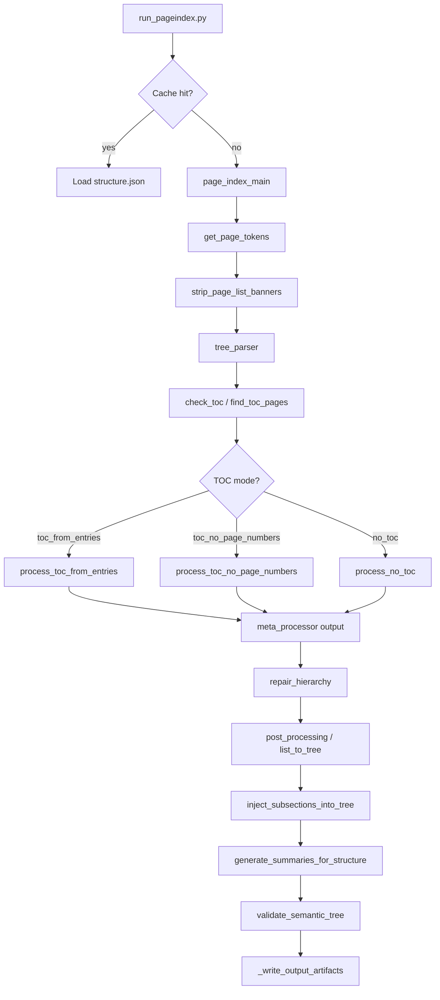

# PageIndex — Complete Technical Deep Dive

> **Audience:** Developers who need to understand PageIndex from first principles through implementation details.  
> **Scope:** The locally modified PageIndex inside `topic2manim/PageIndex/`, based on [VectifyAI/PageIndex](https://github.com/VectifyAI/PageIndex) but adapted for **Ollama** (local SLMs), optional **NVIDIA NIM** cloud fallback, and optional **Gemini** fallback.

---

## Table of Contents

1. [What PageIndex Does (The Basics)](#1-what-pageindex-does-the-basics)
2. [Where It Fits in topic2manim](#2-where-it-fits-in-topic2manim)
3. [End-to-End Pipeline Overview](#3-end-to-end-pipeline-overview)
4. [Repository Layout](#4-repository-layout)
5. [Running PageIndex](#5-running-pageindex)
6. [Configuration System](#6-configuration-system)
7. [Stage 0 — Entry Point & Cache](#7-stage-0--entry-point--cache)
8. [Stage 1 — PDF Text Extraction](#8-stage-1--pdf-text-extraction)
9. [Stage 2 — Table of Contents Detection](#9-stage-2--table-of-contents-detection)
10. [Stage 3 — TOC Processing (Three Paths)](#10-stage-3--toc-processing-three-paths)
11. [Stage 4 — Tree Construction](#11-stage-4--tree-construction)
12. [Stage 5 — Hierarchy Repair & Subsection Injection](#12-stage-5--hierarchy-repair--subsection-injection)
13. [Stage 6 — Large-Node Splitting](#13-stage-6--large-node-splitting)
14. [Stage 7 — Summary Generation & Metadata](#14-stage-7--summary-generation--metadata)
15. [Stage 8 — Validation & Artifact Writing](#15-stage-8--validation--artifact-writing)
16. [The LLM Layer](#16-the-llm-layer)
17. [Deterministic Algorithms (No LLM)](#17-deterministic-algorithms-no-llm)
18. [Pydantic Schemas](#18-pydantic-schemas)
19. [Quality Tiers & Routing Policy](#19-quality-tiers--routing-policy)
20. [Checkpoints, Resume & Caching](#20-checkpoints-resume--caching)
21. [Output Artifacts Reference](#21-output-artifacts-reference)
22. [Downstream Integration](#22-downstream-integration)
23. [Legacy Code (Preserved but Unused)](#23-legacy-code-preserved-but-unused)
24. [Function & Module Index](#24-function--module-index)
25. [Mental Model & Design Principles](#25-mental-model--design-principles)

---

## 1. What PageIndex Does (The Basics)

### The problem

Educational PDFs (textbooks, syllabi, lab manuals) are long, unstructured blobs of text. To generate targeted educational videos or answer “where is topic X covered?”, you need a **machine-readable map** of the document:

- What are the chapters and sections?
- Which **physical PDF pages** does each section span?
- What is each section **about** (summary, keywords)?

### The solution

PageIndex converts a PDF into a **hierarchical tree index** — essentially a smart, enriched table of contents:

```
Document
├── Preface (pages 1–1)
├── Chapter 1: Atoms and Molecules (pages 2–45)
│   ├── 1.1 Laws of Chemical Combination (pages 3–8)
│   └── 1.2 Dalton's Atomic Theory (pages 9–15)
└── Chapter 2: Structure of Atom (pages 46–90)
    └── ...
```

Each node carries:

| Field | Meaning |
|-------|---------|
| `title` | Section/chapter title |
| `start_page` / `end_page` | Inclusive 1-based PDF page range |
| `structure` | Hierarchical numbering (`"1"`, `"1.2"`, `"1.2.3"`) |
| `level` | Depth in tree (1 = chapter, 2 = section, …) |
| `node_id` | Stable ID (`"0000"`, `"0001"`, …) |
| `summary` | 2–5 sentence description (optional) |
| `keywords` | Top terms for retrieval |
| `semantic_tags` | Curriculum tags (`atomic-structure`, etc.) |
| `content_type` | `chapter`, `section`, `preface`, … |

### Key design choice in this fork

The upstream PageIndex relied heavily on cloud LLMs (OpenAI). **This fork prioritizes:**

1. **Local inference** via Ollama (`pageindex/local_llm.py`)
2. **Deterministic fallbacks** (regex TOC parsing, fuzzy page matching, extractive summarization)
3. **Optional cloud escalation** (NVIDIA NIM under `--max-quality`, Gemini on failure)

That tradeoff: **free and offline**, but **slow** on MacBook Air class hardware, and **quality depends on model size**.

---

## 2. Where It Fits in topic2manim

```
PDF textbook
    │
    ▼
PageIndex  ──►  results/<name>.pdf/structure.json
    │                    │
    │                    ├── summaries.json
    │                    ├── extracted_pages.json
    │                    └── pipeline_metrics.json
    │
    ▼
topic2manim backend / retrieval / video planning
    │
    ▼
Manim scene generation + narration
```

PageIndex is the **curriculum intelligence layer**. It does **not** render videos. Downstream code (e.g. `backend/modules/retrieval/pageindex_retriever.py`, planning modules) reads `structure.json` to locate relevant pages and context for a given topic.

Indexing and video generation are **separate steps** today: run PageIndex first, then consume artifacts.

---

## 3. End-to-End Pipeline Overview

The orchestrator is `page_index_main()` in `pageindex/page_index.py`. The active architecture (as documented in that file’s module docstring) is:

```
PDF file
  │
  ├─► get_page_tokens()           Extract text + token counts per page
  │
  ├─► find_toc_pages()            Detect TOC (deterministic regex OR LLM batches)
  │       └─► check_toc()         Classify into one of 3 modes
  │
  ├─► meta_processor()            Flat list with physical_index per TOC entry
  │       ├─ toc_from_entries     (TOC has page numbers)
  │       ├─ toc_no_page_numbers  (TOC without pages — LLM assigns)
  │       └─ no_toc               (No TOC — LLM outlines body text)
  │
  ├─► repair_hierarchy()          Fix numbering, drop junk, synthesize parents
  ├─► post_processing()           Assign page spans, build nested tree
  ├─► inject_subsections_into_tree()  Add children if chapters are flat
  │
  ├─► process_large_node_recursively()  (optional) Split oversized chapters
  │
  ├─► generate_summaries_for_structure()  Per-node summaries
  ├─► validate_semantic_tree()    Quality gates
  │
  └─► Write structure.json, tree.json, summaries.json, metrics
```

### Pipeline diagram



---

## 4. Repository Layout

```
PageIndex/
├── run_pageindex.py          # CLI entry point
├── requirements.txt
├── ONBOARDING.md             # Setup & quick start (user-facing)
├── PAGEINDEX_DEEP_DIVE.md    # This document
│
├── pageindex/                # Core Python package
│   ├── __init__.py           # Re-exports page_index, retrieve, client
│   ├── page_index.py         # ★ Main pipeline orchestrator
│   ├── page_index_md.py      # Markdown → tree (alternate input)
│   ├── utils.py              # PDF I/O, tree ops, summaries, ConfigLoader
│   ├── local_llm.py          # Ollama structured generation
│   ├── model_router.py       # Per-stage model selection
│   ├── nvidia_hybrid.py      # NVIDIA NIM cloud fallback
│   ├── deterministic_toc.py  # Regex TOC parser (no LLM)
│   ├── hierarchy_repair.py   # Junk filter, subsection injection, title polish
│   ├── heading_hints.py      # Heuristics for heading vs noise
│   ├── extractive.py         # Textrank-style summarization (no LLM)
│   ├── validators.py         # Semantic tree validation
│   ├── quality_policy.py     # fast / balanced / high routing
│   ├── schemas.py            # Pydantic models for LLM JSON
│   ├── json_repair.py        # Parse/repair malformed LLM JSON
│   ├── telemetry.py          # PipelineMetrics
│   ├── pedagogy_metadata.py  # learning_objectives, semantic_tags
│   ├── results_loader.py     # Read artifacts programmatically
│   ├── config.yaml           # Default configuration
│   └── retrieve.py           # Document retrieval / benchmark
│
├── results/                  # Per-PDF output (gitignored in practice)
│   └── Chemistry.pdf/
│       ├── structure.json
│       ├── extracted_pages.json
│       └── ...
│
├── logs/                     # JsonLogger run logs
└── examples/documents/       # Place your PDFs here
```

---

## 5. Running PageIndex

### Minimal command

```bash
cd topic2manim/PageIndex
PYTHONPATH=. python run_pageindex.py \
  --pdf_path "examples/documents/your_textbook.pdf" \
  --model qwen2.5:3b
```

`PYTHONPATH=.` is required so `import pageindex` resolves to the local package.

### Important CLI flags

| Flag | Effect |
|------|--------|
| `--pdf_path` | Required for PDF mode |
| `--md_path` | Alternative: index a Markdown file |
| `--model` | Override default Ollama model |
| `--cpu` / `--gpu` | Select `cpu_mode` vs `gpu_mode` profile from config |
| `--demo` | Short run: ~5 pages, shallow tree, demo_overrides |
| `--max-pages N` | Truncate to first N pages |
| `--no-summaries` | Skip summary stage (faster) |
| `--resume` | Load checkpoints from `results/<pdf>/` |
| `--force-reindex` | Ignore SHA-256 cache |
| `--quality` | Route heavy stages to `qwen2.5-coder:7b` |
| `--max-quality` | Enterprise mode: long timeouts, NVIDIA hybrid |
| `--quality-level high` | Maximum accuracy: LLM-first everything |
| `--pdf-parser PyMuPDF` | Use PyMuPDF instead of PyPDF2 |
| `--fail-on-missing-model` | Exit if configured Ollama model not pulled |
| `--no-gemini-fallback` | Don't call Gemini API on local failure |

### What `run_pageindex.py` does beyond calling the pipeline

1. **Resolves PDF path** — tries CWD, script dir, strips erroneous `PageIndex/` prefix (`_resolve_existing_file`)
2. **SHA-256 cache** — if `structure.json` + `structure.json.hash` match current PDF bytes, skip indexing
3. **Builds `user_opt` dict** — merges CLI args into `ConfigLoader().load()`
4. **Prints tree** — `print_tree()` after completion
5. **Writes cache hash** — `_write_cache()` after successful run

---

## 6. Configuration System

Configuration lives in `pageindex/config.yaml` and is loaded by `ConfigLoader` in `pageindex/utils.py`.

### Layering order

When you call `ConfigLoader().load(user_opt)`:

1. Load base `config.yaml`
2. Merge CLI / programmatic overrides (`user_opt`)
3. Apply **mode profile**: `cpu_mode` or `gpu_mode` keys (timeouts, batch sizes, …)
4. If `--demo`: apply `demo_overrides`
5. If `--max-quality` or `quality_level=high`: merge `max_quality_mode` / `high_quality_mode`
6. Call `configure_from_opt()` → propagates limits into `local_llm.py`, `model_router.py`, `nvidia_hybrid.py`

### Key config knobs

| Key | Typical CPU value | Purpose |
|-----|-------------------|---------|
| `generation_model` | `ollama/qwen2.5:3b` | Default Ollama model |
| `toc_check_page_num` | 10 | Pages scanned for TOC |
| `toc_pages_per_batch` | 2 | Pages per LLM TOC batch |
| `toc_page_chars_limit` | 4000 | Max chars per page in TOC prompt |
| `toc_batch_timeout_seconds` | 60 | Per-batch TOC timeout |
| `inference_timeout_seconds` | 120 | Default LLM call timeout |
| `max_prompt_tokens` | 4500 | Token budget guard |
| `recursive_depth` | 0 | Large-node splitting depth (0 = off on CPU) |
| `max_page_num_each_node` | 12 | Split chapter if span exceeds |
| `extractive_min_confidence` | 0.45 | Threshold for non-LLM summaries |

### Stage-specific models

`stage_models` maps pipeline stages to models:

```yaml
stage_models:
  toc_detection: "ollama/qwen2.5:3b"
  no_toc_outline: "ollama/qwen2.5:3b"
  chapter_summary: "ollama/qwen2.5:3b"
  summary_generation: "ollama/qwen2.5:3b"
  title_cleanup: "ollama/qwen2.5:3b"
```

`model_router.model_for_stage(stage, default)` returns the override if set.

---

## 7. Stage 0 — Entry Point & Cache

### `page_index_main(doc, opt)` — the heart

**File:** `pageindex/page_index.py`  
**Signature:** `page_index_main(doc, opt=None) -> dict`

**Steps:**

1. Reset global split counter (`MAX_LARGE_NODE_SPLITS = 4`)
2. Reset runtime telemetry (`reset_runtime_summary()`, `reset_junk_filter_stats()`)
3. Create `JsonLogger(doc)` → logs to `logs/<pdf>_<timestamp>.json`
4. Create `PipelineCheckpoints(results/<pdf_name>/)`
5. Reset `PipelineMetrics`
6. Extract or resume pages
7. Run async `page_index_builder()` via `asyncio.run()`
8. Dump metrics, print runtime summary

### Cache mechanism (`run_pageindex.py`)

```python
def _is_cached(pdf_path, output_dir) -> bool:
    # structure.json exists AND structure.json.hash == SHA256(pdf bytes)
```

Cache is **content-addressed**: renaming the file does not invalidate; changing PDF bytes does.

---

## 8. Stage 1 — PDF Text Extraction

### `get_page_tokens(pdf_path, model, pdf_parser, use_api_tokenizer)`

**File:** `pageindex/utils.py`

**Returns:** `List[Tuple[str, int]]` — `(page_text, token_count)` per page, **0-indexed list = page 1 at index 0**.

**Parsers:**

| Parser | Library | When to use |
|--------|---------|-------------|
| `PyPDF2` | Default | Simple digital PDFs |
| `PyMuPDF` | `--pdf-parser PyMuPDF` | Merged/scanned PDFs where PyPDF2 fails |

PyPDF2 failure automatically falls back to PyMuPDF with a console message.

**Token counting:** By default uses `len(text)//4` (fast). With `use_api_tokenizer=True`, uses LiteLLM + `token_count_model` (e.g. `gemini/gemini-2.5-flash-lite`).

### Post-extraction cleaning

**`strip_page_list_banners(page_list)`** — Counts short lines appearing on ≥35% of pages; removes them as repeated headers/footers (NCERT watermarks, “CBSE Grade …”, etc.).

### Checkpoint

Saves `extracted_pages.json`:

```json
[
  {"page": 1, "token_count": 842, "text": "..."},
  {"page": 2, "token_count": 1203, "text": "..."}
]
```

With `--resume`, this file is loaded instead of re-parsing the PDF.

---

## 9. Stage 2 — Table of Contents Detection

### `find_toc_pages(start_page_index, page_list, opt, logger, results_dir)`

**File:** `pageindex/page_index.py`

Scans the first `opt.toc_check_page_num` pages (default 10–20) for a table of contents.

### Detection strategy (in order)

#### A. Deterministic single-page TOC (`deterministic_toc.py`)

1. `find_toc_page_index(page_texts)` — regex search for `TABLE OF CONTENTS` or `Contents` in first ~800 chars
2. `deterministic_parse_toc(full_toc_text)` — regex parsers for common layouts:
   - **Layout A:** `1.2 Title .......... 45` (dot leaders)
   - **Layout B:** Vertical triplet (number line / title line / page line)
   - **Layout C:** Title on one line, page number on next
3. Confidence score `_toc_confidence()` — entry density, monotonic page numbers, level variety, TOC header bonus
4. If `confidence >= toc_deterministic_min_confidence` (default 0.55) → **skip LLM entirely**

**Skipped when** `quality_level=high` (`skip_deterministic_toc(opt)` returns True) — forces LLM-only TOC for max accuracy.

#### B. Deterministic multi-page scan

If anchor page parse fails, concatenate all candidate pages and run `deterministic_parse_toc` on the batch.

#### C. LLM batched detection

**`_detect_toc_batch(batch_start, batch_end, page_list, opt, ...)`**

- Sends `toc_pages_per_batch` pages (often 1–2) to Ollama
- Each page truncated to `toc_page_chars_limit` chars
- Strips repeated headers via `_strip_headers_footers`
- Calls `generate_structured(..., TOCDetectionResult, stage="toc_detection")`
- Saves debug artifact: `raw_toc_batch_{N}.txt`

**On failure:** batch may be **halved** and retried (shrink strategy). Under `--max-quality`, may escalate to NVIDIA after timeouts.

**Merge rule:** Need `toc_found=True` and **≥3 entries** after deduplication.

### `check_toc(page_list, opt, logger, results_dir)`

Classifies result into one of three **modes**:

| Mode | Condition | Next stage |
|------|-----------|------------|
| `toc_from_entries` | ≥60% of entries have `page_number > 0` | `process_toc_from_entries` |
| `toc_no_page_numbers` | TOC found but pages missing | `process_toc_no_page_numbers` |
| `no_toc` | No usable TOC | `process_no_toc` |

Checkpoint: `toc_candidates.json` (list of `TOCEntry` dicts).

---

## 10. Stage 3 — TOC Processing (Three Paths)

All paths produce a **flat list** of dicts with at least `title`, `structure`, and `physical_index` (1-based PDF page).

### Path A: `process_toc_from_entries` (preferred)

**When:** Printed TOC included page numbers that the detector captured.

**Algorithm:**

1. `_toc_entries_to_flat_list(detection)` — maps `TOCEntry` → `{structure, title, page}` (deterministic, no LLM reparsing)
2. `convert_page_to_int()` — normalize page strings
3. **Direct pages vs offset extraction:**
   - If ≥80% of entries have pages → use TOC page numbers directly as `physical_index`
   - Else → `toc_index_extractor()` LLM call: match titles to `<physical_index_N>` tags in body pages after TOC
4. `map_toc_pages_to_physical()` — remap logical textbook page markers (`--- Page 12 ---`) to physical indices
5. `verify_page_anchors()` — fuzzy title match; nudge page ±2 if better score
6. `deterministic_repair_missing_pages()` — fill gaps via fuzzy search between neighbors

### Path B: `process_toc_no_page_numbers`

**When:** TOC text exists but entries lack page numbers.

1. `toc_transformer()` — LLM converts flat TOC text → `HierarchicalTOC` JSON
2. For each token-budget chunk of body pages, `add_page_number_to_toc()` — LLM marks where each section starts
3. `deterministic_repair_missing_pages()` — same fuzzy repair

### Path C: `process_no_toc`

**When:** No TOC detected (common for poorly scanned books).

1. Wrap every page in `<physical_index_N>` tags
2. Group pages into batches fitting `max_prompt_tokens - PROMPT_OVERHEAD_TOKENS`
3. For each batch: `generate_structured(..., HierarchicalTOC, stage="no_toc_outline")`
4. Skip batches with garbled OCR (`/G65`-style glyph codes)
5. On `TokenBudgetExceeded`: halve batch and retry once
6. Flatten hierarchical result via `_hierarchical_toc_to_flat_physical()`

### `meta_processor()` — common post-path cleanup

```python
async def meta_processor(page_list, mode, ...):
    # dispatch to one of three paths
    toc_with_page_number = ...
    # drop None physical_index
    toc_with_page_number = validate_and_truncate_physical_indices(...)
    toc_with_page_number = filter_junk_toc_entries(...)  # answer-key noise
    return toc_with_page_number
```

Checkpoint: `validated_toc.json`

---

## 11. Stage 4 — Tree Construction

### `tree_parser(page_list, opt, doc, logger, checkpoints, results_dir)`

**File:** `pageindex/page_index.py`

After `meta_processor` returns flat validated TOC:

1. **`add_preface_if_needed`** — if first section starts after page 1, insert synthetic `"Front Matter"` node at page 1
2. **`check_title_appearance_in_start_concurrent`** — sets `appear_start` yes/no using **deterministic fuzzy match** (`deterministic_appear_start`), not LLM
3. **`repair_hierarchy`** — normalize structure codes, synthesize missing parents, drop junk titles, enforce monotonic pages
4. **`post_processing(valid_toc_items, len(page_list), page_list, opt)`**:
   - `assign_page_spans` — compute `end_index` from next section’s start (respecting `appear_start`)
   - `semantic_boundary_refiner` — extend end page up to 2 pages if content continues
   - `list_to_tree` — nest flat list into tree by `structure` parent codes
5. **`semantic_dedupe`** — merge duplicate titles / heavy overlap

Checkpoint: `tree_structure.json`

### `assign_page_spans` — how page ranges work

For flat sorted sections `[S0, S1, S2, ...]`:

```
S_i.start_index = S_i.physical_index
S_i.end_index   = S_{i+1}.physical_index - 1   if S_{i+1}.appear_start == "yes"
                = S_{i+1}.physical_index         otherwise
S_last.end_index = total_pages
```

### `list_to_tree` — nesting by structure code

**File:** `pageindex/utils.py`

Structure `"1.2.3"` → parent is `"1.2"`. Nodes without resolvable parent become roots. Empty `nodes` arrays are removed for leaf nodes.

Each node gets `content_type` via `classify_content_type(title, level)`:

- `"preface"` — appendix, preface keywords
- `"chapter"` — level ≤ 1
- `"section"` — deeper levels

---

## 12. Stage 5 — Hierarchy Repair & Subsection Injection

Textbook PDFs often yield **flat chapters** (no children). PageIndex detects this and injects subsections.

### Early injection (in `tree_parser`)

```python
_early_val = validate_semantic_tree({"structure": toc_tree})
if not _early_val["checks"].get("chapters_have_children"):
    inject_subsections_into_tree(toc_tree, page_list, ...)
```

### `inject_subsections_into_tree`

**File:** `pageindex/hierarchy_repair.py`

For each chapter node without children:

#### Deterministic mode (default / fast / balanced)

`extract_section_headings_from_pages(page_list, start, end, parent_structure)` scans chapter pages for:

1. **Numbered headings:** `1.1 Title` via `_RE_NUMBERED_HEADING`
2. **ALL-CAPS headings:** `HEATING EFFECT OF CURRENT`
3. **Title-Case headings:** 2–9 capitalized words matching science hints

Uses `heading_hints.py` to reject junk (MCQ options, figure captions, answer keys).

#### LLM mode (`quality_level=high`)

`inject_subsections_llm()` sends chapter body (with page tags) to `generate_structured(..., HierarchicalTOC)`.

### `repair_hierarchy` details

- Normalizes structure strings (`"1.2."` → `"1.2"`)
- Creates synthetic parent nodes for orphan `"1.2.3"` when `"1.2"` missing
- Assigns orphan entries structure `{prev}.u{N}`
- Clips depth to 4 levels
- Drops entries with decreasing page numbers

### Final repair pass (in `page_index_builder`)

After summaries, if validation still fails `chapters_have_children` or `has_hierarchy_depth`, runs `inject_subsections_into_tree` again.

### Title polish (`quality_level=high`)

`polish_titles_llm()` — batched LLM cleanup of OCR-noisy titles via `TitlePolishBatch` schema.

---

## 13. Stage 6 — Large-Node Splitting

### `process_large_node_recursively(node, page_list, opt, logger, _depth=0)`

**When:** `opt.recursive_depth > 0` (GPU / max-quality profiles)

**Triggers split if** BOTH:
- Page span > `max_page_num_each_node` (default 10–12)
- Token sum > `max_token_num_each_node` (default 12k–20k)

**Behavior:**

1. Re-runs `meta_processor` in `no_toc` mode on the node’s page slice
2. Replaces node’s children with subdivisions
3. **Hard limits:**
   - `_depth > 0` → never recurse into children (depth-1 only)
   - Global cap `MAX_LARGE_NODE_SPLITS = 4` per document run

---

## 14. Stage 7 — Summary Generation & Metadata

### `generate_summaries_for_structure(structure, model, max_nodes, checkpoints, opt)`

**File:** `pageindex/utils.py`

**Order of work:**

1. Collect **leaf/section nodes** first, then **chapter nodes**
2. Respect `--max-pages` demo cap via `max_nodes`
3. **`reset_slm_summary_budget`** — limits LLM summary calls to `slm_fallback_ratio_max × node_count` (default 50–80%)

### Per-section summarization (`_run_summary_batch`)

For each node in batch:

1. **Garbled OCR?** → title-only stub summary
2. **`quality_level=high`?** → force LLM
3. Else → **`extractive.summarize(text)`** (Textrank-like sentence picking)
   - If `confidence >= extractive_min_confidence` → use extractive result, record path `extractive_summary`
   - Else → queue for LLM batch (`SummaryBatch` schema)

LLM batch prompt includes draft summary from extractive step for refinement.

### Chapter summarization (`_summarize_chapter_node`)

Prefer concatenating **child section summaries** (no LLM) when blob ≥200 chars.

Otherwise LLM via `stage="chapter_summary"` when `--quality` or high mode.

Fallback chain: child concat → extractive → `"This chapter covers: {title}."`

### Pedagogical metadata (`pedagogy_metadata.py`)

**`enrich_node_metadata(node, child_titles)`** — deterministic:

- `semantic_tags` from keyword/title term map (`atom` → `atomic-structure`)
- `learning_objectives` — templated from title
- `visualizable_elements` — Manim-friendly concepts
- `grade_appropriateness` — heuristic from document context

---

## 15. Stage 8 — Validation & Artifact Writing

### `validate_semantic_tree(result, logger, fragment_max_ratio)`

**File:** `pageindex/validators.py`

| Check | Meaning |
|-------|---------|
| `has_hierarchy_depth` | At least one node has children |
| `chapters_have_children` | Every chapter node has children |
| `summaries_non_empty` | Summaries ≥30 chars, not fragment-heavy |
| `summaries_not_title_only` | Not just "This section covers: X" |
| `semantic_tags_present` | Tags on summary nodes |
| `monotonic_spans` | Page ranges non-decreasing, end ≥ start |
| `no_minimal_success` | Pipeline didn't fall back to per-page flat structure |
| `no_junk_headings` | No NCERT boilerplate titles |
| `min_node_count` | Adaptive minimum (≥ chapters + 1 or 6) |
| `ocr_quality_ok` | Advisory: all chapter summaries aren't title-only |

Failures → stored in `result["validation_warnings"]` and `semantic_validation.json`.

### `_write_output_artifacts`

Writes:

| File | Content |
|------|---------|
| `structure.json` | Full document record; `structure` uses `children` key (export format) |
| `tree_structure.json` | Same as structure export |
| `tree.json` | Alias for video pipeline |
| `summaries.json` | Flat list of nodes with summaries |

In-memory tree uses `nodes`; exported JSON uses `children` via `nodes_to_children_export()`.

### Fallback: `_minimal_flat_structure`

On catastrophic `PipelineStageFailure` during tree build:

```python
[{"node_id": "0000", "title": "Page 1", "start_index": 1, "end_index": 1}, ...]
```

One node per page — pipeline still exits “successfully” but validation will fail.

---

## 16. The LLM Layer

### Architecture

```
generate_structured(prompt, Schema, stage=...)
        │
        ├─► assert_prompt_within_budget()
        ├─► model_for_stage(stage) → Ollama model name
        ├─► _call_slm() → ollama.Client.chat(format="json")
        ├─► json_repair.repair_and_parse() → Pydantic validate
        │
        ├─ on TimeoutError + max_quality + nvidia eligible:
        │       nvidia_generate_raw() → NVIDIA NIM API
        │
        └─ on exhausted retries + GEMINI_API_KEY:
                _call_gemini_fallback() → LiteLLM or google.generativeai
```

### `generate_structured` — critical parameters

| Param | Purpose |
|-------|---------|
| `stage` | Telemetry + model routing + timeout policy |
| `batch_index` | Logging / debug |
| `inference_options` | Ollama `num_predict`, `temperature`, … |
| `timeout_seconds` | Per-call override (TOC batches use `toc_batch_timeout_seconds`) |
| `fail_fast_json` | TOC: skip batch on parse error instead of retry |
| `skip_budget_check` | Rare bypass of token limit |

### JSON repair (`json_repair.py`)

Local models often emit malformed JSON. Repair pipeline:

1. Strip markdown fences
2. Fix trailing commas, truncated strings
3. Pydantic validation
4. Retry prompt with minified partial schema
5. TOC-specific: `regex_salvage_toc()` extracts entries from broken output

### NVIDIA hybrid (`nvidia_hybrid.py`)

Activated when `hybrid_nvidia_enabled: true` (max-quality / high).

- API: `https://integrate.api.nvidia.com/v1/chat/completions`
- Requires `NVIDIA_API_KEY` env var
- Models: `meta/llama-3.3-70b-instruct` (primary), `nvidia/nemotron-3-nano-30b-a3b` (fallback)
- Uses guided JSON when `use_guided_json: true`
- Escalation after N local timeouts per stage (`nvidia_route_after_timeouts`)

### Runtime telemetry

`print_runtime_summary()` at end:

```
total inference calls, local vs fallback, avg latency, tree node count, summary count
```

`PipelineMetrics.dump()` → `pipeline_metrics.json` (stage timings, timeouts, truncations, shrink events).

---

## 17. Deterministic Algorithms (No LLM)

| Function | File | Purpose |
|----------|------|---------|
| `deterministic_parse_toc` | `deterministic_toc.py` | Regex TOC extraction |
| `deterministic_appear_start` | `utils.py` | Fuzzy title-at-page-start (rapidfuzz) |
| `deterministic_repair_missing_pages` | `utils.py` | Fill missing page indices |
| `verify_page_anchors` | `utils.py` | ±2 page nudge by fuzzy score |
| `map_toc_pages_to_physical` | `hierarchy_repair.py` | Logical → physical page map |
| `extract_section_headings_from_pages` | `hierarchy_repair.py` | Subsection detection |
| `extractive.summarize` | `extractive.py` | Textrank sentence selection |
| `filter_junk_toc_entries` | `hierarchy_repair.py` | Drop answer-key headings |
| `semantic_dedupe` | `utils.py` | Merge duplicate/overlapping nodes |
| `strip_page_list_banners` | `utils.py` | Remove repeated headers |

### Extractive summarization internals

1. `_clean_for_summary` — drop MCQ lines, watermarks, figure captions
2. `_split_sentences` — sentence split + fragment filter
3. `_textrank_scores` — TF × position scoring
4. Pick top N sentences → `_score_confidence` → if ≥ threshold, skip LLM

---

## 18. Pydantic Schemas

**File:** `pageindex/schemas.py`

All LLM structured outputs validate against these models (`strict=True`):

| Schema | Used in stage |
|--------|---------------|
| `TOCDetectionResult` | `toc_detection` — `{toc_found, toc_entries: [TOCEntry]}` |
| `TOCEntry` | `{title, page_number, structure}` |
| `HierarchicalTOC` | `no_toc_outline`, `toc_transformer`, subsection LLM |
| `TOCPhysicalIndexList` | `toc_index_extractor` |
| `AddPageNumberResult` | `add_page_number_to_toc` |
| `SummaryBatch` | `summary_generation` — `{nodes: [NodeSummary]}` |
| `NodeSummary` | `{node_id, summary, keywords, semantic_tags, content_type}` |
| `TitlePolishBatch` | `title_cleanup` |
| `DocDescription` | `doc_description` |
| `PlainSummary` | `chapter_summary` — `{summary}` |

Legacy schemas (`ThinkingCompleted`, `TitleAppearanceAnswer`, …) support **legacy functions** only.

---

## 19. Quality Tiers & Routing Policy

**File:** `pageindex/quality_policy.py`

| Tier | CLI | Behavior summary |
|------|-----|------------------|
| **fast** | (default) | Deterministic TOC when confident; extractive summaries; deterministic subsections |
| **balanced** | `--max-quality` | Longer timeouts; `qwen2.5-coder:7b` on heavy stages; NVIDIA hybrid |
| **high** | `--quality-level high` | Skip deterministic TOC; force LLM summaries & subsections; title polish; junk filter relaxed |

`log_quality_path_summary()` prints deterministic vs LLM call counts at end.

### Model promotion under quality flags

| Flag | Models affected |
|------|-----------------|
| `--quality` | `chapter_summary`, `toc_index_extractor`, `no_toc_outline` → coder 7b |
| `--max-quality` | Above + `toc_detection`, `title_cleanup`, `tree_construction` |
| `quality_level=high` | All heavy stages + `summary_generation`, `extractive_polish`, `ocr_cleanup` |

---

## 20. Checkpoints, Resume & Caching

### Three persistence mechanisms

| Mechanism | Trigger | Storage |
|-----------|---------|---------|
| **SHA-256 cache** | Same PDF bytes, no `--force-reindex` | `structure.json.hash` |
| **Pipeline checkpoints** | `--resume` | Individual JSON files in `results/<pdf>/` |
| **Summary cache** | During summary stage | `summary_cache.json` |

### Checkpoint files and order

```
extracted_pages.json     ← Stage 1
toc_candidates.json      ← Stage 2
validated_toc.json       ← Stage 3
tree_structure.json      ← Stage 4
summaries.json           ← Stage 7 (optional)
structure.json           ← Final
semantic_validation.json ← Final
pipeline_metrics.json    ← Final
```

`PipelineCheckpoints.is_done(filename, resume)` returns False unless `--resume` is set.

---

## 21. Output Artifacts Reference

### `structure.json` (primary deliverable)

```json
{
  "doc_name": "Chemistry.pdf",
  "structure": [
    {
      "title": "Chapter 1: Some Basic Concepts",
      "structure": "1",
      "level": 1,
      "node_id": "0001",
      "parent_id": null,
      "start_page": 3,
      "end_page": 28,
      "start_index": 3,
      "end_index": 28,
      "summary": "...",
      "keywords": ["mole", "atomic mass"],
      "semantic_tags": ["general-concept"],
      "learning_objectives": ["Understand ..."],
      "visualizable_elements": ["..."],
      "grade_appropriateness": "Class IX",
      "content_type": "chapter",
      "children": [ /* nested sections */ ]
    }
  ],
  "validation_warnings": []  // optional
}
```

### Debug / intermediate files

| File | Use |
|------|-----|
| `raw_toc_batch_N.txt` | Exact TOC detection prompt + result |
| `toc_candidates.json` | Raw detected TOC entries |
| `validated_toc.json` | Flat list after page assignment |
| `extracted_pages.json` | Full page text dump |
| `pipeline_metrics.json` | Stage timings, failures, inference counts |
| `semantic_validation.json` | Pass/fail per check |

### Reading artifacts in code

```python
from pageindex.results_loader import DocumentArtifacts

artifacts = DocumentArtifacts.from_pdf_path("examples/documents/Chemistry.pdf")
structure = artifacts.load("structure.json")
all_nodes = artifacts.walk_nodes()
```

---

## 22. Downstream Integration

### Expected consumer contract

1. Load `results/<pdf_basename>/structure.json`
2. Walk `structure` array recursively — exported format uses **`children`**, not `nodes`
3. Use `start_page`/`end_page` (or `start_index`/`end_index`) for PDF slicing
4. Use `summary` + `keywords` for retrieval ranking

### topic2manim touchpoints

- `backend/modules/retrieval/pageindex_retriever.py` — keyword/title matching over tree
- `backend/modules/planning/storyboard.py` — may consume section context when wired
- Scripts like `scripts/build_chemistry9_semantic_layer.py` — enrich artifacts further

PageIndex output is **necessary but not sufficient** for video generation — additional semantic layers (`concept_graph.json`, etc.) may be built separately.

---

## 23. Legacy Code (Preserved but Unused)

`page_index.py` retains functions prefixed `_LEGACY_` for backward compatibility with tests and external callers. **The active pipeline does not call them.**

Examples:

| Legacy function | Original purpose |
|-----------------|------------------|
| `_LEGACY_toc_extractor` | Raw TOC text + page index detection loop |
| `_LEGACY_verify_toc` | LLM probabilistic TOC verification |
| `_LEGACY_fix_incorrect_toc_with_retries` | LLM repair of wrong page anchors |
| `_LEGACY_check_title_appearance` | LLM “does title appear on page?” |

The stabilized pipeline replaced these with deterministic fuzzy matching and regex TOC parsing to reduce LLM call count and failure modes.

---

## 24. Function & Module Index

### Entry & orchestration

| Symbol | File | Role |
|--------|------|------|
| `page_index_main` | `page_index.py` | Top-level PDF indexer |
| `tree_parser` | `page_index.py` | TOC → tree orchestration |
| `page_index` | `page_index.py` | Thin wrapper with ConfigLoader |
| `md_to_tree` | `page_index_md.py` | Markdown indexing path |

### TOC pipeline

| Symbol | File | Role |
|--------|------|------|
| `find_toc_pages` | `page_index.py` | TOC detection |
| `check_toc` | `page_index.py` | Mode classification |
| `process_toc_from_entries` | `page_index.py` | TOC with page numbers |
| `process_toc_no_page_numbers` | `page_index.py` | TOC without pages |
| `process_no_toc` | `page_index.py` | Body outline inference |
| `meta_processor` | `page_index.py` | Path dispatch + cleanup |
| `parse_toc` | `deterministic_toc.py` | Regex TOC parser |
| `find_toc_page_index` | `deterministic_toc.py` | Locate TOC page |

### Tree building

| Symbol | File | Role |
|--------|------|------|
| `post_processing` | `utils.py` | Spans + tree nest |
| `list_to_tree` | `utils.py` | Flat → nested |
| `assign_page_spans` | `utils.py` | Compute end_index |
| `repair_hierarchy` | `hierarchy_repair.py` | Fix structure codes |
| `inject_subsections_into_tree` | `hierarchy_repair.py` | Add section children |
| `semantic_dedupe` | `utils.py` | Dedup nodes |

### Summaries & metadata

| Symbol | File | Role |
|--------|------|------|
| `generate_summaries_for_structure` | `utils.py` | Batch summarize all nodes |
| `summarize` | `extractive.py` | Deterministic summary |
| `enrich_node_metadata` | `pedagogy_metadata.py` | Tags, objectives |

### LLM infrastructure

| Symbol | File | Role |
|--------|------|------|
| `generate_structured` | `local_llm.py` | Core inference + validate |
| `configure_from_opt` | `local_llm.py` | Apply config to globals |
| `model_for_stage` | `model_router.py` | Stage → model name |
| `nvidia_generate_raw` | `nvidia_hybrid.py` | Cloud escalation |

### Config & I/O

| Symbol | File | Role |
|--------|------|------|
| `ConfigLoader.load` | `utils.py` | Merge YAML + CLI |
| `PipelineCheckpoints` | `utils.py` | Resume artifacts |
| `get_page_tokens` | `utils.py` | PDF extraction |
| `DocumentArtifacts` | `results_loader.py` | Read results |
| `validate_semantic_tree` | `validators.py` | Quality gates |

---

## 25. Mental Model & Design Principles

### 1. Deterministic first, LLM when needed

Every stage tries regex/fuzzy/extractive methods before spending inference budget. High-quality mode inverts this intentionally.

### 2. Flat intermediate, nested output

The pipeline thinks in **flat sorted TOC rows** until `list_to_tree`. Page assignment happens on the flat list where sort order is unambiguous.

### 3. Fail soft, validate hard

Individual LLM batches can fail (skip segment, shrink batch, salvage JSON) without killing the run. Validation records quality problems in `validation_warnings` rather than always aborting.

### 4. Token budget as a first-class constraint

MacBook-local models have small context windows. `TokenBudgetExceeded` propagates upward to trigger batch shrinking — not silent truncation of prompts (except controlled pre-tokenize in `_pre_tokenize_truncate`).

### 5. Content-addressed caching

Indexing a 200-page textbook may take 30–90+ minutes. Reuse `structure.json` until the PDF changes.

### 6. Educational PDF heuristics everywhere

NCERT/SCERT-specific noise (watermarks, answer keys, doubled TOC text, `/G##` OCR glyphs) has dedicated detectors because generic document AI assumptions fail on Indian textbook PDFs.

---

## Quick Reference: Which file do I edit for…?

| Goal | Start here |
|------|------------|
| Change default model/timeouts | `pageindex/config.yaml` |
| Improve TOC regex parsing | `pageindex/deterministic_toc.py` |
| Tune heading detection | `pageindex/heading_hints.py` |
| Change summary strategy | `pageindex/utils.py` (`generate_summaries_for_structure`, `_run_summary_batch`) |
| Add new LLM stage | `schemas.py` + call site + `stage_models` in config |
| Change validation rules | `pageindex/validators.py` |
| Change output JSON shape | `page_index.py` (`_write_output_artifacts`, `format_structure`) |
| Wire new cloud provider | `pageindex/local_llm.py` or new module mirroring `nvidia_hybrid.py` |

---

## Related documents

- [ONBOARDING.md](./ONBOARDING.md) — setup, CLI examples, troubleshooting
- [PAGEINDEX_IMPROVEMENT_PLAN.md](./PAGEINDEX_IMPROVEMENT_PLAN.md) — known issues and roadmap
- [topic2manim/INTEGRATION_GUIDE.md](../INTEGRATION_GUIDE.md) — how artifacts connect to the video pipeline

---

*Generated for the topic2manim PageIndex fork. For upstream behavior differences, compare against [VectifyAI/PageIndex](https://github.com/VectifyAI/PageIndex).*
