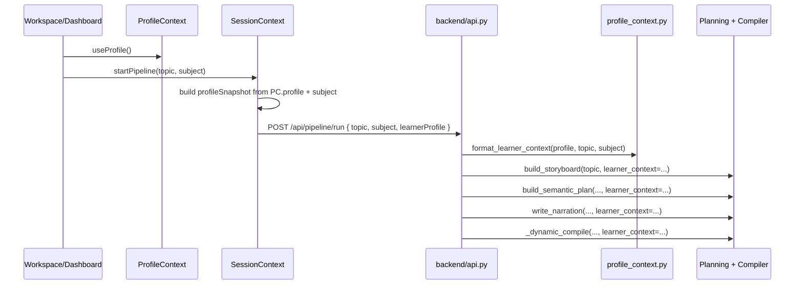

# Learner Profile Context — Implementation Guide

This document explains **where learner profile data lives in the frontend today**, **why it does not yet reach the LLM**, and **exactly how to wire it through** so storyboard, narration, semantic plans, and Manim code are personalized to the user’s academic level, learning style, pace, and subject confidence.

---

## 1. Executive summary

| Layer | Status today |
|-------|----------------|
| **Frontend** | Profile is collected (onboarding + Profile screen), stored in React context, synced to `profile.json` via API, and mirrored in `localStorage`. |
| **Pipeline trigger** | `POST /api/pipeline/run` sends only `topic`, `subject`, and API keys — **no profile**. |
| **Backend pipeline** | All LLM prompts use the raw `topic` string only. No reader for `profile.json` during generation. |
| **UI copy** | Profile page says settings are “synchronised with prompt context,” but that is **aspirational** until backend work below is done. |

**Goal:** Pass a normalized **learner profile snapshot** with every pipeline run and inject a formatted **“Learner Context”** block into every LLM system/user prompt that affects script and Manim output.

---

## 2. Where profile data is stored (frontend)

### 2.1 Canonical schema (`ProfileContext`)

**File:** [`frontend/src/context/ProfileContext.jsx`](../frontend/src/context/ProfileContext.jsx)

```javascript
const DEFAULT_PROFILE = {
  learner_id: '',
  name: '',
  academic_level: 'class_11',      // class_9 | class_10 | class_11 | class_12 | undergraduate | competitive
  exam_target: ['JEE'],            // array: JEE, NEET, CBSE, ICSE, Board Prep, Self-study, etc.
  learning_style: 'visual',        // visual | conceptual | example_first | equation_first
  pace_preference: 'balanced',     // slow_deep | balanced | fast_overview
  weak_subjects: [],               // reserved; not heavily used in UI yet
  confidence_map: {
    Chemistry: 50,
    Physics: 50,
    Mathematics: 50
  },
  created_at: '',
  updated_at: ''
};
```

### 2.2 Dual persistence strategy

| Store | Key / path | When written | When read |
|-------|------------|--------------|-----------|
| **React state** | `ProfileContext.profile` | `updateProfile()`, onboarding submit, initial guest creation | All screens via `useProfile()` |
| **localStorage** | `learnos_profile` | Every `updateProfile()` and guest bootstrap | Fallback if `/api/load/profile.json` fails or has no `learner_id` |
| **Backend disk** | `backend/data/user/profile.json` | `POST /api/persist` with `filename: "profile.json"` | `GET /api/load/profile.json` on app boot |

**Load order on startup** (`ProfileContext` `useEffect`):

1. `fetch('/api/load/profile.json')` — if response has `learner_id`, use server copy.
2. Else `localStorage.getItem('learnos_profile')`.
3. Else create new guest profile (`user-<random>`), save to localStorage only until first `updateProfile`.

### 2.3 Where users edit profile

| Screen | File | Fields captured |
|--------|------|-----------------|
| **Onboarding** (first run) | [`frontend/src/screens/Onboarding.jsx`](../frontend/src/screens/Onboarding.jsx) | `name`, `academic_level`, `exam_target`, `learning_style`, `pace_preference`, `confidence_map` |
| **Profile settings** | [`frontend/src/screens/Profile.jsx`](../frontend/src/screens/Profile.jsx) | Same + API keys in `localStorage` only (`GEMINI_API_KEY`, `NVIDIA_API_KEY`) |

Onboarding is shown when `profile.name` is empty after leaving the landing page ([`App.jsx`](../frontend/src/App.jsx) lines 57–62).

### 2.4 Profile usage in UI today (not in LLM)

| Consumer | Behavior |
|----------|----------|
| [`Dashboard.jsx`](../frontend/src/screens/Dashboard.jsx) | Sorts topic suggestions by **lowest** `confidence_map` subject. |
| [`Onboarding.jsx`](../frontend/src/screens/Onboarding.jsx) | Displays a static summary of choices (no LLM call). |
| [`Profile.jsx`](../frontend/src/screens/Profile.jsx) | Save message claims sync with “prompt context” (not wired to pipeline yet). |

### 2.5 What is **not** profile (related but separate)

| Data | Storage | Used for |
|------|---------|----------|
| API keys | `localStorage`: `GEMINI_API_KEY`, `NVIDIA_API_KEY` | Already sent in [`SessionContext.startPipeline`](../frontend/src/context/SessionContext.jsx) |
| Session / video | `session.json`, `history.json` | Playback, library — not learner prefs |
| Analytics | `analytics.json` | Dashboard metrics, `weak_topic_flags` (optional future signal) |

---

## 3. Pipeline entry point — the missing link

**File:** [`frontend/src/context/SessionContext.jsx`](../frontend/src/context/SessionContext.jsx)

`startPipeline(query, subject)` currently POSTs:

```javascript
body: JSON.stringify({
  topic: query,
  subject,
  apiKey: geminiApiKey || nvidiaApiKey,
  geminiApiKey,
  nvidiaApiKey
})
```

**`useProfile()` is never imported here.** The backend cannot personalize without extending this payload.

**Call sites that invoke the pipeline:**

- [`Workspace.jsx`](../frontend/src/screens/Workspace.jsx) — topic search form → `startPipeline(inputTopic, selectedSubject)`
- [`Dashboard.jsx`](../frontend/src/screens/Dashboard.jsx) — suggestion cards → `startPipeline(topicTitle, subject)`

Both should ultimately send the same profile snapshot (via context or explicit argument).

---

## 4. Backend today

### 4.1 API contract

**File:** [`backend/api.py`](../backend/api.py)

```python
class PipelineRunRequest(BaseModel):
    topic: str
    subject: str
    apiKey: Optional[str] = None
    geminiApiKey: Optional[str] = None
    nvidiaApiKey: Optional[str] = None
```

`run_pipeline_task(session_id, topic, ...)` receives **no profile**. It calls, in order:

1. Explanation package LLM (generic NCERT prompt)
2. `build_storyboard(topic)`
3. `build_all_semantic_plans(storyboard)`
4. `write_all_narrations(plans)`
5. `synchronize_all` → `semantic_compile_all` → `render` → `merge`

None of these functions accept a `learner_profile` argument today.

### 4.2 Schema mismatch (important)

If `profile.json` does not exist, the backend **default** from `GET /api/load/profile.json` uses a **different shape**:

```python
{
  "learner_id": "default-learner",
  "fullname": "Explorer",
  "learning_goal": "...",
  "favourite_subject": "Mechanics",
  "difficulty_level": "Standard",
  "curriculum_board": "CBSE (Class 10)",
  ...
}
```

The frontend never writes these fields. After the user saves profile in the UI, disk contains the **frontend schema** (`name`, `academic_level`, etc.).

**Recommendation:** Treat the frontend schema as canonical; update backend defaults to match, or add a normalizer that maps both shapes to one internal `LearnerProfile` model.

---

## 5. Target architecture



---

## 6. Implementation plan

### Phase 1 — Frontend: send profile with every run

#### 1.1 Import profile in `SessionContext`

```javascript
import { useProfile } from './ProfileContext';
```

Inside `SessionProvider`, read `const { profile } = useProfile();`  
**Caveat:** `SessionProvider` wraps inside `ProfileProvider` in `App.jsx` — order is correct.

#### 1.2 Build a serializable snapshot

Add a small helper (same file or `frontend/src/utils/profileSnapshot.js`):

```javascript
export function buildProfileSnapshot(profile, subject) {
  return {
    learner_id: profile.learner_id,
    name: profile.name || 'Learner',
    academic_level: profile.academic_level,
    exam_target: profile.exam_target || [],
    learning_style: profile.learning_style,
    pace_preference: profile.pace_preference,
    confidence_map: profile.confidence_map || {},
    subject_for_lesson: subject,
    subject_confidence: profile.confidence_map?.[subject] ?? 50,
  };
}
```

#### 1.3 Extend `startPipeline` body

```javascript
body: JSON.stringify({
  topic: query,
  subject,
  apiKey: geminiApiKey || nvidiaApiKey,
  geminiApiKey,
  nvidiaApiKey,
  learnerProfile: buildProfileSnapshot(profile, subject),
}),
```

Optional: also `POST /api/persist` profile before run so backend disk is fresh even if user skipped Profile save.

---

### Phase 2 — Backend: accept and thread profile

#### 2.1 Pydantic models (`api.py`)

```python
class LearnerProfilePayload(BaseModel):
    learner_id: str = ""
    name: str = "Learner"
    academic_level: str = "class_11"
    exam_target: list[str] = []
    learning_style: str = "visual"
    pace_preference: str = "balanced"
    confidence_map: dict[str, int] = {}
    subject_for_lesson: str = "Physics"
    subject_confidence: int = 50

class PipelineRunRequest(BaseModel):
    topic: str
    subject: str
    learnerProfile: Optional[LearnerProfilePayload] = None
    # ... existing API key fields
```

#### 2.2 Store on job + pass to task

```python
ACTIVE_JOBS[session_id] = {
    ...
    "learner_profile": req.learnerProfile.model_dump() if req.learnerProfile else None,
}

background_tasks.add_task(
    run_pipeline_task,
    session_id,
    req.topic,
    req.apiKey,
    req.geminiApiKey,
    req.nvidiaApiKey,
    req.learnerProfile.model_dump() if req.learnerProfile else None,
)
```

#### 2.3 Fallback: load from disk

If `learnerProfile` is omitted (CLI / old client):

```python
profile_path = USER_DATA_DIR / "profile.json"
if profile_path.exists():
    learner_profile = json.loads(profile_path.read_text())
```

---

### Phase 3 — `profile_context.py` (new backend module)

**File:** `backend/modules/planning/profile_context.py`

Responsibilities:

1. **Normalize** raw dict → consistent internal structure.
2. **Map** `academic_level` → grade band instructions (see table below).
3. **Map** `learning_style` + `pace_preference` → narration and visual rules.
4. **Emit** a single markdown block reused in all prompts.

Example API:

```python
def format_learner_context(
    profile: dict[str, Any] | None,
    topic: str,
    subject: str,
) -> str:
    """Return a prompt section (~400–800 chars) describing the learner."""
```

Example output block:

```text
LEARNER CONTEXT (personalize all content to this student):
- Name: Abhishek | Level: Class 11 (Senior Secondary) | Exams: JEE, CBSE
- Subject for this lesson: Physics (self-rated confidence: 42% — prioritize clarity and intuition)
- Learning style: visual — lead with diagrams, analogies, and Manim motion before equations
- Pace: slow_deep — longer holds, more step-by-step scenes, avoid skipping prerequisites
- Vocabulary: NCERT/JEE-appropriate; define jargon on first use
- Do NOT use examples far above this level (no graduate-only math unless topic requires it)
```

#### Grade band mapping (`academic_level` → LLM rules)

| `academic_level` | Narration | Equations in Manim | Scene complexity |
|------------------|-----------|--------------------|------------------|
| `class_9`, `class_10` | Simple sentences, everyday analogies | Minimal; labels over symbols | 3–4 scenes max detail per idea |
| `class_11`, `class_12` | Standard textbook + exam hooks | Full CBSE/JEE notation | Full 5-scene arc |
| `undergraduate` | Rigorous definitions | Derivations allowed | Deeper math overlays |
| `competitive` | Exam-trick awareness, time-efficient | Heavy equation focus if `equation_first` | Fast recap + drill |

#### Learning style → generation rules

| `learning_style` | Storyboard | Narration | Manim |
|------------------|------------|-----------|-------|
| `visual` | Prefer templates with motion (`magnetism`, `projectile`, `circular_motion`) | “Watch as…”, “Notice how…” | More `FadeIn`, trails, arrows |
| `conceptual` | Extra scene for “why” before “how” | Historical/intuitive framing | Fewer numbers, more labels |
| `example_first` | `anchor_example` = numerical scenario first | Open with a worked situation | Show numbers on screen early |
| `equation_first` | Include equation highlight events | State formula then interpret terms | `MathTex` / `Text` equations prominent |

#### Pace → timing hints (narration length / scene density)

| `pace_preference` | Narration word target | Storyboard |
|-------------------|----------------------|------------|
| `slow_deep` | 55–70 words/scene | Repeat misconception beat |
| `balanced` | 40–55 words/scene | Standard arc |
| `fast_overview` | 30–40 words/scene | Fewer events, summary-heavy |

#### Confidence → difficulty calibration

Use `subject_confidence` (0–100) for the **lesson subject**:

- **&lt; 40:** Assume weak foundation — define prerequisites in scene 1–2, slower narration, simpler anchor examples.
- **40–70:** Standard depth.
- **&gt; 70:** Can use denser notation and fewer hand-holding analogies.

Also compare `confidence_map` across Chemistry / Physics / Mathematics to add one line: “Student is weakest in X; if topic spans subjects, bridge gently.”

---

### Phase 4 — Inject into each LLM call site

| Stage | Module | Change |
|-------|--------|--------|
| Explanation package | `api.py` `run_pipeline_task` | Append `{learner_context}` to system prompt; ask for objectives matched to level. |
| Storyboard | `modules/planning/storyboard.py` | Add `{learner_context}` to `STORYBOARD_SYSTEM` or user prompt; tune `anchor_example` complexity. |
| Semantic plan | `modules/planning/semantic_plan.py` | Inject context; choose assets/events appropriate to style (e.g. more labels for `visual`). |
| Narration | `modules/planning/narration_writer.py` | Inject context into `NARRATION_PROMPT`; adjust word count by `pace_preference`. |
| Dynamic Manim | `modules/manim/semantic_compiler.py` `_dynamic_compile` | Inject context + equation density rules. |
| Concept guide (if present) | `concept_guide.py` | Select grade-appropriate subsection from `ideas.md` using `academic_level`. |

**Pattern for each module:**

```python
from modules.planning.profile_context import format_learner_context

def build_storyboard(topic: str, learner_profile: dict | None = None) -> list:
    ctx = format_learner_context(learner_profile, topic, subject="Physics")
    messages = [
        {"role": "system", "content": STORYBOARD_SYSTEM + "\n\n" + ctx},
        {"role": "user", "content": prompt},
    ]
```

Thread `learner_profile` from `run_pipeline_task` into every `build_*` call.

---

### Phase 5 — Align backend default `profile.json`

Update [`api.py`](../backend/api.py) fallback for `profile.json` to match frontend `DEFAULT_PROFILE` so CLI-only runs and fresh installs behave consistently.

---

### Phase 6 — Optional enrichments

| Source | Use |
|--------|-----|
| `analytics.json` → `weak_topic_flags` | Extra line in context: “Recently struggled with: …” |
| `history.json` | Avoid repeating same `anchor_example` across sessions |
| `subject` from Workspace dropdown | Already passed; drives `subject_confidence` |

---

## 7. Files to modify (checklist)

### Frontend

- [ ] `frontend/src/context/SessionContext.jsx` — import profile, send `learnerProfile`
- [ ] `frontend/src/utils/profileSnapshot.js` (new) — snapshot builder
- [ ] `frontend/src/screens/Profile.jsx` — optional: show “Profile will be sent with next generation” debug line in dev

### Backend

- [ ] `backend/api.py` — `LearnerProfilePayload`, extend `PipelineRunRequest`, thread through `run_pipeline_task`
- [ ] `backend/modules/planning/profile_context.py` (new) — formatter + mappings
- [ ] `backend/modules/planning/storyboard.py` — `learner_profile` param + prompt injection
- [ ] `backend/modules/planning/semantic_plan.py` — same
- [ ] `backend/modules/planning/narration_writer.py` — same + dynamic word limits
- [ ] `backend/modules/manim/semantic_compiler.py` — `_dynamic_compile` injection
- [ ] `backend/api.py` — explanation package prompt in `run_pipeline_task`

### Docs / tests

- [ ] `docs/PROFILE_CONTEXT_IMPLEMENTATION.md` (this file)
- [ ] Manual test matrix (Section 8)

---

## 8. Testing matrix

After implementation, verify with the same topic and different profiles:

| Test | Profile settings | Expected difference |
|------|------------------|---------------------|
| A | `class_9`, `slow_deep`, Physics confidence 30 | Shorter words, more analogies, simpler visuals |
| B | `class_12`, `equation_first`, Physics confidence 80 | Equations earlier, denser narration |
| C | `learning_style: visual` vs `conceptual` | Different anchor examples / scene emphasis |
| D | Subject Chemistry vs Physics | Confidence line reflects correct subject % |

**How to verify:**

1. Save profile on Profile screen.
2. Generate “Explain magnetism” from Workspace.
3. Inspect `backend/data/json/storyboard.json` and `semantic_plan_*.json` for level-appropriate goals.
4. Listen to narration / read `data/audio/scene_*.txt` for vocabulary level.
5. Compare Manim scripts in `data/manim/scene_*.py` for equation density.

---

## 9. Security and privacy notes

- Profile is stored locally under `backend/data/user/` — single-user deployment assumption.
- Do not log full profile in production logs; log `learner_id` + `academic_level` only.
- API keys remain in `localStorage` — unchanged; not part of `learnerProfile` payload.

---

## 10. Quick reference — data flow today vs target

```
TODAY:
  Onboarding/Profile → ProfileContext → persist → profile.json
  Workspace topic  → SessionContext  → /api/pipeline/run { topic, subject, keys }
  Backend LLM      → topic string only

TARGET:
  Onboarding/Profile → ProfileContext → persist → profile.json
  Workspace topic  → SessionContext  → /api/pipeline/run { topic, subject, keys, learnerProfile }
  Backend          → profile_context.format_learner_context()
                  → injected into storyboard | semantic_plan | narration | dynamic Manim
```

---

## 11. Related frontend files (index)

| File | Role |
|------|------|
| `frontend/src/context/ProfileContext.jsx` | Source of truth in React; load/save |
| `frontend/src/context/SessionContext.jsx` | **Injection point** for pipeline API |
| `frontend/src/screens/Onboarding.jsx` | Initial profile capture |
| `frontend/src/screens/Profile.jsx` | Edit profile + API keys |
| `frontend/src/screens/Workspace.jsx` | Triggers `startPipeline` |
| `frontend/src/screens/Dashboard.jsx` | Uses `confidence_map` for UI sorting only |
| `frontend/src/App.jsx` | Provider nesting: `ProfileProvider` → `SessionProvider` |
| `frontend/vite.config.js` | Proxies `/api` → `localhost:5000` |

---

## 12. Estimated effort

| Phase | Effort |
|-------|--------|
| Phase 1 — Frontend payload | ~1 hour |
| Phase 2 — API + threading | ~1–2 hours |
| Phase 3 — `profile_context.py` | ~2–3 hours |
| Phase 4 — Prompt injection (4 modules) | ~3–4 hours |
| Phase 5 — Schema alignment + tests | ~1–2 hours |

**Total:** ~1 day for a complete, tested personalization pass.

---

*Last updated: aligned with frontend `ProfileContext` schema and `backend/api.py` pipeline as of the current `topic2manim/` layout.*
