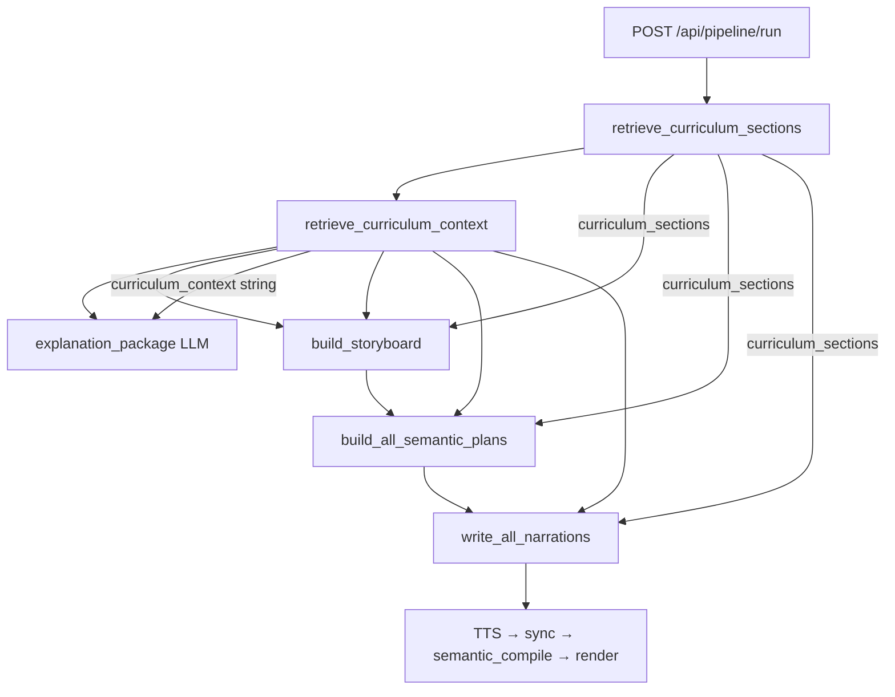

# PageIndex RAG Retrieval & Topic2Manim Video Pipeline — Diagnostic Analysis

**Repository:** `/Users/abhisheklgowda/Desktop/manim/topic2manim/`  
**Report date:** 2026-06-15  
**Audience:** External engineering agents (e.g. Grok) diagnosing wrong retrieval, poor visuals, weak pedagogy, and TTS/visual desync  
**Companion artifacts:** `INTEGRATION_STATUS.md`, `INTEGRATION_GUIDE.md`, indexed data under `PageIndex/results/`

---

## 1. Executive Summary

The Topic2Manim API pipeline **does** retrieve curriculum context from on-disk PageIndex artifacts and inject it into LLM planners, but integration health is **fragile and frequently wrong in practice**. The two dominant root causes of the reported symptoms are:

1. **Wrong retrieval (RAG):** Document routing defaults to the **newest** indexed folder (`ilovepdf_merged.pdf` as of this audit), not the Chemistry or Physics textbook the user expects. Scoring is naive **substring keyword overlap** over title/summary/keywords/semantic_tags — so a query like `"model of an atom"` matches `"atoms"` inside *Balanced Chemical Equations* nodes (score ≈ 1.3) instead of Rutherford/Bohr sections. The Workspace UI does **not** pass `documentId`; only Knowledge Graph does when the user clicks a node after selecting a document.

2. **Poor visuals / weak pedagogy / desync:** There is **no atomic-structure Manim template**. Chemistry topics are rendered through generic explain templates (`concept_card`, `diagram`, `comparison`, `timeline`, `equation`) that show **labeled circles, rectangles, and text cards** — or through `freeform`, where the LLM invents Manim using `Rectangle`/`Square`/`Circle` primitives. Explain templates **ignore per-event timeline `start` times** and only pad to total `audio_duration`, so narration anchor phrases and visual beats are **not time-aligned**. The 5-scene storyboard enforces template/anchor uniqueness but **not** the agreed arc (analogy → intuition → formal concept → example → summary).

**Integration health score (revised): 4.5 / 10** — backend wiring exists; default routing and visual/substrate gaps make end-user output unreliable without manual `documentId` or `PAGEINDEX_ACTIVE_DOC`.

---

## 2. Current Retrieval Architecture (`pageindex_retriever.py`)

**File:** `topic2manim/backend/modules/retrieval/pageindex_retriever.py`  
**Artifact loader:** `topic2manim/PageIndex/pageindex/results_loader.py` (`DocumentArtifacts`)

### 2.1 Module layout (`backend/modules/`)

```
backend/modules/
├── retrieval/
│   └── pageindex_retriever.py      # RAG entry point
├── planning/
│   ├── storyboard.py
│   ├── semantic_plan.py
│   ├── narration_writer.py
│   ├── profile_context.py
│   ├── asset_registry.py
│   └── visual_skeleton.py          # legacy beat skeleton (unused by semantic path)
├── templates/
│   ├── explain/                    # concept_card, comparison, diagram, equation, timeline
│   ├── mechanics/                  # intro, force, inertia, …, summary (17 files)
│   └── freeform.py
├── manim/
│   ├── semantic_compiler.py
│   ├── renderer.py
│   └── templates/                  # DiagramScene, ConceptCardScene, chalkboard_scene, …
├── sync/
│   ├── sync_engine.py
│   ├── timeline_builder.py
│   └── whisper_align.py
├── tts/piper_tts.py
├── assets/mechanics.py             # ASSET_REGISTRY (physics only)
└── config.py
```

> **Note:** There is no `synth/templates/` path. Templates live under `backend/modules/templates/` and `backend/modules/manim/templates/`.

### 2.2 `_resolve_doc_folder` — exact resolution order

```python
def _resolve_doc_folder(document_id: Optional[str] = None) -> Tuple[str, str]:
    # 1. Request document_id (if provided and matchable)
    if document_id:
        matched = _match_folder(document_id)
        if matched:
            return matched, "request"
        logger.warning("document_id=%r did not match any indexed folder; falling back", document_id)

    # 2. PAGEINDEX_ACTIVE_DOC env var
    env_doc = os.environ.get("PAGEINDEX_ACTIVE_DOC", "").strip()
    ...

    # 3. Newest structure.json by mtime
    newest = _newest_folder()
    if newest:
        return newest, "newest"

    # 4. Hardcoded Physics PDF basename
    return _DEFAULT_PDF.name, "default"
```

**`_match_folder`** tries exact folder name, `doc_id + ".pdf"`, strip `.pdf`, then fuzzy `needle in hay` substring match.

**Live resolution order (2026-06-15 audit):**

| `document_id` argument | Resolved folder | Source |
|------------------------|-----------------|--------|
| `None` (API default) | `ilovepdf_merged.pdf` | `newest` |
| `Chemistry.pdf` | `Chemistry.pdf` | `request` |
| `SCERT Kerala State Syllabus 10th Standard Physics Textbooks English Medium Part 1.pdf` | same | `request` |

**Why Chemistry topics silently hit the wrong book:** `Workspace.jsx` calls `startPipeline(topic, subject)` **without** `documentId`. With no env var set, `_newest_folder()` picks `ilovepdf_merged.pdf` (mtime Jun 14 21:23 — newer than Chemistry.pdf and Physics PDF). That merged index contains NCERT Class 10 **Chemical Reactions and Equations** content where node summaries/keywords include `"atoms"`, `"atomic-structure"`, and `"molecule model"` — which falsely score for atomic-model queries.

### 2.3 `_score_node` — full logic

```python
_TOP_K = 3
_CONTENT_CHAR_CAP = 3000

def _score_node(node: dict, topic_words: set) -> float:
    title = (node.get("title") or "").lower()
    summary = (node.get("summary") or "").lower()
    keywords = " ".join(node.get("keywords") or []).lower()
    tags = " ".join(node.get("semantic_tags") or []).lower()
    combined = f"{title} {summary} {keywords} {tags}"
    hits = sum(1 for w in topic_words if w in combined)   # substring match!
    depth_bonus = 0.1 * (node.get("level", 1) - 1)
    summary_bonus = 0.2 if len((node.get("summary") or "")) > 30 else 0.0
    return hits + depth_bonus + summary_bonus
```

**Topic tokenization** (`retrieve_curriculum_sections`):

```python
topic_words = set(w for w in topic.lower().split() if len(w) > 2)
```

- Filters words ≤2 chars (`"of"` dropped from `"model of an atom"` → `{model, atom}`).
- **Not used in scoring:** `learning_objectives`, `visualizable_elements`, `content_type`, breadcrumb/chapter context, `extracted_pages.json` body text, prerequisite graph.
- Preface nodes excluded: `if node.get("content_type") != "preface"`.

### 2.4 `curriculum_context` and `curriculum_sections` assembly

**`retrieve_curriculum_sections`** → list of up to `_TOP_K` nodes with `score > 0`, each dict containing:

- Metadata from `structure.json` node: title, breadcrumb, node_id, pages, summary, keywords, semantic_tags, learning_objectives, visualizable_elements, grade_appropriateness
- `prerequisites` from `concept_graph.json` (always `[]` today — file absent)
- `content`: page text via `artifacts.get_page_text(start, end, max_chars=3000, skip_garbled=True)`
- `document_id`, `artifacts_dir`, `score`

**`retrieve_curriculum_context`** / **`retrieve_curriculum`** flatten sections into `context_text`:

```
[{breadcrumb}] (pages start-end)
Summary: ...
Keywords: ...
Tags: ...
Prerequisites: ...
Objectives: ...
Source text:
[page N]
...
---
(next section)
```

Page text is loaded **after** ranking — it does not influence which nodes are selected.

### 2.5 Concrete bad retrieval example

**Query:** `"Rutherford atomic model"` or `"model of an atom"`  
**No `document_id` (Workspace default):**

```
score=1.30  doc=ilovepdf_merged.pdf  title='Writing a Chemical Equation'
score=1.30  doc=ilovepdf_merged.pdf  title='Balanced Chemical Equations'
score=1.30  doc=ilovepdf_merged.pdf  title='BONDING IN CARBON – THE COVALENT BOND'
```

**Mechanism:** `"atom"` matches substring `"atoms"` in equation-balancing summaries; `"model"` may match `"molecule model"` in keywords. Depth/summary bonuses tie-break unrelated sections.

**Same query with `document_id='Chemistry.pdf'` (correct):**

```
score=3.30  title="Rutherford's Gold Foil Experiment"
score=3.20  title='Unit 1 : Structure of Atom'
score=2.30  title='Plum Pudding Model of the Atom'
```

Source text for top hit correctly includes plum pudding model prose from pages 11–12.

**Query:** `"model of an atom"` with **Physics** PDF explicitly:

```
score=0.30  title='Introduction to Electric Current'   # only depth_bonus + summary_bonus
```

Physics textbook has **no atomic structure chapter** — retrieval returns weak electric-current sections.

---

## 3. Why Wrong Nodes Are Being Retrieved

| Factor | Status | Impact |
|--------|--------|--------|
| Substring keyword overlap | Active | `"atom"` ∈ `"atoms"`; `"model"` ∈ `"molecule model"` |
| No embedding / BM25 / PageIndex `retrieve.py` | `PageIndex/pageindex/retrieve.py` **unused** by backend | Misses semantic similarity |
| `learning_objectives` | Present in nodes, **not scored** | Generic boilerplate anyway |
| `semantic_tags` | Scored as lowercase joined string | Helps when tags match (`atomic-structure`) but drowned by substring false positives |
| Chapter context / breadcrumb | Not scored | Parent unit title ignored during ranking |
| `extracted_pages.json` | Used only post-rank for `content` field | Page evidence cannot correct a bad top-3 |
| `visualizable_elements` | In section dict, **not scored or passed to planners** | `"Bohr atom orbits"` on chapter node never steers visuals |
| `document_id` routing | **Partial** — API accepts it; Workspace omits it | Silent wrong textbook |
| Default = newest index | `ilovepdf_merged.pdf` today | Worse than Physics-only default described in older docs |
| `concept_graph.json` | **Missing** from all `PageIndex/results/*/` | `prerequisites` always `[]` |

**`concept_graph.json`:** Grep across `PageIndex/results/` — **zero files**. `_load_concept_graph` returns `{}`.

---

## 4. Curriculum Context Injection into LLM Planners

### 4.1 Data flow



### 4.2 `storyboard.py` — prompt construction

**System prompt:** 5-scene arc, distinct templates/anchors, no timing fields.

**User prompt** (`STORYBOARD_PROMPT`) includes:

```
CURRICULUM CONTEXT:
{curriculum_context}
...
- Use the curriculum context as the PRIMARY source of truth.
- Do not invent concepts that are not supported by the curriculum context.
- If the curriculum context is empty, fall back to general educational knowledge.
{learner_context}
```

**Anchor enrichment** (`_build_curriculum_anchor`) — only place `curriculum_sections` list is used:

```python
def _build_curriculum_anchor(curriculum_context, curriculum_sections):
    ...
    anchor_block = "MATCHED CURRICULUM SECTIONS:\n" + "\n".join(anchor_lines)
    return f"{anchor_block}\n\nDETAILED CONTEXT:\n{curriculum_context}"
```

Each anchor line: breadcrumb, page range, first 8 keywords.

### 4.3 `semantic_plan.py` and `narration_writer.py`

Both accept `curriculum_sections` in function signatures but **never reference it in prompts** — only `curriculum_context` string is injected:

```python
# semantic_plan.py — SEMANTIC_PLAN_EXPLAIN_PROMPT / SEMANTIC_PLAN_PROMPT
CURRICULUM CONTEXT:
{curriculum_context}
Use the curriculum context as the primary source of truth.
```

```python
# narration_writer.py — NARRATION_PROMPT
CURRICULUM CONTEXT:
{curriculum_context}
Use the curriculum context as the primary source of truth.
Do not contradict the curriculum context.
```

### 4.4 Do LLMs follow grounding instructions?

**In code:** Instructions are present but **soft** — no validation that output titles, `content` objects, or narration sentences cite retrieved sections. When retrieval is wrong, planners faithfully ground on **chemical equations** text. When retrieval is empty (`score == 0` for all nodes), storyboard explicitly allows parametric fallback.

**Narration repair loop** only enforces **anchor_phrase** substrings, not curriculum fidelity:

```python
missing = _find_missing(text, unique_phrases)  # case-insensitive substring
# After 3 attempts, uses best attempt even if phrases still missing
```

---

## 5. Pedagogical Structure Enforcement (5-Scene Storyboard)

### 5.1 Declared arc (`storyboard.py` module docstring)

```
Scene 1: intro (overview + key term)
Scenes 2-4: core concept templates
Scene 5: summary
```

### 5.2 What the prompt actually requires

- Scene 1: `intro` template — `subtitle`, `key_term`
- Scenes 2–4: pick from mechanics simulation family OR explain family OR `freeform`
- Scene 5: `summary` — `summary_points` (3 bullets)
- Scenes 2–4 must have **distinct** `concept_template` and **distinct** `anchor_example`
- Each `learning_goal` must be a unique sentence

**Not enforced anywhere:**

| Intended pedagogical beat | Enforced? |
|---------------------------|-----------|
| Analogy / hook | ❌ No scene role for analogy |
| Visual intuition | ❌ No required template ordering |
| Formal concept / definition | ❌ LLM discretion only |
| Worked example | ❌ `anchor_example` is a loose string, not a numeric worked example |
| Summary | ✅ Scene 5 `summary` template |

### 5.3 Post-validation

**`_validate_entry`:** Clamps unknown templates to `freeform`; copies title, anchor, learning_goal, summary_points.

**`_enforce_distinct_middle`:** Duplicate template or duplicate `anchor_example` (case-insensitive) → rewrite scene to `freeform`.

**`_validate_plan` (semantic):** Validates asset_ids, event types, merges explain `content` via `merge_content()`.

### 5.4 `anchor_example`, `learning_goal`, `summary_points`

- **`anchor_example`:** Per-scene concrete scenario string from storyboard LLM; passed to semantic plan and narration prompts.
- **`learning_goal`:** One sentence per scene; copied from storyboard into semantic plan if missing.
- **`summary_points`:** Scene 5 only; rendered as bullet list in `SummaryTemplate`.

No cross-scene validator checks that scene 2 is “intuition” and scene 4 is “example.”

---

## 6. Semantic Plan Stage & Visual Asset Selection

### 6.1 Template families

| Family | IDs | Visual substrate |
|--------|-----|------------------|
| **EXPLAIN** | `concept_card`, `comparison`, `equation`, `timeline`, `diagram` | Chalkboard scenes — cards, side-by-side text, MathTex, step labels, **labeled circles** |
| **MECHANICS** | `inertia`, `force`, `projectile`, … (14 motion templates) | `ASSET_REGISTRY`: block, hockey_puck, car, ground, arrow_force, … |
| **BOOKENDS** | `intro`, `summary` | Text / bullet animations |
| **FALLBACK** | `freeform` | Full Manim file authored by LLM |

`EXPLAIN_TEMPLATE_IDS` in `templates/explain/__init__.py`.

### 6.2 How assets are chosen for atomic topics

1. Storyboard LLM picks templates (often `concept_card` + `comparison` + `timeline` for chemistry).
2. Semantic plan LLM fills `CONTENT_SCHEMA` — e.g. diagram:

```python
CONTENT_SCHEMA = """{
  "title": "<scene title>",
  "nodes": ["<node A>", "<node B>", "<node C>"]
}"""
```

3. For explain templates, `"assets": []` is **required** — no particle assets.
4. If storyboard picks a mechanics template (e.g. `force`) for an atomic topic, semantic plan assigns `block`/`hockey_puck` from `ASSET_REGISTRY` — **physics crates**, not atoms.

### 6.3 Root cause: cubes / boxes instead of nucleus + orbits

| Code path | What gets drawn | Evidence |
|-----------|-----------------|----------|
| `diagram` → `DiagramScene` | `Circle` + `Text` labels in a row with arrows | `manim/templates/diagram_scene.py:57-69` |
| `concept_card` → `ConceptCardScene` | `RoundedRectangle` cards with text | `manim/templates/concept_card.py:32-55` |
| `chalkboard_scene.build_anatomy_scene` | **`Rectangle(width=2, height=1)`** per labeled part | `manim/templates/chalkboard_scene.py:114-123` |
| `assets/mechanics._block` | **`Rectangle`** crate | `assets/mechanics.py:64-71` |
| Legacy `compiler._create_mobject_line` | **`Square(side_length=1.6)`** for skeleton type `Square` | `manim/compiler.py:205-206` |
| `freeform` LLM | Allowed: `Rectangle`, `Circle`, `Dot` — no orbit helpers | `templates/freeform.py:34` |

**Search results:** No files matching `atomic_model`, dedicated `nucleus` template, or `electron orbit` Manim scene in `backend/modules/`. `PageIndex/pageindex/pedagogy_metadata.py` maps keywords like `"bohr"` → `"Bohr atom orbits"` for indexing metadata, but **video pipeline never reads this file**.

### 6.4 `visualizable_elements` in indexed data

Chapter node `Unit 1 : Structure of Atom` (`Chemistry.pdf/structure.json`):

```json
"visualizable_elements": [
  "discharge tube",
  "plum pudding model",
  "gold foil experiment",
  "Bohr atom orbits"
]
```

Leaf section `Rutherford's Gold Foil Experiment`: `"visualizable_elements": []` — empty at section level. **Neither field is used** by retriever scoring or semantic compiler.

---

## 7. Narration Generation, Anchor Phrases & Synchronization

### 7.1 Anchor phrase lifecycle

1. **Semantic plan** prompt requires 2–4 events, each with `anchor_phrase` (3–7 words), verbatim in later narration.
2. **Narration writer** extracts phrases, dedupes case-insensitively, builds `NARRATION_PROMPT` with ordered phrase list.
3. **Validation:** `_find_missing` — case-insensitive contiguous substring check.
4. **Repair:** Up to 3 attempts with `NARRATION_REPAIR_PROMPT` listing missing phrases.
5. **Fallback:** If still missing, uses last attempt; if no phrases at all, `_generate_free()` without curriculum block.

### 7.2 Sync engine

```python
# sync_engine.synchronize_scene
word_timestamps = align(wav_path, narration)  # WhisperX or uniform fallback
timeline = build_event_timeline(events, word_timestamps, audio_duration)
```

**`build_event_timeline`** (`timeline_builder.py`):

- Finds phrase in word stream via `_find_phrase_span` (exact token window, else first-word anchor).
- Sets `event.start = phrase_start + phase_offset` (`before` -0.25s, `on` 0, `after` phrase duration).
- Sets `run_time` from `importance` (0.4–2.0s); `hold` events get `hold_after = phrase_duration`.

**`USE_WHISPERX` default:** `false` in `config.py` → **uniform word spacing** fallback (`whisper_align._align_uniform`).

### 7.3 Critical gap: templates ignore `event.start`

- `event_start()` is defined in `mechanics/_base.py` but **never called** in any template compile function (grep: only definition).
- Mechanics templates (`force.py`, `intro.py`) play animations **sequentially from t=0**, using `event_rt` / `event_hold` for durations only.
- **Explain templates** (`concept_card`, `diagram`, `comparison`, …) only call `audio_duration(timeline)` and fixed internal animation times — **no event IDs, no `start` delays**.

Example — `comparison.py`:

```python
dur = audio_duration(timeline)
body = f"""self.build_scene(..., audio_duration={dur:.3f})"""
```

`ComparisonScene.build_scene` plays all panels in ~2.1s then `self.wait(tail)` — **independent of when anchor phrases are spoken**.

### 7.4 Observed sync quality

| Layer | Quality |
|-------|---------|
| Anchor phrases in narration text | Moderate — repair loop helps |
| Narration ↔ curriculum content | Poor when retrieval wrong |
| Visual beats ↔ anchor phrase timing | **Poor** — timeline `start` unused |
| Total scene length ↔ audio | Moderate — tail `wait` pads to `audio_duration` |
| WhisperX alignment | Usually **off** — env default false |

---

## 8. Template System & Manim Code Generation

### 8.1 Explain templates (`templates/explain/`)

| File | Manim scene | Layout risk |
|------|-------------|-------------|
| `concept_card.py` | `ConceptCardScene` | Up to 4 cards `arrange(RIGHT)` — long titles overlap on narrow frames |
| `diagram.py` | `DiagramScene` | 3–8 circles; labels truncated to 24 chars |
| `comparison.py` | `ComparisonScene` | Two 5.2-wide boxes; content capped 200 chars |
| `equation.py` | `EquationScene` | MathTex + explanation text |
| `timeline.py` | `TimelineScene` | Horizontal step labels |

**Allowed events (all explain):** `place_title`, `reveal`, `highlight`, `hold` — but scenes **do not dispatch** on these event types at compile time.

### 8.2 Mechanics templates (`templates/mechanics/` — 17 files)

Physics motion sequences using `get_code()` from `assets/mechanics.py`. Appropriate for forces/motion; **inappropriate** for atomic structure unless storyboard mis-assigns them.

### 8.3 Semantic compiler dispatch

```python
# semantic_compiler.semantic_compile
template_cls = TEMPLATES.get(template_id)
timeline = sync_result.get("timeline", {...})
timeline["audio_duration"] = sync_result.get("audio_duration", 8.0)
code = template_cls.compile(plan, timeline)
```

`freeform` bypasses deterministic scenes — NVIDIA planner writes full `GeneratedScene` with soft overlap guardrails (`buff>=0.4` in prompt only).

### 8.4 Weaknesses summary

- **No layout engine** — truncation (`[:60]`, `[:120]`) instead of dynamic scaling.
- **No domain asset registry** for chemistry/biology.
- **Explain path is narration-length-synced only**, not beat-synced.
- **`semantic_compiler._GEOMETRY_PRIMITIVES`** warns on primitives but does not block them — expected inside templates.

---

## 9. Personalization Layer (`learner_profile`)

**File:** `planning/profile_context.py`

| Function | Effect |
|----------|--------|
| `normalize_profile` | Maps frontend profile to internal shape; `subject_confidence` from map |
| `format_learner_context` | Injected into storyboard, semantic plan, narration, freeform prompts |
| `pace_word_budget` | `slow_deep` 55–75, `balanced` 40–60, `fast_overview` 30–45 words/scene |

**`_STYLE_GUIDANCE`** steers **wording and template family preference in prompts** (e.g. visual → “lead with diagrams”). 

**Does not affect:**

- Manim colors, layout, or asset selection code paths
- Retrieval document or scoring
- Template dispatch (no rule like “if visual style → force diagram”)

`api.py` builds `learnerProfile` snapshot in `SessionContext` and logs personalization at pipeline start.

---

## 10. Known Gaps & Risks (Integration Report §10 — Updated 2026-06-15)

| ID | Gap (from June 2026 report) | Status | Evidence |
|----|----------------------------|--------|----------|
| **P0** | `documentId` in API / frontend | **Partial** | `PipelineRunRequest.documentId` + `api.py:691`; `SessionContext.startPipeline(..., documentId)`; **Workspace/Dashboard do not pass it** |
| **P0** | Default doc = wrong textbook | **Open — worse** | Newest = `ilovepdf_merged.pdf`, not Physics 10 |
| **P1** | `concept_graph.json` | **Open** | Not present under any `PageIndex/results/*/` |
| **P1** | Keyword-only matching | **Open** | `_score_node` unchanged; substring bugs |
| **P1** | Persist `curriculum_sections` in outputs | **Open** | Only server logs; not in `session.json` / `storyboard.json` |
| **P1** | `/results` mount empty | **Fixed** | `api.py:833` mounts `CURRICULUM_RESULTS_DIR` (`PageIndex/results`) |
| **P2** | `KnowledgeGraph.jsx` mock data | **Partial** | Still defaults to `MOCK_SYLLABUS`; loads real `structure.json` when user picks doc from `/api/curriculum/documents` |
| **P2** | PDF upload / index API | **Fixed** | `POST /api/curriculum/index`, `GET /api/curriculum/documents` |
| **P2** | CLI disconnected from retrieval | **Fixed** | `main.py:54-64` calls `retrieve_curriculum`; `--document-id` flag exists |
| **P2** | `INTEGRATION_GUIDE.md` outdated | **Open** | Describes pre-wiring architecture |
| **P2** | `curriculum_sections` unused in semantic/narration | **Open (new)** | Dead parameter except storyboard anchor |
| **P2** | Event `start` times unused in Manim compile | **Open (new)** | `event_start()` never called |
| **P2** | No atomic/nuclear Manim template | **Open (new)** | No `atomic_model` in codebase |
| **P2** | `PageIndex/pageindex/retrieve.py` unused | **Open** | Backend reimplemented simpler scorer |
| **P2** | `visualizable_elements` not in pipeline | **Open** | Indexed but ignored |
| **P2** | `USE_WHISPERX=false` default | **Open** | Uniform alignment degrades phrase spans |

---

## 11. Root Cause Analysis for User's Observed Symptoms

### 11.1 Wrong / irrelevant nodes retrieved

1. Workspace sends no `documentId` → `ilovepdf_merged.pdf` default.
2. Substring scoring: `"atom"` matches `"atoms"` in chemical equation nodes.
3. Physics PDF has no atomic chapter — even correct routing fails for atom queries.
4. `semantic_tags` like `atomic-structure` appear on equation nodes in merged PDF, reinforcing false positives.

### 11.2 Cubes instead of nucleus + orbits; overlapping text

1. **No** `atomic_model.py` or orbit renderer.
2. `diagram` template → labeled **circles**; `concept_card` → **rectangles**; mis-picked `force`/`inertia` → **block Rectangle** assets.
3. `freeform` LLM often uses `Square`/`Rectangle` for “proton/neutron” labels.
4. Text overlap: fixed positions, hard truncation, no collision detection (`ConceptCardScene` arranges up to 4 cards horizontally).

### 11.3 Missing pedagogical structure

1. Storyboard schema = intro + 3 varied middles + summary — **not** analogy→intuition→formal→example.
2. Explanation package LLM (`api.py:430-436`) asks for analogies but output is **not bound** to storyboard scenes.
3. No validator for pedagogical scene roles.

### 11.4 TTS and visuals feel unrelated

1. Narration grounded on wrong `curriculum_context` (equations vs atom models).
2. Visual templates animate on **fixed internal schedule**, not WhisperX/uniform phrase timestamps.
3. Anchor phrases constrain narration wording but **explain templates never bind** `reveal`/`highlight` to those times.
4. `freeform` asks LLM to “estimate timing by phrase order” — unreliable.

### 11.5 Other visible issues

- **`VideoPlayer.jsx`** canvas overlay draws a nice Bohr-style nucleus for atom topics — **this is decorative UI only**, not the rendered Manim MP4.
- **TreeError in file explorer:** Not traced in video pipeline code; likely IDE/indexer issue on large `structure.json` (3877+ lines in `ilovepdf_merged.pdf/structure.json`).
- **Generic `learning_objectives`** in indexed nodes (“Understand the key concepts of…”) add noise without pedagogical value.

---

## 12. Concrete, Prioritized Recommendations

### 12.1 Short-term (days)

1. **Wire `documentId` from Workspace** — map `selectedSubject` → `Chemistry.pdf` / Physics PDF; pass through `startPipeline(topic, subject, docId)`.
2. **Stop defaulting to `newest`** — prefer subject-based default (`_guess_subject` + match) or require explicit doc; exclude `ilovepdf_merged.pdf` from auto-pick list until curated.
3. **Fix `_score_node` tokenization** — word-boundary match (`re.search(r'\b' + w)`) not substring; down-rank nodes where hit only appears in generic `"atoms"` plural.
4. **Boost chapter tags** — add +2.0 if `atomic-structure` in tags and query contains `{atom, bohr, rutherford, nucleus, electron}`.
5. **Pass `visualizable_elements` into semantic plan prompt** when non-empty on matched sections.
6. **Set `PAGEINDEX_ACTIVE_DOC=Chemistry.pdf`** in `backend/.env` for atomic-structure demos until UI routing ships.

### 12.2 Medium-term (weeks)

1. **Add `templates/explain/atomic_model.py` + `AtomicModelScene`** — nucleus `Dot` cluster, concentric `Circle` orbits, `MoveAlongPath` electrons; `CONTENT_SCHEMA` with `model_type: rutherford|bohr|thomson`, shell counts.
2. **Storyboard pedagogical schema** — explicit scene roles: `scene_role: hook|intuition|formal|example|summary` with validation.
3. **Use `event_start` in all templates** — `self.wait(event_start(timeline, eid))` before each beat; explain scenes should map `reveal`/`highlight` to timed events.
4. **Run semantic layer builder** on Chemistry + Physics dirs → generate `concept_graph.json`; wire prerequisites into storyboard ordering.
5. **Enable WhisperX** (`USE_WHISPERX=true`) where GPU/CPU allows.
6. **Persist retrieval audit** — save `curriculum_sections` + `resolution_source` to `data/json/retrieval.json` per session.

### 12.3 Long-term

1. **Embedding retrieval** — port or wrap `PageIndex/pageindex/retrieve.py`; index summary + page chunks.
2. **Frontend Knowledge Graph** — default to first real doc from `/api/curriculum/documents`; remove `MOCK_SYLLABUS` fallback except offline mode.
3. **Domain asset registry** — chemistry particles, orbitals, reaction diagrams separate from `ASSET_REGISTRY` mechanics.
4. **Grounding validation** — post-LLM check that scene titles/key terms appear in retrieved `content` or fail closed.

---

## Appendix A: Indexed Documents On Disk

| Folder | Nodes (approx.) | Notes |
|--------|-----------------|-------|
| `PageIndex/results/Chemistry.pdf/` | 33 | SCERT Class 10 Chemistry — Unit 1 atomic structure |
| `PageIndex/results/SCERT Kerala State Syllabus 10th Standard Physics Textbooks English Medium Part 1.pdf/` | 20 | Electricity, light — **no atom models** |
| `PageIndex/results/ilovepdf_merged.pdf/` | large | Merged NCERT content; **currently default**; equation chapters poison atom queries |

---

## Appendix B: API Pipeline Entry Points

| Entry | Retrieval | `documentId` |
|-------|-----------|--------------|
| `backend/api.py` → `run_pipeline_task` | ✅ `retrieve_curriculum_sections(topic, document_id=...)` | From `PipelineRunRequest.documentId` |
| `backend/main.py` CLI | ✅ `retrieve_curriculum(topic, document_id=...)` | `--document-id` flag |
| `frontend/Workspace.jsx` | Triggers API | ❌ Not passed |
| `frontend/KnowledgeGraph.jsx` | Triggers API | ✅ `startPipeline(label, subject, selectedDocId)` |
| `frontend/Dashboard.jsx` | Triggers API | ❌ Not passed |

---

## Appendix C: Key Code References

| Concern | Path |
|---------|------|
| Document resolution | `backend/modules/retrieval/pageindex_retriever.py:83-104` |
| Node scoring | `backend/modules/retrieval/pageindex_retriever.py:194-204` |
| Storyboard anchor block | `backend/modules/planning/storyboard.py:134-155` |
| Semantic plan prompts | `backend/modules/planning/semantic_plan.py:34-134` |
| Narration repair | `backend/modules/planning/narration_writer.py:127-155` |
| Timeline builder | `backend/modules/sync/timeline_builder.py:34-98` |
| Explain compile (no event timing) | `backend/modules/templates/explain/diagram.py:28-37` |
| Block/cube asset | `backend/modules/assets/mechanics.py:64-71` |
| Freeform Manim LLM | `backend/modules/templates/freeform.py:25-66` |
| Artifact loader | `PageIndex/pageindex/results_loader.py:42-112` |

---

*End of diagnostic report. For intended architecture, see `INTEGRATION_GUIDE.md`. For prior integration changelog, see `INTEGRATION_STATUS.md` (partially superseded by this document).*
