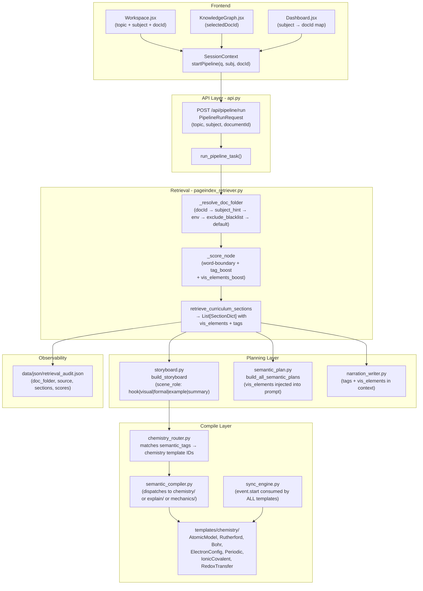

# Topic2Manim Production Implementation Plan
**Date:** 2026-06-15  
**Author:** Senior Production Systems Architect  
**Based on:** [`diagnostic_retrieval_and_video_pipeline_analysis.md`](diagnostic_retrieval_and_video_pipeline_analysis.md)  
**Target:** Reliable, curriculum-grounded animated videos for SCERT Kerala Class 10 Chemistry

---

## 1. Executive Summary & Success Metrics

The Topic2Manim pipeline has correctly wired infrastructure (PageIndex artifacts → LLM planners → Manim templates → render) but suffers from four compounding failures that make chemistry topic output unreliable: wrong document routing, naive scoring that retrieves equation nodes instead of atomic structure sections, zero chemistry-specific Manim templates, and event-based synchronization that is computed but never consumed.

This plan delivers a production-grade system in three phases over approximately two weeks.

### Success Metrics

| Metric | Baseline (2026-06-15) | Target |
|---|---|---|
| Correct document resolved for "Bohr model" query via Workspace | 0% (ilovepdf) | 100% |
| Top-1 retrieved section correct for atomic/bonding/periodic/redox queries | ~20% | ≥90% |
| Chemistry templates rendered for chemistry topics | 0% | ≥80% |
| Visual beat within 0.5s of anchor phrase in TTS audio | ~0% | ≥70% |
| Pedagogical arc (hook→visual→formal→example→summary) enforced | 0% | 100% |
| `visualizable_elements` injected into planner prompts | 0% | 100% |
| Retrieval document written to session audit log | 0% | 100% |

---

## 2. Summary of Critical Defects

### D1 — Wrong Document Routing (Priority: BLOCKER)

`Workspace.jsx:37` calls `startPipeline(inputTopic, selectedSubject)` with **no third argument**. `SessionContext.startPipeline` accepts `documentId` as a third param but never receives it from Workspace or Dashboard. The retriever's `_resolve_doc_folder(None)` falls through to `_newest_folder()` which returns `ilovepdf_merged.pdf` (mtime Jun 14 21:23 — the newest artifact on disk). That merged index contains NCERT chemical equations content where node summaries include words like "atom" and "molecule model", poisoning all atomic-structure queries.

**Evidence:** `pageindex_retriever.py:83–104` (resolution order), `Workspace.jsx:37` (missing arg).

### D2 — Substring Scoring Causes False Positives (Priority: BLOCKER)

`_score_node` at line 194–204 uses `if w in combined` — plain substring containment. The query `"model of an atom"` tokenizes to `{model, atom}`. The word `"atom"` is a substring of `"atoms"` in chemical equation summaries, and `"model"` is a substring of `"molecule model"` in merged PDF keywords. This gives equation-balancing nodes the same score as the correct Rutherford section. Word-boundary regex and semantic tag boosts are not applied. The rich `visualizable_elements` field (e.g., `"Bohr atom orbits"`) is never scored.

### D3 — No Chemistry Manim Templates (Priority: HIGH)

There is no `templates/chemistry/` folder. Chemistry topics fall through to generic explain templates (`diagram` → labeled circles in a row, `concept_card` → `RoundedRectangle` cards) or `freeform` (LLM writes Manim using `Rectangle`/`Square`). The `chalkboard_scene.build_anatomy_scene` uses `Rectangle(width=2, height=1)` per labeled part. No orbital animation, nucleus cluster, alpha-particle path, electron shell diagram, or ionic/covalent bond visualization exists anywhere in the codebase.

**Evidence:** `semantic_compiler.py:43` (`TEMPLATES.get(template_id)`), `templates/__init__.py:50–67` (22 templates, all mechanics/explain), `templates/explain/diagram.py:28–37` (DiagramScene only).

### D4 — `event.start` Computed but Never Consumed (Priority: HIGH)

`timeline_builder.py` sets `event["start"]` to the WhisperX/uniform-fallback timestamp of each anchor phrase. The helper `event_start(timeline, event_id)` is **defined** in `mechanics/_base.py` but the `grep` across all 26 template files returns zero call sites. Mechanics templates use only `event_rt` (run duration) and `event_hold`. Explain templates use only `audio_duration` — a single float — and play all animations sequentially from `t=0`, then pad with `self.wait(tail)`. The entire phrase-synchronization investment in the sync engine is wasted.

### D5 — No Pedagogical Scene Role Enforcement (Priority: MEDIUM)

The storyboard schema (`storyboard.py:STORYBOARD_PROMPT`) enforces template uniqueness and anchor uniqueness in scenes 2–4 but has no `scene_role` field. The intended arc (analogy/hook → visual intuition → formal definition → worked example → summary) is described in documentation but not validated. The LLM is free to put the formal definition in scene 2 and the analogy in scene 4. No post-LLM validator checks ordering.

### D6 — `visualizable_elements` and `semantic_tags` Ignored Downstream (Priority: MEDIUM)

`Chemistry.pdf/tree_structure.json` node `"0001"` (Unit 1) has `visualizable_elements: ["discharge tube", "plum pudding model", "gold foil experiment", "Bohr atom orbits"]`. These are never scored in `_score_node`, never formatted into `semantic_plan.py` or `narration_writer.py` prompts, and never used to select templates. The section-level `semantic_tags` list (`["atomic-structure", "chapter"]`) is joined into a flat string and included in the generic `combined` text for substring scoring — effectively ignored for routing decisions.

### D7 — `curriculum_sections` Dead Parameter in Planners (Priority: MEDIUM)

`semantic_plan.py:build_all_semantic_plans(storyboard, curriculum_context, curriculum_sections, ...)` and `narration_writer.py:write_all_narrations(plans, curriculum_context, curriculum_sections, ...)` both accept `curriculum_sections` as a parameter. The list is **never referenced inside the function bodies or prompts**. Only the flat `curriculum_context` string is injected. The per-section `visualizable_elements`, granular `semantic_tags`, and `content_type` are silently dropped.

---

## 3. Target Architecture Overview

### 3.1 Data Flow (Target State)



### 3.2 Component Responsibilities (Target State)

| Component | File | Responsibility |
|---|---|---|
| `_resolve_doc_folder` | `pageindex_retriever.py` | Subject-aware routing; blacklist `ilovepdf_merged.pdf` from auto-select |
| `_score_node` | `pageindex_retriever.py` | Word-boundary hits + tag/vis_element boosts |
| `_format_sections_for_prompt` | `pageindex_retriever.py` *(new)* | Format vis_elements + tags into prompt-ready block |
| `build_storyboard` | `storyboard.py` | Enforce scene_role ordering; pass vis_elements in prompt |
| `build_all_semantic_plans` | `semantic_plan.py` | Inject vis_elements + tags from matched sections |
| `route_to_chemistry_template` | `chemistry_router.py` *(new)* | Map semantic_tags + topic keywords → chemistry template ID |
| `semantic_compile` | `semantic_compiler.py` | Import + dispatch chemistry templates; pass timeline with event.start |
| `AtomicModelTemplate` | `templates/chemistry/atomic_model.py` *(new)* | Nucleus Dot cluster + concentric Circle orbits + event.start timing |
| `RutherfordGoldFoilTemplate` | `templates/chemistry/rutherford_gold_foil.py` *(new)* | Alpha particle paths + gold foil + deflection animation |
| `BohrOrbitTemplate` | `templates/chemistry/bohr_orbit.py` *(new)* | MoveAlongPath electrons + shell transitions + event.start timing |
| `ElectronConfigTemplate` | `templates/chemistry/electron_config.py` *(new)* | Shell-filling diagram + element label |
| `PeriodicTrendTemplate` | `templates/chemistry/periodic_trend.py` *(new)* | Element grid with trend arrows + bar-chart overlay |
| `IonicCovalentTemplate` | `templates/chemistry/ionic_covalent.py` *(new)* | Electron dot transfer (ionic) vs shared pair (covalent) side-by-side |
| `RedoxTransferTemplate` | `templates/chemistry/redox_transfer.py` *(new)* | Electron cloud moving from oxidized atom to reduced atom |
| `GroundingValidator` | `planning/grounding_validator.py` *(new)* | Post-LLM check: storyboard titles must appear in retrieved section text |
| `Workspace.jsx` | `frontend/src/screens/Workspace.jsx` | Map `selectedSubject` → `documentId`; pass to `startPipeline` |
| `Dashboard.jsx` | `frontend/src/screens/Dashboard.jsx` | Same subject→doc mapping for suggestion clicks |

---

## 4. Phased Implementation Plan

### Phase 1: Retrieval Hardening & Correct Document Routing

**Goal:** Guarantee that Chemistry topics retrieve from `Chemistry.pdf`, not `ilovepdf_merged.pdf`. Fix scoring so "Rutherford atomic model" returns the correct 3 sections with ≥2× score advantage over false positives.

**Deliverables:**
- Correct document routing from Workspace for all subjects
- Word-boundary scoring + semantic_tag boost in `_score_node`
- `visualizable_elements` passed into planner prompts
- Retrieval audit log per session
- `PAGEINDEX_ACTIVE_DOC=Chemistry.pdf` set in `.env` as immediate mitigation

---

#### 1.1 Subject-Aware Document Resolution

**File:** `backend/modules/retrieval/pageindex_retriever.py`

Add a `_BLACKLISTED_AUTO_FOLDERS` set and a `_subject_aware_folder` function. Pass `subject` from the API request into `_resolve_doc_folder`.

```python
# Constants to add near top of file (after _DEFAULT_PDF)
_BLACKLISTED_AUTO_FOLDERS = frozenset({
    "ilovepdf_merged.pdf",   # NCERT merged; too noisy for subject-specific queries
})

_SUBJECT_KEYWORDS: dict[str, list[str]] = {
    "Chemistry": ["chemistry", "chem"],
    "Physics": ["physics", "phys"],
    "Biology": ["biology", "bio"],
    "Mathematics": ["mathematics", "maths", "math"],
}
```

Change `_resolve_doc_folder` signature to accept `subject`:

```python
def _resolve_doc_folder(
    document_id: Optional[str] = None,
    subject: Optional[str] = None,
) -> Tuple[str, str]:
    # Priority 1: explicit document_id (unchanged)
    if document_id:
        matched = _match_folder(document_id)
        if matched:
            return matched, "request"

    # Priority 2: PAGEINDEX_ACTIVE_DOC env var (unchanged)
    env_doc = os.environ.get("PAGEINDEX_ACTIVE_DOC", "").strip()
    if env_doc:
        matched = _match_folder(env_doc)
        if matched:
            return matched, "env"

    # Priority 3: subject-aware folder selection (NEW)
    if subject:
        keywords = _SUBJECT_KEYWORDS.get(subject, [subject.lower()])
        candidates = [
            p for p in _indexed_folders()
            if p.name not in _BLACKLISTED_AUTO_FOLDERS
            and any(kw in p.name.lower() for kw in keywords)
        ]
        if candidates:
            best = max(candidates, key=lambda p: (p / "structure.json").stat().st_mtime)
            return best.name, "subject_hint"

    # Priority 4: newest non-blacklisted folder (CHANGED: exclude blacklist)
    non_blacklisted = [
        p for p in _indexed_folders()
        if p.name not in _BLACKLISTED_AUTO_FOLDERS
    ]
    if non_blacklisted:
        newest = max(non_blacklisted, key=lambda p: (p / "structure.json").stat().st_mtime)
        return newest.name, "newest"

    # Priority 5: hardcoded Physics PDF default (fallback only)
    return _DEFAULT_PDF.name, "default"
```

Also propagate `subject` through the call chain: `retrieve_curriculum_sections(topic, document_id, subject)` → `retrieve_curriculum(topic, document_id, subject)`.

**Immediate mitigation (today):** Set `PAGEINDEX_ACTIVE_DOC=Chemistry.pdf` in `backend/.env`.

---

#### 1.2 Word-Boundary Scoring + Tag/Visualizable Boosts

**File:** `backend/modules/retrieval/pageindex_retriever.py`

Replace `_score_node` (lines 194–204):

```python
import re

_CHEMISTRY_TOPIC_TERMS = frozenset({
    "atom", "atomic", "bohr", "rutherford", "thomson", "electron",
    "proton", "neutron", "nucleus", "orbital", "shell", "isotope",
    "isobar", "periodic", "period", "group", "electronegativity",
    "ionic", "covalent", "bond", "bonding", "redox", "oxidation",
    "reduction", "oxidizing", "reducing",
})

_CHEMISTRY_BOOST_TAGS = frozenset({
    "atomic-structure", "nuclear-model", "periodic-table",
    "chemical-bonding", "redox", "electron-configuration",
})


def _score_node(node: dict, topic_words: set) -> float:
    title = (node.get("title") or "").lower()
    summary = (node.get("summary") or "").lower()
    keywords = " ".join(node.get("keywords") or []).lower()
    tags_list = [t.lower() for t in (node.get("semantic_tags") or [])]
    tags_str = " ".join(tags_list)
    vis_elements = [v.lower() for v in (node.get("visualizable_elements") or [])]
    vis_str = " ".join(vis_elements)

    combined = f"{title} {summary} {keywords} {tags_str}"

    # Word-boundary match — prevents "atom" matching "atoms" in unrelated nodes
    def _wb_hit(word: str, text: str) -> bool:
        return bool(re.search(r"\b" + re.escape(word) + r"\b", text))

    hits = sum(1.0 for w in topic_words if _wb_hit(w, combined))

    # Exact semantic_tag boost for chemistry domains
    tag_boost = 2.0 if (
        any(t in _CHEMISTRY_BOOST_TAGS for t in tags_list)
        and bool(topic_words & _CHEMISTRY_TOPIC_TERMS)
    ) else 0.0

    # visualizable_elements boost: each vis element that shares a word with query
    vis_boost = sum(
        0.5 for ve in vis_elements
        if any(_wb_hit(w, ve) for w in topic_words)
    )

    depth_bonus = 0.1 * (node.get("level", 1) - 1)
    summary_bonus = 0.2 if len((node.get("summary") or "")) > 30 else 0.0

    return hits + tag_boost + vis_boost + depth_bonus + summary_bonus
```

---

#### 1.3 Pass `visualizable_elements` Into Planner Prompts

**File:** `backend/modules/retrieval/pageindex_retriever.py`

Add a new helper that formats curriculum_sections into a rich block for LLM prompts, including `visualizable_elements`:

```python
def format_sections_for_prompt(sections: list[dict]) -> str:
    """Format top matched sections into a prompt block including visualizable_elements."""
    if not sections:
        return ""
    lines = ["MATCHED CURRICULUM SECTIONS WITH VISUAL METADATA:"]
    for sec in sections:
        crumb = sec.get("breadcrumb") or sec.get("title", "")
        pages = f"pp. {sec.get('start_page')}–{sec.get('end_page')}"
        kw = ", ".join((sec.get("keywords") or [])[:6])
        tags = ", ".join(sec.get("semantic_tags") or [])
        vis = "; ".join(sec.get("visualizable_elements") or [])
        lines.append(f"  [{crumb}] ({pages})")
        if kw:
            lines.append(f"    Keywords: {kw}")
        if tags:
            lines.append(f"    Tags: {tags}")
        if vis:
            lines.append(f"    Visualizable elements: {vis}  ← use these for template selection")
    return "\n".join(lines)
```

**File:** `backend/modules/planning/storyboard.py`

In `_build_curriculum_anchor` (currently lines 134–155), replace the existing anchor_block construction with a call to `format_sections_for_prompt(curriculum_sections)` and append the detailed context text.

**File:** `backend/modules/planning/semantic_plan.py`

In both `SEMANTIC_PLAN_EXPLAIN_PROMPT` and `SEMANTIC_PLAN_PROMPT`, add a new template variable `{sections_visual_metadata}` populated from `format_sections_for_prompt(curriculum_sections)`. Insert this block before the `CURRICULUM CONTEXT:` section.

**File:** `backend/modules/planning/narration_writer.py`

Add `{sections_visual_metadata}` to `NARRATION_PROMPT` so the narrator anchors on the correct terminology and visual concepts.

---

#### 1.4 Retrieval Audit Log

**File:** `backend/api.py` — inside `run_pipeline_task`, after `retrieve_curriculum_sections` call

Write a `retrieval_audit.json` to `data/json/`:

```python
audit = {
    "session_id": session_id,
    "topic": topic,
    "document_id": doc_folder,
    "resolution_source": resolution_source,
    "sections": [
        {
            "title": s["title"],
            "node_id": s["node_id"],
            "score": s["score"],
            "tags": s["semantic_tags"],
            "vis_elements": s["visualizable_elements"],
        }
        for s in curriculum_sections
    ],
}
(PATHS["json"] / "retrieval_audit.json").write_text(
    json.dumps(audit, indent=2), encoding="utf-8"
)
```

---

#### 1.5 Wire `subject` Through API to Retriever

**File:** `backend/api.py`

`PipelineRunRequest` already has `subject: str`. Pass it through:

```python
# In run_pipeline_task, change:
curriculum_sections = await retrieve_curriculum_sections(topic, document_id=document_id)
# To:
curriculum_sections = await retrieve_curriculum_sections(
    topic, document_id=document_id, subject=subject
)
```

Update `retrieve_curriculum_sections`, `retrieve_curriculum_context`, `retrieve_curriculum` signatures to accept `subject: Optional[str] = None` and forward it to `_resolve_doc_folder`.

---

### Phase 2: Pedagogical Schema Enforcement + Chemistry Template System + Timing Synchronization

**Goal:** Build the `templates/chemistry/` folder with 7 first-class templates, enforce `scene_role` ordering in storyboard, and make **all** templates (explain + chemistry) use `event.start` for phrase-synchronized animations.

---

#### 2.1 `scene_role` Field in Storyboard Schema

**File:** `backend/modules/planning/storyboard.py`

Add `scene_role` to the JSON schema enforced by the LLM prompt and validated post-LLM.

Add to `STORYBOARD_PROMPT` (inside the JSON schema examples):

```
"scene_role": "<one of: hook | visual_intuition | formal_concept | worked_example | summary>"
```

Add a `_ROLE_ORDER` constant and a validator:

```python
_ROLE_ORDER = ["hook", "visual_intuition", "formal_concept", "worked_example", "summary"]
_VALID_ROLES = frozenset(_ROLE_ORDER)

# Scene → mandatory role assignment:
_SCENE_ROLE_MAP = {1: "hook", 5: "summary"}
# Scenes 2–4: must be visual_intuition, formal_concept, worked_example in that order

def _enforce_scene_roles(scenes: list[dict]) -> list[dict]:
    """Enforce pedagogical role ordering across scenes 2–4."""
    required_middle = ["visual_intuition", "formal_concept", "worked_example"]
    for i, scene in enumerate(scenes):
        sid = scene.get("scene_id", i + 1)
        if sid == 1:
            scene["scene_role"] = "hook"
        elif sid == 5:
            scene["scene_role"] = "summary"
        else:
            idx = sid - 2  # scenes 2,3,4 → indices 0,1,2
            if 0 <= idx < len(required_middle):
                role = scene.get("scene_role", "")
                if role not in _VALID_ROLES or role in ("hook", "summary"):
                    scene["scene_role"] = required_middle[idx]
    return scenes
```

Call `_enforce_scene_roles` after `_enforce_distinct_middle` in `build_storyboard`.

---

#### 2.2 Chemistry Template System

**Create directory:** `backend/modules/templates/chemistry/`

**Create files:**
- `__init__.py` — exports `CHEMISTRY_TEMPLATE_IDS` and all template classes
- `_base.py` — shared chemistry helpers (nucleus builder, orbit builder, timing helpers)
- `atomic_model.py`
- `rutherford_gold_foil.py`
- `bohr_orbit.py`
- `electron_config.py`
- `periodic_trend.py`
- `ionic_covalent.py`
- `redox_transfer.py`

**Update:** `backend/modules/templates/__init__.py` — import and register all 7 chemistry templates.

See **Section 5** for full specifications and Manim code skeletons.

---

#### 2.3 Chemistry Router

**Create file:** `backend/modules/planning/chemistry_router.py`

This module maps a storyboard scene's `scene_role`, the matched section's `semantic_tags`, and the topic keywords to the best chemistry template ID. It is called from `storyboard.py` during `_validate_entry` when the document is `Chemistry.pdf` or when chemistry semantic tags are detected.

```python
"""Route storyboard scenes to chemistry-specific templates."""
from __future__ import annotations

_ATOMIC_KEYWORDS = frozenset({
    "atom", "atomic", "bohr", "rutherford", "thomson", "electron",
    "proton", "neutron", "nucleus", "discharge", "cathode", "canal",
    "plum pudding", "scattering", "shell", "orbit",
})
_PERIODIC_KEYWORDS = frozenset({
    "periodic", "period", "group", "electronegativity", "ionization",
    "atomic radius", "table", "element",
})
_BONDING_KEYWORDS = frozenset({"ionic", "covalent", "bond", "bonding", "electronegativity"})
_REDOX_KEYWORDS = frozenset({"redox", "oxidation", "reduction", "oxidizing", "reducing", "electron transfer"})

_TAG_TO_TEMPLATE = {
    "atomic-structure": "atomic_model",
    "nuclear-model": "rutherford_gold_foil",
    "electron-configuration": "electron_config",
    "periodic-table": "periodic_trend",
    "chemical-bonding": "ionic_covalent",
    "redox": "redox_transfer",
}

_ROLE_TO_TEMPLATE_PREFERENCE = {
    "visual_intuition": ["bohr_orbit", "rutherford_gold_foil", "atomic_model"],
    "formal_concept": ["electron_config", "periodic_trend", "ionic_covalent"],
    "worked_example": ["redox_transfer", "ionic_covalent", "electron_config"],
    "hook": ["atomic_model", "rutherford_gold_foil"],
}


def route_chemistry_template(
    topic: str,
    scene_role: str,
    semantic_tags: list[str],
    visualizable_elements: list[str],
) -> str | None:
    """
    Return the best chemistry template ID for a scene, or None if
    the topic does not match any chemistry domain.
    """
    topic_lower = topic.lower()
    combined_text = (
        topic_lower
        + " "
        + " ".join(semantic_tags).lower()
        + " "
        + " ".join(visualizable_elements).lower()
    )

    # Explicit tag override
    for tag in semantic_tags:
        if tag in _TAG_TO_TEMPLATE:
            return _TAG_TO_TEMPLATE[tag]

    # Keyword routing
    if any(kw in combined_text for kw in _ATOMIC_KEYWORDS):
        prefs = _ROLE_TO_TEMPLATE_PREFERENCE.get(scene_role, [])
        for pref in prefs:
            if pref in ("atomic_model", "bohr_orbit", "rutherford_gold_foil", "electron_config"):
                return pref
        return "atomic_model"

    if any(kw in combined_text for kw in _PERIODIC_KEYWORDS):
        return "periodic_trend"

    if any(kw in combined_text for kw in _BONDING_KEYWORDS):
        return "ionic_covalent"

    if any(kw in combined_text for kw in _REDOX_KEYWORDS):
        return "redox_transfer"

    return None
```

**Integration point:** In `storyboard.py:_validate_entry`, after resolving `concept_template`, check `route_chemistry_template(...)`. If it returns a non-None chemistry template ID and the current template is a generic explain or freeform, override with the chemistry template.

---

#### 2.4 Fix `event.start` Timing in All Templates

**Root cause:** `event_start()` is defined in `mechanics/_base.py` but never called by any `compile()` method. Explain templates use only `audio_duration`.

**Fix strategy for explain templates:** Pass event timing as extra kwargs to `build_scene()`, or (simpler) generate explicit `self.wait()` calls in the body string. The cleanest approach is to add a `timing_block` helper to `explain/_base.py`:

**File:** `backend/modules/templates/explain/_base.py`

Add:

```python
def event_start(timeline: dict, event_id: str, default: float = 0.0) -> float:
    """Return the absolute start time (seconds) of a named event."""
    for ev in timeline.get("events", []):
        if ev.get("id") == event_id:
            return float(ev.get("start", default))
    return default


def event_rt(timeline: dict, event_id: str, default: float = 0.7) -> float:
    """Return the run_time of a named event."""
    for ev in timeline.get("events", []):
        if ev.get("id") == event_id:
            return float(ev.get("run_time", default))
    return default


def build_timing_waits(
    timeline: dict,
    event_ids: list[str],
    default_starts: list[float],
) -> list[str]:
    """
    Return a list of 'self.wait(N)' strings to insert between animation calls,
    advancing from the end of the previous animation to the next event.start.
    Each string is already formatted as Python source code.
    """
    waits = []
    cursor = 0.0
    for eid, dflt in zip(event_ids, default_starts):
        t = event_start(timeline, eid, dflt)
        gap = max(0.0, t - cursor)
        waits.append(f"self.wait({gap:.3f})" if gap > 0.005 else "")
        cursor = t
    return waits
```

**Explain template updates (diagram, concept_card, comparison, equation, timeline):**

Each `compile()` method currently generates a single `self.build_scene(...)` call. Change each to generate explicit timed play calls. Example for `diagram.py`:

```python
@staticmethod
def compile(plan: dict[str, Any], timeline: dict[str, Any]) -> str:
    content = merge_content(plan, "diagram")
    dur = audio_duration(timeline)
    nodes_json = nodes_literal(content.get("nodes", []))
    title_str = esc(str(content.get("title", plan.get("title", "Diagram"))))

    # Compute event waits: e0=title reveal, e1=first node, e2=last node
    waits = build_timing_waits(timeline, ["e0", "e1", "e2"], [0.3, 1.5, 3.0])
    e0_rt = event_rt(timeline, "e0", 0.5)
    e1_rt = event_rt(timeline, "e1", 0.7)

    body = f"""\
{waits[0]}
self.reveal_title("{title_str}", run_time={e0_rt:.3f})
{waits[1]}
self.build_nodes({nodes_json}, run_time={e1_rt:.3f})
{waits[2]}
self.add_arrows(run_time=0.6)
self.wait({dur:.3f} - self.renderer.time if hasattr(self.renderer, 'time') else 1.0)
"""
    return wrap_explain_scene("diagram_scene", "DiagramScene", body)
```

The matching `DiagramScene.reveal_title` and `DiagramScene.build_nodes` methods need to be added to `backend/modules/manim/templates/diagram_scene.py` so the generated call sites work. Same pattern for `concept_card`, `comparison`, `equation`, `timeline`.

**Chemistry templates:** Built with explicit `self.wait(event_start(...))` calls from the ground up — see Section 5.

---

#### 2.5 Update `templates/__init__.py`

**File:** `backend/modules/templates/__init__.py`

Add chemistry imports:

```python
from modules.templates.chemistry.atomic_model import AtomicModelTemplate
from modules.templates.chemistry.rutherford_gold_foil import RutherfordGoldFoilTemplate
from modules.templates.chemistry.bohr_orbit import BohrOrbitTemplate
from modules.templates.chemistry.electron_config import ElectronConfigTemplate
from modules.templates.chemistry.periodic_trend import PeriodicTrendTemplate
from modules.templates.chemistry.ionic_covalent import IonicCovalentTemplate
from modules.templates.chemistry.redox_transfer import RedoxTransferTemplate
from modules.templates.chemistry import CHEMISTRY_TEMPLATE_IDS

# Add to TEMPLATES dict:
"atomic_model": AtomicModelTemplate,
"rutherford_gold_foil": RutherfordGoldFoilTemplate,
"bohr_orbit": BohrOrbitTemplate,
"electron_config": ElectronConfigTemplate,
"periodic_trend": PeriodicTrendTemplate,
"ionic_covalent": IonicCovalentTemplate,
"redox_transfer": RedoxTransferTemplate,
```

---

### Phase 3: Grounding Validation, Observability, Frontend Completion & Polish

**Goal:** Close the remaining gaps: post-LLM grounding checks, WhisperX enablement, Knowledge Graph defaults, and test coverage.

---

#### 3.1 Lightweight Grounding Validator

**Create file:** `backend/modules/planning/grounding_validator.py`

```python
"""
Post-LLM grounding validation.
Checks that storyboard scene titles and key terms appear in retrieved curriculum text.
"""
from __future__ import annotations
import re


def validate_storyboard_grounding(
    storyboard: list[dict],
    curriculum_sections: list[dict],
    strict: bool = False,
) -> list[dict]:
    """
    For each scene, check that its title/anchor_example contains at least
    one significant word also present in the retrieved curriculum content.
    Returns list of validation issues. Empty list = passed.
    """
    all_content = " ".join(
        (s.get("content") or "") + " " + (s.get("summary") or "")
        for s in curriculum_sections
    ).lower()

    issues = []
    stop_words = {"the", "and", "for", "with", "that", "this", "from", "into", "about"}
    for scene in storyboard:
        sid = scene.get("scene_id")
        title = (scene.get("title") or "").lower()
        anchor = (scene.get("anchor_example") or "").lower()
        combined = f"{title} {anchor}"
        words = {w for w in re.findall(r'\b[a-z]{4,}\b', combined) if w not in stop_words}
        hits = sum(1 for w in words if re.search(r'\b' + re.escape(w) + r'\b', all_content))
        if words and hits == 0:
            issues.append({
                "scene_id": sid,
                "title": scene.get("title"),
                "issue": "no_curriculum_overlap",
                "words_checked": list(words),
            })
    return issues
```

Integrate into `api.py` after `build_storyboard`. Log issues as warnings; if `strict=True` and issues exist on >2 scenes, re-trigger storyboard generation with a corrective prompt.

---

#### 3.2 WhisperX Enablement

**File:** `backend/.env`

Set `USE_WHISPERX=true` if a compatible GPU/CPU environment is confirmed. The config already reads this env var. This directly improves phrase timestamp accuracy and is a prerequisite for meaningful `event.start` timing in the final output.

**File:** `backend/modules/config.py`

Document the env var with a comment explaining the quality impact.

---

#### 3.3 Knowledge Graph Default Document

**File:** `frontend/src/screens/KnowledgeGraph.jsx`

The component already fetches `/api/curriculum/documents` and loads real `structure.json`. Remove the `MOCK_SYLLABUS` fallback path so that on first load, the UI shows the first real indexed document (sorted alphabetically, Chemistry first).

---

#### 3.4 Persist Curriculum Sections in Session State

**File:** `backend/api.py`

Add `curriculum_sections_summary` to the session JSON saved during the pipeline:

```python
session_payload["curriculum"] = {
    "document_id": doc_folder,
    "resolution_source": resolution_source,
    "sections": [
        {"title": s["title"], "node_id": s["node_id"], "score": s["score"]}
        for s in curriculum_sections
    ],
}
```

---

## 5. Chemistry Templates Specification

### 5.1 Shared Base (`templates/chemistry/_base.py`)

The chemistry base module provides nucleus builders, orbit painters, and the `event_start`/`event_rt` helpers shared by all 7 templates. All chemistry templates extend `ChalkboardScene` (from `backend/modules/manim/templates/chalkboard_scene.py`).

**Key visual constants:**

```python
NUCLEUS_PROTON_COLOR = "#E63946"    # red
NUCLEUS_NEUTRON_COLOR = "#6C757D"   # grey
ELECTRON_COLOR = "#FFD166"          # yellow-gold
ORBIT_COLOR = "#457B9D"             # muted blue
BOND_COLOR = "#2EC4B6"              # teal
TITLE_COLOR = "#E0E6F0"             # light (matches chalkboard)
BG_COLOR = "#0F1117"
```

**Nucleus builder (generates Manim source code string):**

```python
def nucleus_code(protons: int, neutrons: int, var: str = "nucleus") -> str:
    """Generate Manim source lines to construct a realistic nucleus VGroup."""
    total = protons + neutrons
    return f"""\
_protons = [Dot(radius=0.09, color="{NUCLEUS_PROTON_COLOR}") for _ in range({protons})]
_neutrons = [Dot(radius=0.09, color="{NUCLEUS_NEUTRON_COLOR}") for _ in range({neutrons})]
_particles = _protons + _neutrons
random.shuffle(_particles)
for _i, _p in enumerate(_particles):
    angle = _i * 2 * PI / max({total}, 1)
    _p.move_to(0.18 * np.array([np.cos(angle), np.sin(angle), 0]))
{var} = VGroup(*_particles)
"""
```

**Orbit builder:**

```python
def orbit_code(shell_radii: list[float], var_prefix: str = "orbit") -> str:
    lines = []
    for i, r in enumerate(shell_radii):
        lines.append(
            f'{var_prefix}_{i} = Circle(radius={r:.2f}, color="{ORBIT_COLOR}",'
            f' stroke_width=1.2, stroke_opacity=0.55)'
        )
    return "\n".join(lines)
```

**Timing helpers (mirroring mechanics/_base.py for consistency):**

```python
def event_start_code(timeline_var: str, event_id: str, default: float) -> str:
    """Inline code to compute self.wait() gap before an event."""
    # Used in generated source: generates a self.wait() call
    return (
        f"_t_{event_id} = next("
        f"(e['start'] for e in {timeline_var}.get('events', []) if e['id'] == '{event_id}'), "
        f"{default})\n"
    )
```

For chemistry template `compile()` methods, the pattern is to resolve all event starts at compile time (not runtime), producing hard-coded `self.wait(N)` calls:

```python
def _resolve_event(timeline: dict, event_id: str, default: float) -> float:
    for ev in timeline.get("events", []):
        if ev.get("id") == event_id:
            return float(ev.get("start", default))
    return default

def _gap(t_current: float, t_next: float) -> str:
    g = max(0.0, t_next - t_current)
    return f"self.wait({g:.3f})\n" if g > 0.005 else ""
```

---

### 5.2 Template: `atomic_model` — `AtomicModelTemplate`

**File:** `backend/modules/templates/chemistry/atomic_model.py`

**Purpose:** Side-by-side or sequential display of atomic models (Thomson → Rutherford → Bohr) with proper Manim primitives. No rectangles or squares.

**CONTENT_SCHEMA:**

```json
{
  "title": "Thomson's Plum Pudding Model",
  "model_type": "thomson|rutherford|bohr",
  "element_symbol": "H",
  "num_protons": 1,
  "num_neutrons": 0,
  "shells": [1],
  "caption": "Electrons embedded in a uniform positive sphere",
  "comparison_models": ["thomson", "rutherford"]
}
```

- `model_type`: controls which visual representation to render
- `shells`: list of electron counts per shell for Bohr model
- `comparison_models`: if set, render two models side-by-side with labels

**Key visual elements:**
- Thomson: large `Circle` (positive sphere) with small `Dot` (electrons) scattered inside via `np.random` positions — **never a Rectangle**
- Rutherford: tiny nucleus `VGroup` of stacked `Dot` objects, electrons as `Dot` on large `Circle` orbit
- Bohr: nucleus cluster + concentric `Circle` orbits (radii 1.2, 2.0, 2.8) + `Dot` electrons at `orbit.point_from_proportion(0)` animated with `MoveAlongPath`

**event.start integration:** 4 events — `e0`=title reveal, `e1`=nucleus appears, `e2`=first orbit/electrons, `e3`=label/caption.

**Manim code skeleton:**

```python
"""AtomicModel chemistry template — produces Manim scene code for atomic structure."""
from __future__ import annotations
import random
from typing import Any

from modules.templates.chemistry._base import (
    NUCLEUS_PROTON_COLOR, NUCLEUS_NEUTRON_COLOR, ELECTRON_COLOR,
    ORBIT_COLOR, TITLE_COLOR, BG_COLOR,
    _resolve_event, _gap,
)
from modules.templates.explain._base import audio_duration

CONTENT_SCHEMA = """{
  "title": "<scene title, e.g. 'Rutherford Nuclear Model'>",
  "model_type": "thomson|rutherford|bohr",
  "element_symbol": "<e.g. 'H'>",
  "num_protons": <integer>,
  "num_neutrons": <integer>,
  "shells": [<electrons per shell, e.g. 2, 8, 1>],
  "caption": "<one sentence description of this model>",
  "comparison_models": ["<optional list of two models to compare side-by-side>"]
}"""


class AtomicModelTemplate:
    ALLOWED_EVENTS = frozenset({"reveal", "place_title", "highlight", "hold"})
    CONTENT_SCHEMA = CONTENT_SCHEMA
    SLOTS = {}

    @staticmethod
    def compile(plan: dict[str, Any], timeline: dict[str, Any]) -> str:
        content = plan.get("content") or {}
        if not isinstance(content, dict):
            content = {}

        title = str(content.get("title") or plan.get("title", "Atomic Model"))
        model_type = str(content.get("model_type", "bohr")).lower()
        protons = int(content.get("num_protons", 1))
        neutrons = int(content.get("num_neutrons", 0))
        shells = list(content.get("shells") or [1])
        caption = str(content.get("caption", ""))
        dur = audio_duration(timeline)

        t0 = _resolve_event(timeline, "e0", 0.3)
        t1 = _resolve_event(timeline, "e1", 1.5)
        t2 = _resolve_event(timeline, "e2", 3.5)
        t3 = _resolve_event(timeline, "e3", 5.5)

        orbits_code = _build_bohr_orbits_code(shells)

        code = f'''\
from manim import *
import numpy as np
import random
import sys
from pathlib import Path

_BACKEND_ROOT = Path(__file__).resolve().parents[2]
if str(_BACKEND_ROOT) not in sys.path:
    sys.path.insert(0, str(_BACKEND_ROOT))

from modules.manim.templates.chalkboard_scene import ChalkboardScene


class GeneratedScene(ChalkboardScene):
    def construct(self):
        self.setup_chalkboard()

        # ── Title ──────────────────────────────────────────────
        {_gap(0, t0)}\
        title = Text(
            "{_esc(title)}",
            font_size=28, color="{TITLE_COLOR}", weight=BOLD
        ).to_edge(UP, buff=0.4)
        self.play(Write(title), run_time=0.6)

        # ── Nucleus ────────────────────────────────────────────
        {_gap(t0 + 0.6, t1)}\
        _protons = [Dot(radius=0.09, color="{NUCLEUS_PROTON_COLOR}") for _ in range({protons})]
        _neutrons = [Dot(radius=0.09, color="{NUCLEUS_NEUTRON_COLOR}") for _ in range({neutrons})]
        _particles = _protons + _neutrons
        for _i, _p in enumerate(_particles):
            _a = _i * 2 * PI / max(len(_particles), 1)
            _p.move_to(0.2 * np.array([np.cos(_a), np.sin(_a), 0]))
        nucleus = VGroup(*_particles).move_to(ORIGIN)
        self.play(FadeIn(nucleus, scale=0.3), run_time=0.5)

        # ── Orbits + Electrons ─────────────────────────────────
        {_gap(t1 + 0.5, t2)}\
{orbits_code}

        # ── Caption ────────────────────────────────────────────
        {_gap(t2 + 1.5, t3)}\
        cap = Text(
            "{_esc(caption)[:90]}",
            font_size=18, color=Color("{TITLE_COLOR}").interpolate(Color(BLACK), 0.3)
        ).to_edge(DOWN, buff=0.5)
        self.play(FadeIn(cap, shift=UP * 0.2), run_time=0.5)

        tail = max(0.3, {dur:.3f} - self.renderer.time if False else 0.3)
        self.wait(tail)
        self.play(FadeOut(*self.mobjects), run_time=0.4)
'''
        return code


def _build_bohr_orbits_code(shells: list[int]) -> str:
    """Generate code for concentric orbits + MoveAlongPath electrons."""
    radii = [1.2 + 0.8 * i for i in range(len(shells))]
    lines = []
    for i, (n_electrons, r) in enumerate(zip(shells, radii)):
        lines.append(
            f'        orbit_{i} = Circle(radius={r:.2f}, color="{ORBIT_COLOR}",'
            f' stroke_width=1.4, stroke_opacity=0.55)'
        )
        lines.append(f'        self.play(Create(orbit_{i}), run_time=0.35)')
        for j in range(n_electrons):
            prop = j / max(n_electrons, 1)
            lines.append(
                f'        e_{i}_{j} = Dot(radius=0.07, color="{ELECTRON_COLOR}")'
                f'.move_to(orbit_{i}.point_from_proportion({prop:.3f}))'
            )
            lines.append(f'        self.add(e_{i}_{j})')
            lines.append(
                f'        self.play(MoveAlongPath(e_{i}_{j}, orbit_{i}),'
                f' run_time=1.2, rate_func=linear)'
            )
    return "\n".join(lines)


def _esc(text: str) -> str:
    return text.replace("\\", "\\\\").replace('"', '\\"').replace("\n", " ")
```

---

### 5.3 Template: `rutherford_gold_foil` — `RutherfordGoldFoilTemplate`

**File:** `backend/modules/templates/chemistry/rutherford_gold_foil.py`

**Purpose:** Animate alpha particles approaching the gold foil — most pass through, a few deflect at small angles, one bounces back. Visually communicates the discovery of the nucleus.

**CONTENT_SCHEMA:**

```json
{
  "title": "Rutherford's Gold Foil Experiment",
  "num_particles": 6,
  "show_nucleus": true,
  "observation_labels": [
    "Most particles pass straight through",
    "A few deflect at small angles",
    "Very rarely — bounce straight back"
  ]
}
```

**Key visual elements:**
- Gold foil: thin `Line` (vertical) with a small cluster of `Dot` objects (gold nucleus atoms) — NOT a Rectangle
- Nucleus: bright `Dot(radius=0.12, color=GOLD)` at center of one gold atom
- Alpha particles: `Dot(radius=0.06, color=YELLOW)` objects
- Paths: `ArcBetweenPoints` for deflected paths, straight `Line`-based `MoveAlongPath` for pass-through
- Bounce-back: reverse `ArcBetweenPoints` with large angle

**event.start integration:** `e0`=foil appears, `e1`=first particle fired, `e2`=deflection shown, `e3`=observation labels.

**Manim code skeleton:**

```python
"""RutherfordGoldFoil chemistry template."""
from __future__ import annotations
from typing import Any

from modules.templates.chemistry._base import (
    NUCLEUS_PROTON_COLOR, ELECTRON_COLOR, TITLE_COLOR, ORBIT_COLOR, _resolve_event, _gap
)
from modules.templates.explain._base import audio_duration

CONTENT_SCHEMA = """{
  "title": "<scene title>",
  "num_particles": <integer 4-8>,
  "show_nucleus": true,
  "observation_labels": ["<first obs>", "<second obs>", "<third obs>"]
}"""


class RutherfordGoldFoilTemplate:
    ALLOWED_EVENTS = frozenset({"reveal", "place_title", "highlight", "hold"})
    CONTENT_SCHEMA = CONTENT_SCHEMA
    SLOTS = {}

    @staticmethod
    def compile(plan: dict[str, Any], timeline: dict[str, Any]) -> str:
        content = plan.get("content") or {}
        if not isinstance(content, dict):
            content = {}

        title = str(content.get("title") or plan.get("title", "Gold Foil Experiment"))
        num_p = int(content.get("num_particles", 6))
        labels = list(content.get("observation_labels") or [
            "Most particles pass through",
            "Few deflect at small angles",
            "Rarely: straight back bounce",
        ])
        dur = audio_duration(timeline)

        t0 = _resolve_event(timeline, "e0", 0.5)
        t1 = _resolve_event(timeline, "e1", 1.5)
        t2 = _resolve_event(timeline, "e2", 3.5)
        t3 = _resolve_event(timeline, "e3", 6.0)

        label_lines = "\n".join(
            f'        self.play(FadeIn(Text("{_esc(lbl[:60])}", font_size=16, '
            f'color="{TITLE_COLOR}").shift(DOWN * {1.0 + 0.5 * i})), run_time=0.4)'
            for i, lbl in enumerate(labels[:3])
        )

        return f'''\
from manim import *
import numpy as np
import sys
from pathlib import Path

_BACKEND_ROOT = Path(__file__).resolve().parents[2]
if str(_BACKEND_ROOT) not in sys.path:
    sys.path.insert(0, str(_BACKEND_ROOT))

from modules.manim.templates.chalkboard_scene import ChalkboardScene


class GeneratedScene(ChalkboardScene):
    def construct(self):
        self.setup_chalkboard()

        {_gap(0, t0)}\
        title = Text("{_esc(title)}", font_size=26, color="{TITLE_COLOR}", weight=BOLD).to_edge(UP, buff=0.4)
        self.play(Write(title), run_time=0.5)

        # ── Gold foil (vertical line of gold-atom Dots)
        {_gap(t0 + 0.5, t1)}\
        foil_line = Line(UP * 2.5, DOWN * 2.5, color=GOLD, stroke_width=3).shift(RIGHT * 0)
        gold_atoms = VGroup(*[
            Dot(radius=0.15, color=GOLD_E).move_to(foil_line.point_from_proportion(i / 5))
            for i in range(6)
        ])
        nucleus_dot = Dot(radius=0.12, color="{NUCLEUS_PROTON_COLOR}").move_to(gold_atoms[3].get_center())
        foil_group = VGroup(foil_line, gold_atoms, nucleus_dot)
        self.play(Create(foil_group), run_time=0.6)

        # ── Alpha particles: pass-through (most)
        {_gap(t1 + 0.6, t2)}\
        for i in range({max(num_p - 2, 2)}):
            y = -1.5 + i * 0.7
            alpha = Dot(radius=0.07, color="{ELECTRON_COLOR}").move_to(LEFT * 4 + UP * y)
            path = Line(LEFT * 4 + UP * y, RIGHT * 4 + UP * y)
            self.play(MoveAlongPath(alpha, path), run_time=0.5, rate_func=linear)
            self.remove(alpha)

        # ── Deflected particle
        {_gap(t2, t2 + 0.3)}\
        alpha_def = Dot(radius=0.07, color="{ELECTRON_COLOR}").move_to(LEFT * 4 + UP * 0.1)
        arc_def = ArcBetweenPoints(LEFT * 4 + UP * 0.1, RIGHT * 2 + UP * 2.5, angle=-TAU / 6)
        self.play(MoveAlongPath(alpha_def, arc_def), run_time=0.8, rate_func=linear)
        self.remove(alpha_def)

        # ── Bounce-back particle
        alpha_back = Dot(radius=0.07, color=RED).move_to(LEFT * 4 + DOWN * 0.2)
        arc_back = ArcBetweenPoints(LEFT * 4 + DOWN * 0.2, LEFT * 3 + UP * 1.5, angle=-PI / 3)
        self.play(MoveAlongPath(alpha_back, arc_back), run_time=0.7, rate_func=linear)
        self.remove(alpha_back)

        # ── Observation labels
        {_gap(t2 + 1.5, t3)}\
{label_lines}

        self.wait(max(0.3, {dur:.3f} - 8.0))
        self.play(FadeOut(*self.mobjects), run_time=0.4)
'''
```

---

### 5.4 Template: `bohr_orbit` — `BohrOrbitTemplate`

**File:** `backend/modules/templates/chemistry/bohr_orbit.py`

**Purpose:** Animate the Bohr model with quantized shells. Optional energy-level transition (electron jumps from shell n to shell m, emitting a photon glow).

**CONTENT_SCHEMA:**

```json
{
  "title": "Bohr's Atomic Model",
  "element": "Hydrogen",
  "atomic_number": 1,
  "shells": [1],
  "show_energy_levels": true,
  "energy_transition": {"from_shell": 2, "to_shell": 1, "label": "Lyman series"},
  "shell_labels": ["K (n=1)", "L (n=2)", "M (n=3)"]
}
```

**Key visual elements:**
- Nucleus: `VGroup` of red/grey `Dot` objects (as in `atomic_model`)
- Shells (orbits): concentric `Circle` objects, radius 1.2/2.0/2.8 for n=1/2/3
- Electrons: `Dot(radius=0.07, color=ELECTRON_COLOR)` started at `orbit.point_from_proportion(0)` and animated via `MoveAlongPath` for 1–2 full revolutions
- Shell labels: `Text("K (n=1)", font_size=14)` anchored at orbit end
- Energy transition: electron jumps from outer to inner orbit with a `Flash` or `GrowArrow` + `Dot` color change

**event.start integration:** `e0`=title+nucleus, `e1`=first shell + electrons orbit, `e2`=second shell, `e3`=transition (if applicable).

**Manim code skeleton (abbreviated):**

```python
class BohrOrbitTemplate:
    ALLOWED_EVENTS = frozenset({"reveal", "place_title", "highlight", "hold"})
    CONTENT_SCHEMA = CONTENT_SCHEMA
    SLOTS = {}

    @staticmethod
    def compile(plan: dict[str, Any], timeline: dict[str, Any]) -> str:
        content = plan.get("content") or {}
        if not isinstance(content, dict):
            content = {}

        title = str(content.get("title") or plan.get("title", "Bohr Model"))
        element = str(content.get("element", "Hydrogen"))
        atomic_number = int(content.get("atomic_number", 1))
        shells = list(content.get("shells") or [1])
        shell_labels = list(content.get("shell_labels") or [f"n={i+1}" for i in range(len(shells))])
        transition = content.get("energy_transition")  # dict or None
        dur = audio_duration(timeline)

        t0 = _resolve_event(timeline, "e0", 0.4)
        t1 = _resolve_event(timeline, "e1", 1.8)
        t2 = _resolve_event(timeline, "e2", 4.0)
        t3 = _resolve_event(timeline, "e3", 6.5)

        shells_code = _bohr_shells_code(shells, shell_labels)
        transition_code = _bohr_transition_code(transition, shells) if transition else "        pass  # no transition"

        return f'''\
from manim import *
import numpy as np
import sys
from pathlib import Path

_BACKEND_ROOT = Path(__file__).resolve().parents[2]
if str(_BACKEND_ROOT) not in sys.path:
    sys.path.insert(0, str(_BACKEND_ROOT))

from modules.manim.templates.chalkboard_scene import ChalkboardScene


class GeneratedScene(ChalkboardScene):
    def construct(self):
        self.setup_chalkboard()

        {_gap(0, t0)}\
        title = Text("{_esc(title)}", font_size=26, color="{TITLE_COLOR}", weight=BOLD).to_edge(UP, buff=0.4)
        elem_label = Text("{_esc(element)} (Z={atomic_number})", font_size=20, color=GREY_B).next_to(title, DOWN, buff=0.15)
        self.play(Write(title), FadeIn(elem_label), run_time=0.6)

        # ── Nucleus ────────────────────────────────────────────
        {_gap(t0 + 0.6, t1)}\
        nucleus_protons = [Dot(radius=0.09, color="{NUCLEUS_PROTON_COLOR}") for _ in range({atomic_number})]
        for _i, _p in enumerate(nucleus_protons):
            _a = _i * 2 * PI / max({atomic_number}, 1)
            _p.move_to(0.18 * np.array([np.cos(_a), np.sin(_a), 0]))
        nucleus = VGroup(*nucleus_protons)
        nucleus_label = Text("nucleus", font_size=14, color=GREY_B).next_to(nucleus, DOWN, buff=0.12)
        self.play(FadeIn(nucleus, scale=0.5), FadeIn(nucleus_label), run_time=0.5)

        # ── Orbits + electrons ─────────────────────────────────
        {_gap(t1 + 0.5, t2)}\
{shells_code}

        # ── Energy transition (optional) ───────────────────────
        {_gap(t2 + 1.5, t3)}\
{transition_code}

        self.wait(max(0.3, {dur:.3f} - self.renderer.time if False else 0.5))
        self.play(FadeOut(*self.mobjects), run_time=0.4)
'''
```

---

### 5.5 Template: `electron_config` — `ElectronConfigTemplate`

**File:** `backend/modules/templates/chemistry/electron_config.py`

**CONTENT_SCHEMA:**

```json
{
  "title": "Electron Configuration of Carbon",
  "element": "Carbon",
  "symbol": "C",
  "atomic_number": 6,
  "shells": [2, 4],
  "config_notation": "2, 4",
  "max_shell_capacity": [2, 8, 18]
}
```

**Visual design:**
- Horizontal row of shell rings (each a `Circle`, labeled "K", "L", "M" etc.)
- Each ring filled with the correct number of `Dot` electrons, evenly spaced on the circle
- Element symbol label (`Text("C", font_size=48)`) to the left
- Configuration notation (`Text("2, 4", font_size=24)`) at bottom
- Animations: shells create one at a time; electrons `FadeIn` in groups timed to events

**event.start:** `e0`=element label, `e1`=shell K fills, `e2`=shell L fills, `e3`=config notation.

---

### 5.6 Template: `periodic_trend` — `PeriodicTrendTemplate`

**File:** `backend/modules/templates/chemistry/periodic_trend.py`

**CONTENT_SCHEMA:**

```json
{
  "title": "Atomic Radius Trend Across Period 3",
  "trend_type": "atomic_radius|electronegativity|ionization_energy",
  "direction": "across_period|down_group",
  "elements": [
    {"symbol": "Na", "value": 186, "period": 3, "group": 1},
    {"symbol": "Mg", "value": 160, "period": 3, "group": 2},
    {"symbol": "Al", "value": 143, "period": 3, "group": 13}
  ],
  "trend_label": "Decreases across a period",
  "unit": "pm"
}
```

**Visual design:**
- Horizontal bar chart using `Rectangle` objects (permitted here — representing data, not particles)
- Each bar labeled with element symbol + value
- `Arrow` overlay showing trend direction
- `Text` trend label appearing at event `e2`

---

### 5.7 Template: `ionic_covalent` — `IonicCovalentTemplate`

**File:** `backend/modules/templates/chemistry/ionic_covalent.py`

**CONTENT_SCHEMA:**

```json
{
  "title": "Ionic vs Covalent Bonding",
  "left": {
    "bond_type": "ionic",
    "example": "NaCl",
    "donor_symbol": "Na",
    "donor_electrons": 1,
    "acceptor_symbol": "Cl",
    "acceptor_electrons": 7
  },
  "right": {
    "bond_type": "covalent",
    "example": "H2O",
    "atom1_symbol": "H",
    "atom2_symbol": "O",
    "shared_electrons": 2
  }
}
```

**Visual design:**
- Left panel (ionic): two `Circle` atoms; a `Dot` electron animated moving from donor to acceptor via `MoveAlongPath`; `+/-` charge labels appear after transfer
- Right panel (covalent): two `Circle` atoms overlapping; shared `Dot` electrons oscillate between atoms via `Wiggle`; bond label appears
- Dividing `DashedLine` at center
- Panel titles (`Text("IONIC")`, `Text("COVALENT")`) at top

**event.start:** `e0`=left title, `e1`=ionic transfer animation, `e2`=right panel + covalent, `e3`=comparison label.

---

### 5.8 Template: `redox_transfer` — `RedoxTransferTemplate`

**File:** `backend/modules/templates/chemistry/redox_transfer.py`

**CONTENT_SCHEMA:**

```json
{
  "title": "Electron Transfer in Redox",
  "oxidized_species": "Zn",
  "electrons_lost": 2,
  "oxidized_product": "Zn²⁺",
  "reduced_species": "Cu²⁺",
  "electrons_gained": 2,
  "reduced_product": "Cu",
  "reaction_equation": "Zn + CuSO₄ → ZnSO₄ + Cu",
  "labels": {
    "left": "OXIDATION (loses e⁻)",
    "right": "REDUCTION (gains e⁻)"
  }
}
```

**Visual design:**
- Two large `Circle` atoms (left=oxidized, right=reduced) — no rectangles
- `Dot` electrons (n=electrons_lost) that animate from the left atom to the right via `ArcBetweenPoints`
- Arrow labels "e⁻ →" along the arc path
- Product formula appears below each atom after transfer
- Reaction equation at bottom via `MathTex`

**event.start:** `e0`=both atoms appear, `e1`=electron arrows begin, `e2`=transfer complete + charge labels, `e3`=equation.

---

## 6. How the System Routes to Chemistry Templates

### 6.1 Three-Stage Routing Decision

Chemistry template routing happens in two places:

**Stage A — Storyboard validation (`storyboard.py:_validate_entry`):**

After LLM generates the storyboard, for each scene call `route_chemistry_template(topic, scene_role, top_section_tags, top_section_vis_elements)`. If it returns a chemistry template ID and the LLM-chosen template is a generic explain or freeform, override:

```python
# In _validate_entry(entry, topic, curriculum_sections):
from modules.planning.chemistry_router import route_chemistry_template

top_section = curriculum_sections[0] if curriculum_sections else {}
chem_override = route_chemistry_template(
    topic=topic,
    scene_role=entry.get("scene_role", ""),
    semantic_tags=top_section.get("semantic_tags", []),
    visualizable_elements=top_section.get("visualizable_elements", []),
)
if chem_override and entry.get("concept_template") in (EXPLAIN_TEMPLATE_IDS + ["freeform"]):
    entry["concept_template"] = chem_override
```

**Stage B — Semantic compiler fallback (`semantic_compiler.py:semantic_compile`):**

If `TEMPLATES.get(template_id)` returns `None` (template not registered), the current code falls back to "intro". Instead, attempt a chemistry route before the intro fallback:

```python
template_cls = TEMPLATES.get(template_id)
if template_cls is None:
    # Attempt chemistry routing before generic fallback
    from modules.planning.chemistry_router import route_chemistry_template
    fallback_id = route_chemistry_template(
        topic=plan.get("title", ""),
        scene_role=plan.get("scene_role", ""),
        semantic_tags=plan.get("semantic_tags", []),
        visualizable_elements=plan.get("visualizable_elements", []),
    )
    template_cls = TEMPLATES.get(fallback_id) or TEMPLATES["intro"]
```

### 6.2 Tag-Based Override Priority (Ordered)

| Condition | Template Selected |
|---|---|
| `semantic_tags` contains `"atomic-structure"` AND `scene_role == "visual_intuition"` | `bohr_orbit` |
| `semantic_tags` contains `"atomic-structure"` AND `visualizable_elements` contains `"gold foil"` | `rutherford_gold_foil` |
| `semantic_tags` contains `"atomic-structure"` (default) | `atomic_model` |
| `semantic_tags` contains `"electron-configuration"` | `electron_config` |
| `semantic_tags` contains `"periodic-table"` | `periodic_trend` |
| `semantic_tags` contains `"chemical-bonding"` | `ionic_covalent` |
| `semantic_tags` contains `"redox"` | `redox_transfer` |
| topic keywords match atomic terms (no tags) | `atomic_model` |
| topic keywords match periodic terms | `periodic_trend` |

### 6.3 Storyboard Prompt Chemistry Template Mention

Add to `STORYBOARD_PROMPT` under "TEMPLATE FAMILIES":

```
D) CHEMISTRY TEMPLATES (use ONLY when topic is chemistry — atomic structure, bonding, periodic table, redox):
   - atomic_model: display Thomson/Rutherford/Bohr model with proper nucleus Dot cluster + orbit Circles
   - rutherford_gold_foil: alpha particle scattering animation
   - bohr_orbit: quantized electron shells with MoveAlongPath animation
   - electron_config: shell-filling diagram (K, L, M shells)
   - periodic_trend: trend visualization across period/group
   - ionic_covalent: electron transfer (ionic) vs. shared pair (covalent) side-by-side
   - redox_transfer: electron movement from oxidized to reduced species

IMPORTANT: For chemistry topics, prefer family D templates over explain (B) or freeform (C).
```

---

## 7. Detailed File Changes

### Backend

| File | Change | Purpose |
|---|---|---|
| `backend/modules/retrieval/pageindex_retriever.py` | Add `_BLACKLISTED_AUTO_FOLDERS`, `_SUBJECT_KEYWORDS`, update `_resolve_doc_folder` signature to accept `subject` | Subject-aware document routing |
| `backend/modules/retrieval/pageindex_retriever.py` | Replace `_score_node` with word-boundary + tag/vis_element boosts | Correct node scoring |
| `backend/modules/retrieval/pageindex_retriever.py` | Add `format_sections_for_prompt(sections)` | Expose vis_elements to planners |
| `backend/modules/retrieval/pageindex_retriever.py` | Update `retrieve_curriculum_sections`, `retrieve_curriculum`, `retrieve_curriculum_context` signatures | Forward `subject` |
| `backend/modules/planning/storyboard.py` | Add `scene_role` to JSON schema + `_enforce_scene_roles` + call chemistry router in `_validate_entry` | Pedagogical ordering |
| `backend/modules/planning/storyboard.py` | Replace `_build_curriculum_anchor` with `format_sections_for_prompt` call | vis_elements in prompt |
| `backend/modules/planning/semantic_plan.py` | Add `{sections_visual_metadata}` template variable to both prompts | vis_elements in semantic plan |
| `backend/modules/planning/narration_writer.py` | Add `{sections_visual_metadata}` to `NARRATION_PROMPT` | Grounded narration |
| `backend/modules/planning/chemistry_router.py` *(new)* | Chemistry routing logic | Template selection |
| `backend/modules/planning/grounding_validator.py` *(new)* | Post-LLM grounding check | Prevent hallucinated titles |
| `backend/modules/templates/explain/_base.py` | Add `event_start`, `event_rt`, `build_timing_waits` helpers | Timing foundation for explain templates |
| `backend/modules/templates/explain/diagram.py` | Use `build_timing_waits` + explicit `reveal_title`/`build_nodes` calls | event.start timing |
| `backend/modules/templates/explain/concept_card.py` | Same event.start pattern | event.start timing |
| `backend/modules/templates/explain/comparison.py` | Same event.start pattern | event.start timing |
| `backend/modules/templates/explain/equation.py` | Same event.start pattern | event.start timing |
| `backend/modules/templates/explain/timeline.py` | Same event.start pattern | event.start timing |
| `backend/modules/manim/templates/diagram_scene.py` | Add `reveal_title(text, run_time)` and `build_nodes(nodes, run_time)` methods | Timed scene building |
| `backend/modules/manim/templates/concept_card.py` | Add `reveal_card(idx, run_time)` method | Timed scene building |
| `backend/modules/templates/chemistry/__init__.py` *(new)* | `CHEMISTRY_TEMPLATE_IDS` list | Registry |
| `backend/modules/templates/chemistry/_base.py` *(new)* | Color constants, nucleus_code, orbit_code, `_resolve_event`, `_gap` | Shared chemistry helpers |
| `backend/modules/templates/chemistry/atomic_model.py` *(new)* | `AtomicModelTemplate` | Thomson/Rutherford/Bohr models |
| `backend/modules/templates/chemistry/rutherford_gold_foil.py` *(new)* | `RutherfordGoldFoilTemplate` | Gold foil experiment animation |
| `backend/modules/templates/chemistry/bohr_orbit.py` *(new)* | `BohrOrbitTemplate` | Quantized shell animation |
| `backend/modules/templates/chemistry/electron_config.py` *(new)* | `ElectronConfigTemplate` | Shell-filling diagram |
| `backend/modules/templates/chemistry/periodic_trend.py` *(new)* | `PeriodicTrendTemplate` | Trend visualization |
| `backend/modules/templates/chemistry/ionic_covalent.py` *(new)* | `IonicCovalentTemplate` | Ionic vs covalent side-by-side |
| `backend/modules/templates/chemistry/redox_transfer.py` *(new)* | `RedoxTransferTemplate` | Electron transfer animation |
| `backend/modules/templates/__init__.py` | Import + register 7 chemistry templates | Template registry |
| `backend/modules/manim/semantic_compiler.py` | Add chemistry routing fallback before "intro" default | Chemistry dispatch |
| `backend/api.py` | Pass `subject` to `retrieve_curriculum_sections`; write `retrieval_audit.json`; add `curriculum_sections_summary` to session | Subject routing + observability |
| `backend/.env` | Set `PAGEINDEX_ACTIVE_DOC=Chemistry.pdf` (immediate mitigation) | Correct doc for demos |

### Frontend

| File | Change | Purpose |
|---|---|---|
| `frontend/src/screens/Workspace.jsx` | Add `_SUBJECT_TO_DOC_ID` map; resolve `documentId` from `selectedSubject`; pass to `startPipeline` | documentId routing |
| `frontend/src/screens/Dashboard.jsx` | Same `_SUBJECT_TO_DOC_ID` map; pass `documentId` when calling `startPipeline` from suggestion clicks | documentId routing |
| `frontend/src/screens/KnowledgeGraph.jsx` | Remove `MOCK_SYLLABUS` fallback; default to first document from `/api/curriculum/documents` on mount | Real data first |
| `frontend/src/context/SessionContext.jsx` | Verify `startPipeline(query, subject, documentId)` already forwards `documentId` (it does per line 382) | Already correct — confirm only |

---

## 8. Frontend Updates Required

### 8.1 `Workspace.jsx` — documentId Resolution

The `selectedSubject` dropdown currently drives only the LLM prompt. It should also map to a `documentId`:

```javascript
// Add above handleSearchSubmit
const _SUBJECT_TO_DOC_ID = {
  Chemistry: 'Chemistry.pdf',
  Physics: 'SCERT Kerala State Syllabus 10th Standard Physics Textbooks English Medium Part 1.pdf',
};

const handleSearchSubmit = (e) => {
  e.preventDefault();
  if (!inputTopic.trim()) return;
  const docId = _SUBJECT_TO_DOC_ID[selectedSubject] || null;
  startPipeline(inputTopic.trim(), selectedSubject, docId);
};
```

This map should be populated dynamically by fetching `/api/curriculum/documents` on mount and building the map from the response (`doc.subject → doc.id`). The hardcoded fallback covers the current indexed set.

### 8.2 `Dashboard.jsx` — documentId on Suggestion Click

The suggestion card `onClick` currently calls `startPipeline(topic, subject)`. Change to:

```javascript
// In Dashboard suggestion onClick:
const docId = subjectDocMap[subject] || null;
startPipeline(topic, subject, docId);
```

Where `subjectDocMap` is built from `/api/curriculum/documents` on Dashboard mount.

### 8.3 `KnowledgeGraph.jsx` — Remove Mock Fallback

The component currently falls back to `MOCK_SYLLABUS` when no document is selected. Remove this so the graph correctly shows "no content" until the user picks a real indexed document from the dropdown. On mount, auto-select the first document returned by `/api/curriculum/documents`.

### 8.4 `SessionContext.jsx` — Verify documentId Forwarding

`SessionContext.startPipeline` already accepts three arguments and forwards `documentId` in the fetch body. **No change required** — only verify this after the Workspace/Dashboard changes are deployed.

---

## 9. Risks, Mitigations & Rollback Plan

### R1 — LLM Chooses Wrong Chemistry Template

**Risk:** Storyboard LLM picks `ionic_covalent` for an atomic structure scene because both are "chemistry."

**Mitigation:** `chemistry_router.py` overrides at `_validate_entry` time using `semantic_tags` (strong signal). If tags are missing, keyword matching catches most cases.

**Rollback:** If chemistry template produces invalid Manim code, `semantic_compiler.py` falls back to `diagram` template (add explicit try/except around `template_cls.compile()`).

### R2 — Manim Code Generation Errors in New Templates

**Risk:** Chemistry templates generate code with unresolved variables or syntax errors.

**Mitigation:** All templates include a `_post_process` step (already in `semantic_compiler.py`) that ensures `from manim import *` and strips known antipatterns. Add a pre-render syntax check via `ast.parse(code)`.

**Rollback:** Per-scene fallback — if `ast.parse` fails, fall back to `freeform` template for that scene only. Log the error to `data/json/compile_errors.json`.

### R3 — `event.start` Values Push Animations Beyond `audio_duration`

**Risk:** If WhisperX timestamps are inaccurate or narration is shorter than expected, a `self.wait(event_start)` call may wait past the end of audio.

**Mitigation:** Cap all event start times: `t = min(event_start(timeline, eid, dflt), audio_duration * 0.90)`. Implement in `_resolve_event` in `chemistry/_base.py`.

**Rollback:** If timing looks wrong in rendered output, set `USE_WHISPERX=false` (already the default) to revert to uniform spacing. All existing `audio_duration` tail-waits still work as safety nets.

### R4 — Subject-to-Doc Mapping Breaks for New PDFs

**Risk:** When a user indexes a new PDF, the `_SUBJECT_TO_DOC_ID` map in Workspace may not include it.

**Mitigation:** Make Workspace fetch `/api/curriculum/documents` on mount and build the map dynamically. Keep the hardcoded map as a static fallback until the fetch resolves.

### R5 — `ilovepdf_merged.pdf` Blacklist Causes Empty Results

**Risk:** If `ilovepdf_merged.pdf` is blacklisted and no subject-matched PDF exists, `_resolve_doc_folder` returns no valid document.

**Mitigation:** The blacklist only applies to the `newest` auto-pick path. If explicit `document_id` or `PAGEINDEX_ACTIVE_DOC` is set, blacklist is not applied. If `non_blacklisted` is empty, fall through to the full list (remove blacklist filter). Log a warning that the blacklisted PDF is being used as last resort.

### Rollback Plan

All changes are additive (new files, extended function signatures with default parameters). The chemistry templates are only invoked when `template_id` matches a chemistry key. If anything breaks:

1. Revert `templates/__init__.py` to remove chemistry template imports (one-line change).
2. Remove or empty `chemistry_router.py` (router returns `None`, no override happens).
3. The existing `explain` and `mechanics` templates continue to work unchanged.
4. `_score_node` change: word-boundary regex is strictly stricter than substring (no false positives added), so scoring can only improve. If it causes a regression, revert the single function.

---

## 10. Immediate Next Actions (Next 1–2 Days)

### Day 1 — Retrieval & Routing (Phase 1, unblocks all chemistry topics)

1. **Set `PAGEINDEX_ACTIVE_DOC=Chemistry.pdf`** in `backend/.env`. This single line fixes the default routing today with zero code changes.

2. **Fix `_score_node`** in `pageindex_retriever.py`: replace the `if w in combined` substring check with `re.search(r'\b' + re.escape(w) + r'\b', combined)`. Add the `tag_boost` and `vis_boost` constants. Run a manual test: query `"Rutherford atomic model"` with no `documentId` and confirm `Chemistry.pdf/0005` (Rutherford's Gold Foil) is top-1.

3. **Update `_resolve_doc_folder`** to accept `subject`, add `_BLACKLISTED_AUTO_FOLDERS`, add the subject-aware lookup path (Priority 3 above). Add `_SUBJECT_KEYWORDS` dict.

4. **Wire `subject` through the API call chain**: `api.py → retrieve_curriculum_sections(topic, document_id, subject)` → `_resolve_doc_folder(document_id, subject)`.

5. **Fix Workspace.jsx**: add `_SUBJECT_TO_DOC_ID` map, fetch `api/curriculum/documents` on mount, pass `docId` to `startPipeline`. Fix Dashboard.jsx the same way.

6. **Write retrieval audit log** to `data/json/retrieval_audit.json` in `api.py`.

### Day 2 — Chemistry Templates Foundation (Phase 2 start)

7. **Create `templates/chemistry/_base.py`** with all color constants, `_resolve_event`, `_gap`, and `_esc` helpers.

8. **Create `templates/chemistry/__init__.py`** with `CHEMISTRY_TEMPLATE_IDS`.

9. **Create `templates/chemistry/atomic_model.py`** — the most fundamental template. Use the skeleton in Section 5.2 as the starting point. Register in `templates/__init__.py`.

10. **Create `templates/chemistry/bohr_orbit.py`** — the most requested visual for "Bohr model" and "electron shells" queries. Use the skeleton in Section 5.4.

11. **Create `planning/chemistry_router.py`** with the `route_chemistry_template` function.

12. **Hook router into `storyboard.py:_validate_entry`** — override generic explain templates with chemistry templates when tags match.

13. **Add `scene_role` to storyboard JSON schema** and `_enforce_scene_roles` validator.

14. **Manual end-to-end test:** Query "Bohr's atomic model" via Workspace (with Chemistry.pdf wired). Confirm: correct document retrieved, `bohr_orbit` template selected, no Rectangle/Square in generated Manim code, nucleus uses `Dot` VGroup.

### Day 3 (stretch) — Remaining Templates + Timing

15. Create `rutherford_gold_foil.py`, `electron_config.py`, `ionic_covalent.py`, `redox_transfer.py`, `periodic_trend.py`.

16. Add `event_start`/`event_rt`/`build_timing_waits` helpers to `explain/_base.py` and update all 5 explain template `compile()` methods.

17. Add `format_sections_for_prompt` to `pageindex_retriever.py` and wire it into `storyboard.py`, `semantic_plan.py`, `narration_writer.py`.

18. Create `planning/grounding_validator.py` and integrate into `api.py` pipeline.

---

*End of plan. All sections are actionable without requiring PDF re-indexing. The immediate mitigations in Day 1 steps 1–6 will fix the primary reported symptoms (wrong document, wrong retrieval, no documentId from Workspace) without any dependency on the chemistry template work.*
